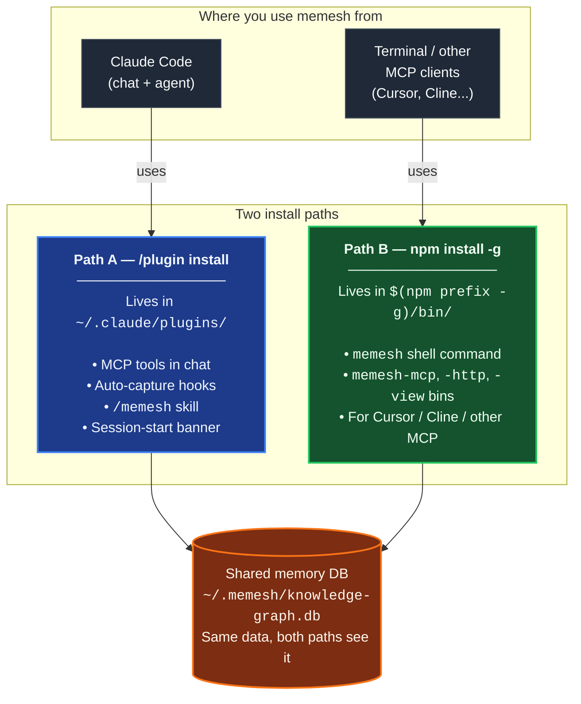

🌐 [English](README.md) | [繁體中文](README.zh-TW.md) | [简体中文](README.zh-CN.md) | [日本語](README.ja.md) | [한국어](README.ko.md) | [Português](README.pt.md) | [Français](README.fr.md) | [Deutsch](README.de.md) | [Tiếng Việt](README.vi.md) | [Español](README.es.md) | [ภาษาไทย](README.th.md)

<p align="center">
  <h1 align="center">MeMesh LLM Memory</h1>
  <p align="center">
    <strong>Lokaler Speicher für Claude Code und MCP-Coding-Agenten.</strong><br />
    Eine SQLite-Datei. Kein Docker. Keine Cloud erforderlich.
  </p>
  <p align="center">
    <a href="https://www.npmjs.com/package/@pcircle/memesh"></a>
    <a href="LICENSE"></a>
    <a href="https://nodejs.org"></a>
    <a href="https://modelcontextprotocol.io"></a>
  </p>
</p>

---

> [!IMPORTANT]
> **Aktiv entwickeltes Projekt** — Funktionen entwickeln sich kontinuierlich weiter und können sich zwischen Releases ändern. Bei Bugs oder Feature-Wünschen bitte [ein Issue eröffnen](https://github.com/PCIRCLE-AI/memesh-llm-memory/issues).

## Das Problem

Ihr Coding-Agent vergisst, was zwischen Sessions passiert ist. Jede Architekturentscheidung, jede Bugfix, jeder fehlgeschlagene Test und jede hart erarbeitete Erkenntnis muss erneut erklärt werden. Claude Code startet von vorne, entdeckt alte Constraints neu und verschwendet Context auf Dinge, die es längst wissen sollte.

**MeMesh gibt Coding-Agenten persistenten, durchsuchbaren und evolvirenden lokalen Speicher.**

Dieses Paket ist die lokale Speicherschicht der MeMesh-Produktfamilie. Es ist bewusst klein und Open-Source gestaltet: Installation via npm, Speicherung im Wissensgraphen unter `~/.memesh/knowledge-graph.db`, Anbindung an Claude Code oder jeden MCP-kompatiblen Client. Gehostete Workspace- und Enterprise-Betriebssystem-Produkte bleiben separat von diesem README und der Roadmap.

---

## Proof — 95.60% R@5 on LongMemEval-S

MeMeshs Retrieval-Engine ist **FTS5 alleine** (kein LLM, keine Embeddings auf dem Hot Path), gemessen am öffentlichen [LongMemEval-S](https://huggingface.co/datasets/xiaowu0162/longmemeval) Benchmark (500 Fragen, MIT-lizenziert):

| System | R@5 | Quelle |
|---|---|---|
| **MeMesh (Mode A, via `recallEnhanced()`)** | **95.60%** | [benchmarks/longmemeval/RESULTS.md](benchmarks/longmemeval/RESULTS.md) |
| MemPalace | 96.6% | Eigenangabe des Anbieters |
| Supermemory | ~82% | Schätzung des Anbieters |
| Zep | 63.8% | LongMemEval-Paper |
| Mem0 | 49.0% | LongMemEval-Paper |

Reproduktionsbefehle, Datensatz-SHA256, rohe Ergebnisse pro Frage und Analyse bekannter Fehlschläge finden sich vollständig in [`benchmarks/longmemeval/`](benchmarks/longmemeval/). In ~10 Sekunden reproduzierbar.

---

## Installationspfade auf einen Blick

MeMesh hat **zwei Installationspfade, die nebeneinander existieren**. Die meisten Nutzer brauchen beide. Beide schreiben in die **selbe Speicher-Datenbank** (`~/.memesh/knowledge-graph.db`), so dass im Claude-Code-Chat erfasste Memories auch in deiner Shell erscheinen und umgekehrt.



**Welchen brauchst du?**

| Was du willst | Installationspfad |
|---|---|
| `/memesh` skill im Claude-Code-Chat verwenden | Path A (Plugin) |
| Auto-Capture in Claude Code (Session → Lessons → nächste Recall) | Path A (Plugin) |
| `memesh remember` / `memesh recall` / `memesh doctor` im Terminal | Path B (npm-global) |
| `memesh` direkt zum Öffnen des Dashboards (ohne `npx`-Startverzögerung) | Path B (npm-global) |
| `memesh-mcp` an Cursor, Cline oder andere MCP-Clients anbinden | Path B (npm-global) |
| Alles oben | **Beide installieren** — kein Konflikt |

> **Häufiges Missverständnis**: Das Claude-Code-Plugin legt `memesh` **nicht** auf deinen Shell-`PATH`. Wenn du nur `/plugin install` läufst und dann im Terminal `memesh reindex` tippst, siehst du `command not found`. Das ist normal — für den Shell-Befehl brauchst du zusätzlich `npm install -g @pcircle/memesh`.

### ⚠️ Das Plugin installiert NICHT das CLI

Das ist die häufigste Verwechslung. Einmal lesen, spart dir später Zeit:

- `/plugin install memesh@pcircle-memesh` aus Claude Code → installiert **nur Path A**. Du erhältst MCP-Tools, Hooks, das `/memesh` skill. `memesh` landet **nicht** auf deinem Shell-`PATH`.
- `memesh reindex` / `memesh update` / `memesh doctor` im Terminal → braucht **Path B** (npm-global). Sonst: `zsh: command not found: memesh`.
- **Empfohlenes Setup für Claude-Code-Nutzer**: **beide installieren**. Koexistieren, teilen sich dieselbe DB, kein Konflikt.

```bash
# Nach /plugin install ..., auch das ausführen:
npm install -g @pcircle/memesh
```

Wenn du memesh nur im Claude-Code-Chat verwendest (nie `memesh` im Terminal tippst), reicht Path A. Alle anderen: beide installieren.

---

## In 60 Sekunden starten

### Schritt 1: Installation

```bash
npm install -g @pcircle/memesh
```

### Schritt 1.5: MeMesh in Claude Code einbinden (empfohlen, einmalig)

`npm install -g` legt die CLI in den PATH und registriert den MCP-Server, aber MeMeshs Claude-Code-Session-Hooks werden **nicht** automatisch verdrahtet. Ohne diese Hooks können Sie `memesh remember` / `recall` manuell verwenden, aber die **Auto-Capture-Schleife** (Session → Lektionen → proaktive Erinnerung in der nächsten Session) bleibt stumm.

```bash
memesh install-hooks         # fügt memesh-Hooks zu ~/.claude/settings.json hinzu
memesh doctor                # bestätigt, dass „Hooks wired into Claude Code" PASST
```

Die Hooks existieren neben Ihren bestehenden Custom-Hooks unter `~/.claude/hooks/` — `install-hooks` schreibt additiv und überschreibt nie Ihre Einträge. Zum Entfernen: `memesh uninstall-hooks`.

### Schritt 2: Entscheidung speichern

```bash
memesh remember --name "auth-decision" --type "decision" --obs "Use OAuth 2.0 with PKCE"
```

### Schritt 3: Später abrufen

```bash
memesh recall "login security"
# → Findet "OAuth 2.0 with PKCE" auch mit anderen Suchbegriffen
```

**Das ist alles.** MeMesh merkt sich jetzt Informationen über Sessions hinweg.

Um Installation und lokale Integration End-to-End zu überprüfen:

```bash
memesh doctor
```

Dashboard öffnen, um den Speicher zu erkunden:

```bash
memesh
```

<p align="center">
  
</p>

<p align="center">
  
</p>

<p align="center">
  
</p>

---

## Für wen ist das gedacht?

| Wenn Sie... | hilft Ihnen MeMesh... |
|---------------|---------------------|
| **Claude Code verwenden** | Projektentscheidungen, dateispezifische Erkenntnisse und vergangene Fehler während der Arbeit automatisch abrufen |
| **Power-User von Coding-Agenten** | Eine lokale Speicherschicht über MCP-kompatible Tools verteilen |
| **ein Team mit KI-Coding-Workflows experimentiert** | Projektwissen ohne gehostete Infrastruktur aus- und importieren |
| **Agent-Entwickler** | Lokalen Speicher via MCP, HTTP oder CLI hinzufügen |

---

## Speziell für Coding-Agenten entwickelt

<table>
<tr>
<td width="33%" align="center">

**Claude Code / Desktop**
```bash
memesh-mcp
```
MCP-Tools + Claude Code Hooks

</td>
<td width="33%" align="center">

**Beliebige HTTP-Clients**
```bash
curl localhost:3737/v1/recall \
  -H "Content-Type: application/json" \
  -d '{"query":"auth"}'
```
`memesh serve` (REST API)

</td>
<td width="33%" align="center">

**Jedes LLM (OpenAI-Format)**
```bash
memesh export-schema \
  --format openai
```
Tools in beliebige API-Aufrufe einfügen

</td>
</tr>
</table>

---

## Warum nicht OpenMemory, Cursor Memories, Mem0 oder Zep?

| | **MeMesh** | OpenMemory | Cursor Memories | Mem0 | Zep / Graphiti |
|---|---|---|---|---|---|
| **Beste Eignung** | Lokaler Speicher für Coding-Agenten | Lokaler/MCP-basierter Cross-Client-Speicher | Cursor-natives Projektgedächtnis | Verwalteter App-/Agent-Speicher | Temporale Wissensgraphen |
| **Installationsform** | `npm install -g @pcircle/memesh` | Lokale App/Server-Flow | In Cursor eingebaut | Cloud API / SDK / MCP | Service/Framework-Setup |
| **Speicherung** | Eine lokale SQLite-Datei | Lokaler Memory-Stack | Cursor-verwaltete Regeln/Memories | Gehostet oder selbstgehostet | Graphdatenbank |
| **Cloud erforderlich** | Nein | Nein im lokalen Modus | Abhängig von Cursor-Konto/-Einstellungen | Ja für Plattform | Meist ja/selbstgehostet |
| **Claude Code Hooks** | Erste Klasse | MCP-Tools | Nein | MCP-Tools | Nicht Claude Code-spezifisch |
| **Dashboard** | Eingebaut | Eingebaut | Cursor-Einstellungen | Plattform-Dashboard | Plattform/Graph-Tools |
| **Tradeoff** | Einfache lokale Lösung, nicht Enterprise-skaliert | Größerer lokaler App-Footprint | An Cursor gebunden | Starke verwaltete Plattform, weniger lokal | Starkes Graph-Modell, aufwendigere Einrichtung |

**MeMesh tauscht Enterprise-skalierte verwaltete Infrastruktur gegen sofortige lokale Einrichtung, inspektierbaren Speicher und Coding-Agent-Workflow-Hooks.**

---

## Was läuft in Claude Code automatisch ab

Sie müssen nicht manuell alles speichern. MeMesh verfügt über **6 Hooks**, die Wissen während der Arbeit erfassen und injizieren:

| Wenn | Was MeMesh tut |
|------|------------------|
| **Am Anfang jeder Session** | Lädt Ihre relevantesten Memories + proaktive Warnungen aus früheren Lektionen + Agentur-Orchestrierungs-Banner |
| **Vor Dateibearbeitungen** | Ruft Memories ab, die an die Datei oder das Projekt gebunden sind, bevor Claude Code schreibt |
| **Vor Bash-Befehlen** | Ermutigt Claude, hochverifizierbare Befehle (Test, Build, Lint, Migration, Deployment, Benchmark) als Hintergrund-Agenten zu versenden |
| **Nach jedem `git commit`** | Erfasst Ihre Änderungen mit Diff-Statistiken |
| **Wenn Claude stoppt** | Erfasst bearbeitete Dateien und behobene Fehler; generiert automatisch strukturierte Lektionen aus Fehlern |
| **Vor Context-Verdichtung** | Speichert Wissen, bevor es durch Context-Limits verloren geht |

> **Jederzeit abschalten:** `export MEMESH_AUTO_CAPTURE=false`

---

## Configuration

Die gesamte Konfiguration erfolgt über Umgebungsvariablen. Die Standardwerte sind rein lokal und ohne Netzwerk — Sie müssen nichts setzen, um ein funktionierendes System zu erhalten.

| Variable | Standard | Was sie bewirkt |
|---|---|---|
| `MEMESH_DB_PATH` | `~/.memesh/knowledge-graph.db` | Überschreibt den Speicherort der SQLite-Datenbank. |
| `MEMESH_AUTO_CAPTURE` | `true` | Deaktiviert die Auto-Capture-Hooks (`Stop`, `PreCompact`) vollständig. |
| `MEMESH_AUTO_DETECT_LLM` | nicht gesetzt (Auto-Erkennung **an**) | Auf `0` setzen, damit memesh einen im Shell-Environment gefundenen API-Schlüssel NICHT verwendet. Standardmäßig nutzt memesh einen gesetzten `ANTHROPIC_API_KEY` / `OPENAI_API_KEY` / `OLLAMA_HOST` für schreibseitige LLM-Funktionen (Konsolidierung, Lesson-Extraktion, Auto-Tagging, Dream), sofern in `~/.memesh/config.json` kein Provider konfiguriert ist. Embeddings sind nicht betroffen — sie bleiben lokal ONNX (384-dim), außer du setzt `embedder.provider` explizit. |
| `MEMESH_ENABLE_AGENTIC_ORCHESTRATION` | nicht gesetzt | Auf `1` setzen, um ein experimentelles Working-Model-Protokoll zu aktivieren (CTO / Orchestrator / Agents-Framing). Fügt ein Session-Start-Banner, einen Bash-Befehls-Nudge und `verify_agent_work`-Telemetrie hinzu. Die Wirksamkeit des Protokolls wird derzeit instrumentiert, ist aber noch nicht erwiesen — Opt-in, falls Sie teilnehmen möchten. **Standard ist OFF**: Die Kern-Memory-Funktionen arbeiten ohne dieses Flag. |
| `MEMESH_AUTO_UPDATE` | `off` | Auto-Update-Richtlinie. `off` (Standard) aktualisiert nie automatisch; `patch` erlaubt `X.Y.Z → X.Y.Z+N`; `minor` ergänzt `X.Y.Z → X.Y+1.0`; `major` erlaubt jedes Bump. Wenn zugelassen, läuft am Session-Ende (Stop-Hook) ein abgekoppeltes `npm install -g`, sodass es Ihre Arbeit nie blockiert — Ergebnisse landen in `~/.memesh/auto-update.log`. Ebenfalls als `autoUpdate` in `~/.memesh/config.json` setzbar (Env hat Vorrang). Wenn die installierte Version von den Maintainern als veraltet markiert wird (Sicherheitswarnung), wird `patch` auch bei `off` erzwungen erlaubt — Minor- / Major-Bumps bleiben manuell, um stille Verhaltensänderungen zu vermeiden. |
| `OPENAI_API_KEY` | nicht gesetzt | Dein OpenAI-Schlüssel. Wird automatisch für LLM-Funktionen genutzt, außer du setzt `MEMESH_AUTO_DETECT_LLM=0` oder konfigurierst einen Provider explizit. |
| `OLLAMA_HOST` | `http://localhost:11434` | Überschreibt den Ollama-Endpoint, wenn ein lokaler Ollama-Provider verwendet wird. |

`memesh doctor` gibt die aufgelöste Konfiguration aus, sodass Sie sehen, was aktiv ist.

Wenn npm eine installierte Version als veraltet kennzeichnet (typischerweise eine Sicherheitswarnung), stellt der nächste Session-Start ein deutliches `⚠️ MeMesh <ver> is DEPRECATED`-Banner voran und `memesh update-status` zeigt dieselbe Zeile, bis Sie aktualisiert haben. Die Prüfung wird unter `~/.memesh/update-check.<version>.json` zwischengespeichert, sodass ein vorübergehender Netzwerkfehler die Warnung nicht abschwächen kann.

---

## Dashboard

8 Reiter, 11 Sprachen, keine externen Abhängigkeiten. Zugang unter `http://localhost:3737/dashboard` wenn der Server läuft.

| Reiter | Was Sie sehen |
|--------|-------------|
| **Insights** | Speicher-Insights — wöchentliche Zusammenfassungen und Mustervorschläge der Dreamer-Engine; Ein-Klick-Akzeptieren/Ablehnen |
| **Search** | Volltextsuche + Vektorsimilarität über alle Memories |
| **Browse** | Paginierte Liste aller Entitäten mit Archiv-/Restore-Funktion |
| **Analytics** | Memory Health Score, 30-Tage-Timeline, PM-Velocity + KG-Konnektivitätskennzahlen, Arbeitsmuster, Bereinigungsvorschläge |
| **Graph** | Interaktiver kraft-gerichteter Wissensgraph mit Typfiltern, Suche, Ego-Modus, Aktualitäts-Heatmap |
| **Lessons** | Strukturierte Lektionen aus vergangenen Fehlern (Fehler, Grundursache, Behebung, Prävention) |
| **Manage** | Entitäten archivieren und wiederherstellen |
| **Settings** | LLM-Provider-Konfiguration, sofortiger Sprachwahlschalter |

---

## Intelligente Features

**🧠 Intelligente Suche** — Suche nach „Login Security" und finde Memories über „OAuth PKCE". MeMesh nutzt auf dem heißen Pfad FTS5 + sqlite-vec, ohne LLM; die Vektor-Ergänzung erreicht dennoch verwandte Formulierungen.

**🌏 Suche in Schriften ohne Wortzwischenräume** — Chinesisch, Japanisch, Koreanisch, Thai, Laotisch, Khmer und halbbreites Katakana werden als überlappende Zeichenpaare indiziert. Eine als 「資料庫遷移前一定要先備份」 gespeicherte Erinnerung findet man deshalb mit 「備份」 — und nicht nur über den exakten Volltext. Der Text wird beim Schreiben wie beim Suchen normalisiert (NFC), sodass unter macOS oder mit einer koreanischen bzw. vietnamesischen Eingabemethode getippte Erinnerungen in beiden Schreibweisen gefunden werden.

**📊 Bewertetes Ranking** — Ergebnisse geordnet nach Relevanz (30%) + Aktualität (25%) + Häufigkeit (18%) + Konfidenz (17%) + Abruf-Auswirkung (10%).

**🔄 Wissensentwicklung** — Entscheidungen ändern sich. `forget` archiviert alte Memories (löscht nie). `supersedes`-Relationen verbinden alt → neu. Ihr KI sieht immer die aktuelle Version.

**⚠️ Konflikterkennung** — Wenn Sie zwei Memories haben, die sich widersprechen, warnt Sie MeMesh.

**🕸️ Wissensgraph-Konnektivität** — `memesh kg backfill-relations --all-rules` verknüpft verwaiste Entitäten über Tag-Kookurrenz, Projekt-Clustering, Sitzungskontext und Namensähnlichkeit — ohne LLM.

**📦 Team-Freigabe** — `memesh export > team-knowledge.json` → mit Team teilen → `memesh import team-knowledge.json`
Importierte Bundles bleiben durchsuchbar, aber MeMesh injiziert importierte Memories nicht automatisch in Claude Hooks, bis Sie sie überprüfen oder lokal neu speichern.

---

## Beispiele aus der Praxis

> "MeMesh hat sich daran erinnert, dass wir vor drei Wochen PKCE gegenüber Implicit Flow gewählt haben. Als ich Claude erneut nach Auth fragte, wusste es bereits Bescheid — keine Wiederholungen nötig."
> — **Einzelentwickler, baut eine SaaS**

> "Wir exportieren unseren Team-Memory jeden Freitag und importieren ihn Montag. Jedes Claude des Teams startet die Woche mit dem Wissen aus der Vorwoche."
> — **3er-Startup mit gemeinsamer Wissensbasis**

> "Das Dashboard zeigte mir, dass 90 % meiner Memories automatisch generierte Session-Logs waren. Ich begann, `remember` bewusst für Architekturentscheidungen zu nutzen. Ein Spielwechsel."
> — **Entwickler, der den Analytics-Reiter entdeckte**

---

## Smart Mode freischalten (optional)

MeMesh funktioniert standardmäßig offline — Recall bleibt strikt LLM-frei (95,60 % R@5 auf LongMemEval-S, ohne LLM). Fügen Sie einen LLM API-Schlüssel nur hinzu, wenn Sie LLM-augmentierte Analyseflüsse zusätzlich nutzen möchten: intelligentere Session-Extraktion, Auto-Tagging neuer Memories, Lektionen aus Fehlern und `dream` Kompression:

```bash
memesh config set llm.provider anthropic
memesh config set llm.api-key sk-ant-...
```

Oder nutzen Sie den Dashboard-Settings-Reiter (visuelles Setup):

```bash
memesh  # öffnet Dashboard → Settings-Reiter
```

### Eigene Embeddings verwenden (optional)

Embeddings nutzen standardmäßig ein lokales ONNX-Modell (`Xenova/all-MiniLM-L6-v2`, 384-dim) — kein API-Schlüssel, nichts verlässt deinen Rechner, und der Standard-FTS5-Recall braucht sie gar nicht. Um stattdessen einen gehosteten oder lokalen Embedder zu nutzen:

```bash
memesh config set embedder.provider openai          # or: ollama
memesh config set embedder.model text-embedding-3-small
```

Der Embedder wird **unabhängig vom Chat-LLM** konfiguriert — `llm.provider` zu ändern ändert nie stillschweigend deine Embeddings. Wechselst du zu einer anderen Dimension (z. B. 384 → 1536), baut MeMesh den Vektorindex beim nächsten Schreibvorgang automatisch neu auf. Unterstützte `embedder.provider`-Werte: `onnx` (Standard, lokal), `openai`, `ollama`.

| | Stufe 0 (Standard) | Stufe 1 (Smart Mode) |
|---|---|---|
| **Search** | FTS5 + sqlite-vec, 95,60 % R@5 (~4 ms pro Recall) | unverändert — Recall ist auf jeder Stufe LLM-frei |
| **Auto-Capture** | Regelbasierte Muster | + LLM extrahiert Entscheidungen & Lektionen |
| **Auto-Tagging** | Nur manuelle Tags | + LLM generiert Tags für neue Memories |
| **Fehleranalyse** | Nicht verfügbar | + LLM wandelt Session-Fehler in strukturierte Lektionen um |
| **Kompression** | Nicht verfügbar | `dream` komprimieren ausschweifende Memories |
| **Kosten** | Kostenlos, kein API-Schlüssel | ~$0,0001 pro Analyseanfrage (Haiku) |

---

## Alle 9 Memory-Tools

| Tool | Was es tut |
|------|-------------|
| `remember` | Wissen mit Beobachtungen, Relationen und Tags speichern |
| `recall` | FTS5 + sqlite-vec Suche mit Multi-Faktor-Bewertung (Relevanz, Aktualität, Häufigkeit, Konfidenz, Abruf-Auswirkung) — kein LLM auf dem Hot Path |
| `forget` | Soft-Archivierung (löscht nie) oder entfernt spezifische Beobachtungen |
| `export` | Memories als JSON zwischen Projekten oder Teamkollegen teilen |
| `import` | Memories mit Merge-Strategien importieren (Skip / Overwrite / Append) |
| `learn` | Strukturierte Lektionen aus Fehlern erfassen (Fehler, Grundursache, Behebung, Prävention) |
| `user_patterns` | Arbeitsmuster analysieren — Zeitplan, Tools, Stärken, Lernbereiche |
| `verify_agent_work` | Verifizierungsbericht für Hintergrund-Agent-Arbeit speichern; Reality-Check gegen behauptete Dateiänderungen via `git diff` |

---

## Architektur

```
                    ┌─────────────────┐
                    │   Core Engine   │
                    │  (8 operations) │
                    └────────┬────────┘
           ┌─────────────────┼─────────────────┐
           │                 │                 │
     CLI (memesh)    HTTP API (serve)    MCP (memesh-mcp)
           │                 │                 │
           └─────────────────┼─────────────────┘
                             │
                    SQLite + FTS5 + sqlite-vec
                    (~/.memesh/knowledge-graph.db)
```

Der Kern ist Framework-agnostisch. Dieselbe Logik läuft vom Terminal, HTTP oder MCP.

---

## Aktualisieren

Der Plugin-Marketplace von Claude Code fixiert Versionen zum Installationszeitpunkt und aktualisiert **nicht** automatisch. So holst du dir ein neues Release:

**Option A — `/plugin` UI**: `memesh@pcircle-memesh` deinstallieren, dann neu installieren. Claude Code holt die neueste Marketplace-Version.

**Option B — Einzeiler-Skript** (kein UI-Klicken, idempotent):

```bash
# Wenn deine Plugin-Installation v4.2.5 oder neuer ist, ist das Skript enthalten:
bash ~/.claude/plugins/cache/pcircle-memesh/memesh/<current-version>/scripts/upgrade-plugin.sh

# Bei Installationen vor v4.2.5 (also v4.2.4 oder v4.2.3)
# ist das Skript noch nicht im Plugin. Nutze stattdessen die npm-global-Kopie:
bash "$(npm prefix -g)/lib/node_modules/@pcircle/memesh/scripts/upgrade-plugin.sh"

# (Das setzt voraus, dass du auch `npm install -g @pcircle/memesh` ausgeführt hast.
# Falls nicht, ist jetzt ein guter Moment dafür — siehe oben „Installationspfade auf
# einen Blick" für die Gründe, warum die meisten Nutzer beide Pfade wollen.)
```

Das Skript fast-forwarded den Marketplace-Cache, legt die neue Version unter `~/.claude/plugins/cache/` ab, installiert Runtime-Dependencies und zeigt `installed_plugins.json` neu. Starte danach Claude Code neu, damit der MCP-Server sich neu verbindet.

**npm-global-Installationen** (`npm install -g @pcircle/memesh`) können sich via `memesh update` selbst aktualisieren. Source-Checkouts: `git pull && npm install && npm run build`.

Beim Session-Start erscheint ein einzeiliges Banner (pro Version alle 24h gedrosselt), wenn ein neueres Release verfügbar ist, und `memesh doctor` meldet das Upgrade-Ziel mit kanalspezifischem Befehl.

---

## Beitragen

```bash
git clone https://github.com/PCIRCLE-AI/memesh-llm-memory
cd memesh-llm-memory && npm install && npm run build
npm test
npm run test:e2e-dashboard
```

Dashboard: `cd dashboard && npm install && npm run dev`

---

<p align="center">
  <strong>MIT</strong> — Erstellt von <a href="https://pcircle.com">PCIRCLE AI</a>
</p>
