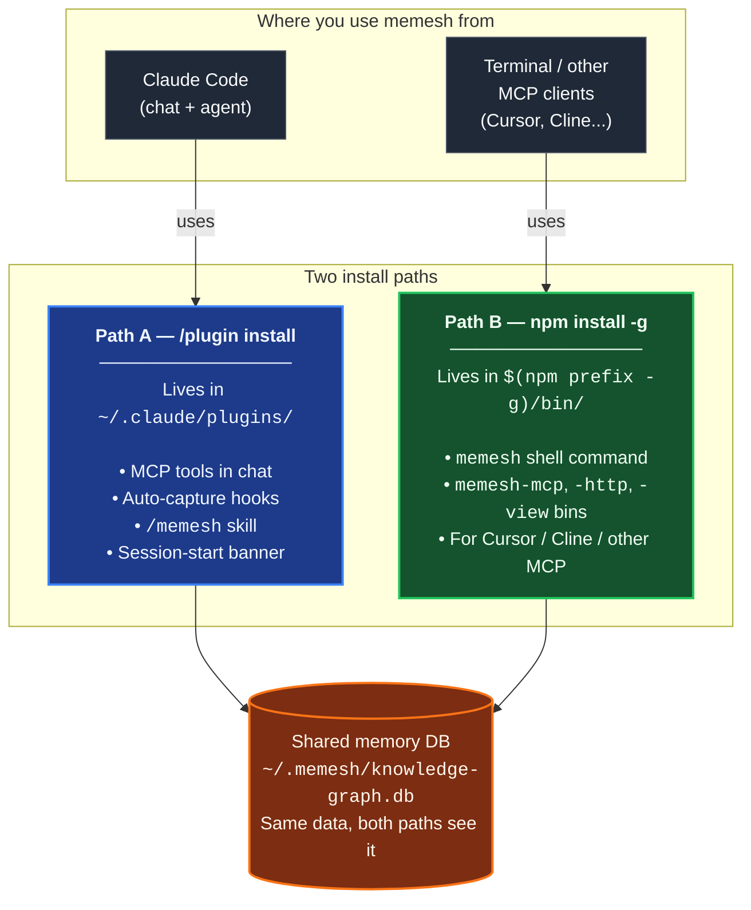

🌐 [English](README.md) | [繁體中文](README.zh-TW.md) | [简体中文](README.zh-CN.md) | [日本語](README.ja.md) | [한국어](README.ko.md) | [Português](README.pt.md) | [Français](README.fr.md) | [Deutsch](README.de.md) | [Tiếng Việt](README.vi.md) | [Español](README.es.md) | [ภาษาไทย](README.th.md)

<p align="center">
  <h1 align="center">MeMesh LLM Memory</h1>
  <p align="center">
    <strong>Memoria local para Claude Code y agentes de codificación MCP.</strong><br />
    Un archivo SQLite. Sin Docker. Sin infraestructura en la nube.
  </p>
  <p align="center">
    <a href="https://www.npmjs.com/package/@pcircle/memesh"></a>
    <a href="LICENSE"></a>
    <a href="https://nodejs.org"></a>
    <a href="https://modelcontextprotocol.io"></a>
  </p>
</p>

---

> [!IMPORTANT]
> **Proyecto en desarrollo activo** — las funcionalidades evolucionan continuamente y pueden cambiar entre versiones. Si encuentras un bug o tienes una solicitud de funcionalidad, por favor [abre un issue](https://github.com/PCIRCLE-AI/memesh-llm-memory/issues).

## El Problema

Tu agente de codificación olvida lo que sucedió en sesiones anteriores. Cada decisión arquitectónica, corrección de bugs, prueba fallida y lección aprendida con esfuerzo debe explicarse de nuevo. Claude Code comienza desde cero, redescubre restricciones antiguas y gasta contexto en cosas que ya debería saber.

**MeMesh proporciona a los agentes de codificación memoria local persistente, buscable y en evolución.**

Este paquete es la capa de memoria local de la familia de productos MeMesh. Es intencionalmente simple y de código abierto: instálalo con npm, mantén tu memoria en `~/.memesh/knowledge-graph.db` y conéctalo a Claude Code o cualquier cliente compatible con MCP. Los productos de workspace alojado y sistemas operativos empresariales deben mantenerse separados del README y roadmap de este paquete.

---

## Prueba — 95.60% R@5 en LongMemEval-S

El motor de recuperación de MeMesh es **solo FTS5** (sin LLM, sin embeddings en la ruta caliente), medido contra el benchmark público [LongMemEval-S](https://huggingface.co/datasets/xiaowu0162/longmemeval) (500 preguntas, licencia MIT):

| Sistema | R@5 | Fuente |
|---|---|---|
| **MeMesh (Modo A, via `recallEnhanced()`)** | **95.60%** | [benchmarks/longmemeval/RESULTS.md](benchmarks/longmemeval/RESULTS.md) |
| MemPalace | 96.6% | Auto-reporte del proveedor |
| Supermemory | ~82% | Estimación del proveedor |
| Zep | 63.8% | Paper de LongMemEval |
| Mem0 | 49.0% | Paper de LongMemEval |

Los comandos de reproducción, SHA256 del dataset, resultados crudos por pregunta y análisis de fallos conocidos están todos en [`benchmarks/longmemeval/`](benchmarks/longmemeval/). Re-ejecutable en ~10 segundos.

---

## Vista rápida de las rutas de instalación

MeMesh tiene **dos rutas de instalación que coexisten**. La mayoría de usuarios quiere ambas. Escriben en la **misma base de datos de memoria** (`~/.memesh/knowledge-graph.db`), por lo que los recuerdos capturados en el chat de Claude Code aparecen en tu shell, y viceversa.



**¿Cuál necesitas?**

| Lo que quieres hacer | Ruta de instalación |
|---|---|
| Usar el skill `/memesh` dentro de una conversación de Claude Code | Path A (plugin) |
| Auto-captura en Claude Code (sesión → lecciones → recall siguiente) | Path A (plugin) |
| Ejecutar `memesh remember` / `memesh recall` / `memesh doctor` en cualquier terminal | Path B (npm-global) |
| Abrir el dashboard con `memesh serve` (sin retraso de arranque de `npx`) | Path B (npm-global) |
| Conectar `memesh-mcp` a Cursor, Cline u otro cliente MCP | Path B (npm-global) |
| Todo lo anterior | **Instala ambos** — no entran en conflicto |

> **Confusión común**: el plugin de Claude Code **no** pone `memesh` en tu `PATH` del shell. Si solo ejecutas `/plugin install` y luego escribes `memesh reindex` en una terminal, verás `command not found`. Es normal — añade `npm install -g @pcircle/memesh` también para acceso desde el shell.

### ⚠️ Instalar el plugin NO instala el CLI

Es la confusión más común. Léelo una vez y te ahorrarás un bucle futuro:

- `/plugin install memesh@pcircle-memesh` desde Claude Code → instala **solo Path A**. Te da herramientas MCP, hooks, el skill `/memesh`. **NO** pone `memesh` en tu `PATH` del shell.
- `memesh reindex` / `memesh update` / `memesh doctor` en una terminal → necesita **Path B** (npm-global). Sin él: `zsh: command not found: memesh`.
- **Configuración recomendada para usuarios de Claude Code**: **instala ambos**. Coexisten, comparten la misma base de datos, no conflictúan.

```bash
# Después de /plugin install ..., ejecuta también esto:
npm install -g @pcircle/memesh
```

Si solo usas memesh a través del chat de Claude Code (nunca tecleas `memesh` en una terminal), Path A solo es suficiente. Para todos los demás: instala ambos.

---

## Primeros Pasos en 60 Segundos

### Opción A — Plugin de Claude Code (instalación de una línea)

Si usas Claude Code, instala MeMesh como plugin desde dentro de la CLI:

```
/plugin marketplace add PCIRCLE-AI/memesh-llm-memory
/plugin install memesh@pcircle-memesh
```

Claude Code conecta los hooks, skills y el servidor MCP automáticamente. Obtienes auto-captura en sesión, recuperación proactiva, el skill `/memesh` (remember / recall / learn / forget) dentro de la conversación de Claude Code, y `remember` / `recall` / `forget` / `learn` disponibles como herramientas MCP para el agente. La CLI y el dashboard local también son completamente accesibles sin ninguna instalación global adicional — `npx @pcircle/memesh <command>` ejecuta cada comando CLI, y `npx @pcircle/memesh` lanza el dashboard en `localhost:3737`. El servidor MCP se ejecuta directamente desde la salida compilada incluida con el plugin — sin búsqueda de `npx`, sin `npm install -g`, sin paso de build. memesh guarda sus datos mediante `node:sqlite`, que forma parte de Node (22.13+), así que actualizar Node no puede dejarlo con un binario compilado para el runtime equivocado.

### Opción B — npm global (optimización opcional)

Si quieres el binario directamente en tu `PATH` de shell (para que `memesh`, `memesh-mcp`, etc. funcionen en cualquier terminal sin la búsqueda `npx` por llamada), o quieres exponer `memesh-mcp` como un comando stdio de ruta fija a **clientes MCP que no son Claude Code** (Cursor, Cline, flujos solo de terminal):

```bash
npm install -g @pcircle/memesh
```

> **Notas de primera instalación (única vez):**
> - **No hace falta compilador** — el motor de base de datos es el propio `node:sqlite` de Node. `sqlite-vec`, que añade la búsqueda por significado, se distribuye como archivo precompilado para macOS (arm64/x64), Linux (x64/arm64) y Windows x64; en cualquier otra plataforma simplemente no está y la recuperación se queda en búsqueda por palabra clave. Nada de esto ejecuta un script de instalación, así que `npm install --ignore-scripts` instala un memesh plenamente funcional.
> - **La búsqueda semántica es opcional** — la ruta de recuperación por defecto es la búsqueda por palabras clave (FTS5), que no necesita modelo ni descarga. La búsqueda por significado necesita un embedder: ejecuta [Ollama](https://ollama.com) en local, o configura un embedder en la nube (ver "Embeddings" más abajo). Sin uno, memesh usa solo búsqueda por palabras clave.

### Paso 1.5: Conecta MeMesh a Claude Code (solo ruta npm)

Si instalaste mediante la **Opción A** (`/plugin install memesh@pcircle-memesh`), omite este paso — Claude Code conecta los hooks del plugin automáticamente.

Si instalaste mediante la **Opción B** (`npm install -g`), la CLI está en tu PATH y el servidor MCP está registrado, pero los hooks de sesión de Claude Code no se conectan automáticamente. Sin ellos, aún puedes usar `memesh remember` / `recall` manualmente, pero el **bucle de captura automática** (sesiones → lecciones → recall en la siguiente sesión) queda en silencio.

```bash
memesh install-hooks         # añade los hooks de memesh a ~/.claude/settings.json
memesh doctor                # confirma que "Hooks wired into Claude Code" pasa
```

Estos hooks coexisten con cualquier hook personalizado que ya tengas en `~/.claude/hooks/` — `install-hooks` escribe entradas aditivas y nunca sobrescribe los tuyos. Para eliminarlos después: `memesh uninstall-hooks`.

### Paso 2: Guarda una decisión

> Los ejemplos bash a continuación asumen que `memesh` está en tu `PATH` (Opción B). Los usuarios de la Opción A (solo plugin) tienen dos rutas equivalentes: pregunta en la conversación de Claude Code (el skill `/memesh` + las herramientas MCP cubren los mismos flujos), o reemplaza `memesh` con `npx @pcircle/memesh` en cualquier shell — mismas flags, sin necesidad de instalación global.

```bash
memesh remember "Use OAuth 2.0 with PKCE for the new auth"
```

O usa la forma explícita cuando quieres un nombre y tipo estables para filtrado posterior:

```bash
memesh remember --name "auth-decision" --type "decision" --obs "Use OAuth 2.0 with PKCE"
```

### Paso 3: Recupérala después

```bash
memesh recall "login security"
# → Encuentra "OAuth 2.0 with PKCE" aunque buscaste palabras diferentes
```

**Eso es todo.** MeMesh ahora está recordando y recuperando a través de sesiones.

Si quieres verificar la instalación y la conexión local de extremo a extremo:

```bash
memesh doctor
```

Abre el dashboard para explorar tu memoria:

```bash
memesh serve
```

<p align="center">
  
</p>

<p align="center">
  
</p>

<p align="center">
  
</p>

---

## ¿Para Quién Es Esto?

| Si eres... | MeMesh te ayuda a... |
|---|---|
| **Un desarrollador usando Claude Code** | Recuperar automáticamente decisiones del proyecto, lecciones específicas de archivos y fracasos anteriores mientras trabajas |
| **Un usuario avanzado de agentes de codificación** | Compartir una capa de memoria local entre herramientas compatibles con MCP |
| **Un equipo experimentando con flujos de trabajo de IA para codificación** | Exportar/importar conocimiento del proyecto sin introducir infraestructura alojada |
| **Un desarrollador de agentes** | Añadir memoria local mediante MCP, HTTP o la CLI |

---

## Diseñado para Agentes de Codificación en Primer Lugar

<table>
<tr>
<td width="33%" align="center">

**Claude Code / Desktop**
```bash
memesh-mcp
```
Herramientas MCP + hooks de Claude Code

</td>
<td width="33%" align="center">

**Cualquier Cliente HTTP**
```bash
curl localhost:3737/v1/recall \
  -H "Content-Type: application/json" \
  -d '{"query":"auth"}'
```
`memesh serve` (REST API)

</td>
<td width="33%" align="center">

**Cualquier LLM (formato OpenAI)**
```bash
memesh export-schema \
  --format openai
```
Pega las herramientas en cualquier llamada API

</td>
</tr>
</table>

---

## ¿Por Qué No OpenMemory, Cursor Memories, Mem0 o Zep?

| | **MeMesh** | OpenMemory | Cursor Memories | Mem0 | Zep / Graphiti |
|---|---|---|---|---|---|
| **Mejor caso de uso** | Memoria local para agentes de codificación | Memoria local/entre clientes MCP | Memoria de proyecto nativa de Cursor | Memoria de aplicación/agente gestionada | Grafos de conocimiento temporal |
| **Forma de instalación** | `npm install -g @pcircle/memesh` | Flujo de aplicación/servidor local | Integrada en Cursor | API en la nube / SDK / MCP | Configuración de servicio/framework |
| **Almacenamiento** | Un archivo SQLite local | Stack de memoria local | Reglas/memories gestionados por Cursor | Stack alojado o auto-alojado | Base de datos de grafos |
| **Nube requerida** | No | No en modo local | Depende de la cuenta/configuración de Cursor | Sí para la plataforma | Generalmente sí/auto-alojado |
| **Hooks de Claude Code** | Primera clase | Herramientas MCP | No | Herramientas MCP | No específico de Claude Code |
| **Dashboard** | Integrado | Integrado | Configuración de Cursor | Dashboard de plataforma | Herramientas de plataforma/grafo |
| **Tradeoff** | Cuña local simple, no a escala empresarial | Huella de aplicación local más amplia | Bloqueado a Cursor | Plataforma gestionada fuerte, menos local-first | Modelo de grafo fuerte, configuración más pesada |

**MeMesh intercambia infraestructura gestionada a escala empresarial por configuración local instantánea, almacenamiento inspectable y hooks de flujo de trabajo de agentes de codificación.**

---

## Qué Sucede Automáticamente en Claude Code

No necesitas recordar todo manualmente. MeMesh tiene **6 hooks** que capturan e inyectan conocimiento mientras trabajas:

| Cuándo | Qué hace MeMesh |
|---|---|
| **Al inicio de cada sesión** | Carga tus memorias más relevantes + advertencias proactivas de lecciones pasadas |
| **Antes de editar archivos** | Recupera memorias vinculadas al archivo o proyecto antes de que Claude escriba código |
| **Cuando pides recordar** | Detecta intención de "remember this" / "guardar en memesh" / "sauvegarder dans memesh" / "記下來" (5 idiomas) y recuerda a Claude que use memesh |
| **Después de cada `git commit`** | Registra qué cambiaste, con estadísticas de diff |
| **Cuando Claude se detiene** | Captura archivos editados, errores corregidos y genera automáticamente lecciones estructuradas a partir de fallos |
| **Antes de compresión de contexto** | Guarda conocimiento antes de que se pierda en límites de contexto |

> **Desactiva en cualquier momento:** `export MEMESH_AUTO_CAPTURE=false`

---

## Configuración

Toda la configuración se realiza mediante variables de entorno. Los valores por defecto son solo locales y sin red — no necesitas configurar nada para tener un sistema funcional.

| Variable | Por defecto | Qué hace |
|---|---|---|
| `MEMESH_DB_PATH` | `~/.memesh/knowledge-graph.db` | Sobrescribe la ubicación de la base de datos SQLite. |
| `MEMESH_AUTO_CAPTURE` | `true` | Desactiva por completo los hooks de auto-captura (`Stop`, `PreCompact`). |
| `MEMESH_AUTO_DETECT_LLM` | sin definir (autodetección **activada**) | Ponlo en `0` para que memesh NO use una clave de API encontrada en el entorno del shell. Por defecto, si `ANTHROPIC_API_KEY` / `OPENAI_API_KEY` / `OLLAMA_HOST` está definida y no has configurado un proveedor en `~/.memesh/config.json`, memesh la usa para las funciones LLM de escritura (consolidación, extracción de lecciones, autoetiquetado, dream). Los embeddings no se ven afectados — siguen siendo solo por palabras clave (FTS5) salvo que definas `embedder.provider` como `ollama` u `openai`. |
| `MEMESH_AUTO_UPDATE` | `off` | Política de auto-actualización. `off` (por defecto) nunca auto-actualiza; `patch` permite `X.Y.Z → X.Y.Z+N`; `minor` añade `X.Y.Z → X.Y+1.0`; `major` permite cualquier bump. Cuando se permite, un `npm install -g` independiente se dispara al final de la sesión (hook Stop) por lo que nunca bloquea tu trabajo — los resultados aterrizan en `~/.memesh/auto-update.log`. También configurable como `autoUpdate` en `~/.memesh/config.json` (env gana). Cuando los mantenedores deprecan la versión instalada (aviso de seguridad), `patch` se fuerza a permitir incluso en `off` — los bumps minor / major siguen siendo manuales para evitar deriva silenciosa de comportamiento. |
| `OPENAI_API_KEY` | sin definir | Tu clave de OpenAI. Se usa automáticamente para las funciones LLM salvo que definas `MEMESH_AUTO_DETECT_LLM=0` o configures un proveedor explícitamente. |
| `OLLAMA_HOST` | `http://localhost:11434` | Sobrescribe el endpoint de Ollama cuando uses un proveedor Ollama local. |

`memesh doctor` imprime la configuración resuelta para que puedas ver qué está activo.

**Proveedores LLM de respaldo (Smart Mode).** En el dashboard, en **Settings → «Fallback providers»**, puedes definir una cadena de failover ordenada — memesh prueba cada proveedor por turno cuando el principal está caído. Añade un respaldo local [Ollama](https://ollama.com), o uno en la nube (OpenAI / Anthropic, con una API key). Compensación de privacidad: cuando se usa un respaldo en la nube, el texto de memoria — que puede ser privado — se envía a ese proveedor, así que importa si trabajas solo en local por privacidad.

Cuando npm marca una versión instalada como deprecada (típicamente un aviso de seguridad), el siguiente inicio de sesión antepone un fuerte banner `⚠️ MeMesh <ver> is DEPRECATED` y `memesh update-status` muestra la misma línea hasta que actualices. La verificación se cachea en `~/.memesh/update-check.<version>.json` para que un fallo de red transitorio no atenúe la advertencia.

---

## Dashboard

8 pestañas, 11 idiomas, cero dependencias externas. Accede en `http://localhost:3737/dashboard` cuando el servidor está en ejecución.

| Pestaña | Qué ves |
|---|---|
| **Insights** | Perspectivas de memoria — resúmenes semanales y propuestas de patrones del motor dreamer; aceptar/rechazar con un clic |
| **Search** | Búsqueda de texto completo + similitud vectorial en todas las memorias |
| **Browse** | Lista paginada de todas las entidades con archivo/restauración |
| **Analytics** | Puntuación de Salud de Memoria, línea de tiempo de 30 días, velocidad PM + métricas de conectividad KG, patrones de trabajo, sugerencias de limpieza |
| **Graph** | Grafo de conocimiento interactivo dirigido por fuerzas con filtros de tipo, búsqueda, modo ego, mapa de calor de recencia |
| **Lessons** | Lecciones estructuradas de fallos pasados (error, causa raíz, corrección, prevención) |
| **Manage** | Archiva y restaura entidades |
| **Settings** | Configuración de proveedor LLM, selector de idioma instantáneo |

---

## Características Inteligentes

**🧠 Búsqueda Inteligente** — Busca "login security" y encuentra memorias sobre "OAuth PKCE". MeMesh usa FTS5 + sqlite-vec en la ruta caliente, sin LLM; el complemento vectorial aún alcanza términos relacionados.

**🌏 Búsqueda en escrituras que no separan las palabras con espacios** — El chino, el japonés, el coreano, el tailandés, el lao, el jemer y el katakana de media anchura se indexan como pares de caracteres solapados. Así, un recuerdo escrito como 「資料庫遷移前一定要先備份」 se encuentra buscando 「備份」, no solo con su texto completo exacto. El texto se normaliza (NFC) tanto al escribir como al consultar, de modo que un recuerdo tecleado en macOS o con un IME coreano o vietnamita se encuentra en cualquiera de las dos grafías.

**📊 Ranking Puntuado** — Los resultados se clasifican por relevancia (30%) + recencia (25%) + frecuencia (18%) + confianza (17%) + impacto de recuperación (10%).

**🔄 Evolución del Conocimiento** — Las decisiones cambian. `forget` archiva memorias antiguas (nunca borra). Las relaciones `supersedes` vinculan antiguas → nuevas. Tu IA siempre ve la versión más reciente.

**⚠️ Detección de Conflictos** — Si tienes dos memorias que se contradicen, MeMesh te advierte.

**🕸️ Conectividad del grafo de conocimiento** — `memesh kg backfill-relations --all-rules` vincula entidades huérfanas mediante co-ocurrencia de etiquetas, agrupación de proyectos, contexto de sesión y similitud de nombres — sin LLM.

**📦 Compartir en Equipo** — `memesh export > team-knowledge.json` → comparte con tu equipo → `memesh import team-knowledge.json`
Los bundles importados permanecen buscables, pero MeMesh no inyecta automáticamente memorias importadas en hooks de Claude hasta que las revises o las guardes localmente de nuevo.

---

## Ejemplos de Uso

> "MeMesh recordó que elegimos PKCE sobre implicit flow hace tres semanas. Cuando le pregunté a Claude sobre auth de nuevo, ya lo sabía — sin necesidad de re-explicar."
> — **Desarrollador independiente, construyendo un SaaS**

> "Exportamos la memoria de nuestro equipo cada viernes e la importamos el lunes. El Claude de cada uno comienza la semana sabiendo qué aprendió el equipo la semana pasada."
> — **Startup de 3 personas, base de conocimiento compartida**

> "El dashboard me mostró que 90% de mis memorias eran logs de sesión auto-generados. Empecé a usar `remember` deliberadamente para decisiones arquitectónicas. Cambio de juego."
> — **Desarrollador que descubrió la pestaña Analytics**

---

## Desbloquea Modo Inteligente (Opcional)

MeMesh funciona sin conexión por defecto — el recall permanece estrictamente sin LLM (95.60% R@5 en LongMemEval-S de fábrica). Añade una clave API de LLM solo si quieres flujos de análisis aumentados por LLM encima: extracción de sesión más inteligente, auto-etiquetado de nuevas memorias, generación de lecciones a partir de fallos, y compresión `dream`:

```bash
memesh config set llm.provider anthropic
memesh config set llm.api-key sk-ant-...
```

O usa la pestaña Configuración del dashboard (configuración visual):

```bash
memesh serve  # abre dashboard → pestaña Settings
```

**Extrae memoria de tus sesiones pasadas.** `memesh dream run --from-transcripts` lee las transcripciones de sesión de Claude Code de este proyecto, le pide al LLM las decisiones y lecciones ocultas en la conversación, y las prepara como propuestas — nada entra en tu grafo automáticamente. Revisa cada una con `memesh dream show <id>` y acepta las que valgan la pena.

### Usa tus propios embeddings (opcional)

Por defecto MeMesh hace recall **solo por palabras clave** (FTS5) — sin clave de API, sin descarga de modelo, nada sale de tu máquina. La búsqueda semántica (por significado) es opcional y necesita un embedder. Configura uno:

```bash
memesh config set embedder.provider openai          # or: ollama
memesh config set embedder.model text-embedding-3-small
```

El embedder se configura **independientemente del LLM de chat** — cambiar `llm.provider` nunca cambia tus embeddings en silencio. Si cambias a una dimensión distinta (p. ej. 768 → 1536), MeMesh reconstruye el índice vectorial automáticamente en la siguiente escritura. Valores de `embedder.provider` soportados: `ollama` (local), `openai` (en la nube). Sin ninguno, el recall se queda en búsqueda por palabras clave.

| | Nivel 0 (por defecto) | Nivel 1 (Modo Inteligente) |
|---|---|---|
| **Búsqueda** | FTS5 + sqlite-vec, 95.60% R@5 | sin cambios — el recall es sin LLM en cada nivel |
| **Auto-capture** | Patrones basados en reglas | + LLM extrae decisiones y lecciones |
| **Auto-etiquetado** | Solo etiquetas manuales | + LLM genera etiquetas para nuevas memorias |
| **Análisis de fallos** | No disponible | + LLM convierte errores de sesión en lecciones estructuradas |
| **Compresión** | No disponible | `dream` comprimen memorias verbosas |
| **Costo** | Gratis, sin clave API | ~$0.0001 por llamada de análisis (Haiku) |

---

## Las 7 Herramientas de Memoria

| Herramienta | Qué hace |
|---|---|
| `remember` | Guardar conocimiento con observaciones, relaciones y etiquetas |
| `recall` | Búsqueda FTS5 + sqlite-vec con scoring multifactor (relevancia, recencia, frecuencia, confianza, impacto de recuperación) — sin LLM en la ruta caliente |
| `forget` | Archivo suave (nunca borra) o elimina observaciones específicas |
| `export` | Compartir memorias como JSON entre proyectos o miembros del equipo |
| `import` | Importar memorias con estrategias de fusión (skip / overwrite / append) |
| `learn` | Registrar lecciones estructuradas de errores (error, causa raíz, corrección, prevención) |
| `user_patterns` | Analizar tus patrones de trabajo — horario, herramientas, fortalezas, áreas de aprendizaje |

---

## Arquitectura

```
                    ┌─────────────────┐
                    │   Core Engine   │
                    │  (7 operations) │
                    └────────┬────────┘
           ┌─────────────────┼─────────────────┐
           │                 │                 │
     CLI (memesh)    HTTP API (serve)    MCP (memesh-mcp)
           │                 │                 │
           └─────────────────┼─────────────────┘
                             │
                    SQLite + FTS5 + sqlite-vec
                    (~/.memesh/knowledge-graph.db)
```

El core es agnóstico de framework. La misma lógica se ejecuta desde terminal, HTTP o MCP.

---

## Actualizar

El plugin marketplace de Claude Code fija las versiones en el momento de la instalación y **no** se actualiza automáticamente. Para obtener una nueva versión:

**Opción A — Interfaz `/plugin`**: desinstala `memesh@pcircle-memesh`, luego reinstala. Claude Code obtiene la versión más reciente del marketplace.

**Opción B — Script en una línea** (sin hacer clic en la UI, idempotente):

```bash
# Si tu plugin instalado es v4.2.5 o posterior, el script viene incluido:
bash ~/.claude/plugins/cache/pcircle-memesh/memesh/<current-version>/scripts/upgrade-plugin.sh

# Si instalaste antes de v4.2.5 (es decir, v4.2.4 o v4.2.3),
# el script aún no está en tu plugin. Usa la copia npm-global en su lugar:
bash "$(npm prefix -g)/lib/node_modules/@pcircle/memesh/scripts/upgrade-plugin.sh"

# (Esto asume que también ejecutaste `npm install -g @pcircle/memesh`. Si no lo has hecho,
# este es un buen momento para hacerlo — consulta la sección "Vista rápida de las rutas
# de instalación" arriba para entender por qué la mayoría de los usuarios quieren ambas.)
```

El script fast-forwarded el caché del marketplace, prepara la nueva versión en `~/.claude/plugins/cache/`, instala las runtime deps y repunta `installed_plugins.json`. Reinicia Claude Code después para que el MCP server se reconecte.

**Las instalaciones npm-global** (`npm install -g @pcircle/memesh`) pueden auto-actualizarse mediante `memesh update`. Source checkouts: `git pull && npm install && npm run build`.

Al inicio de sesión aparece un banner de una línea (limitado a una vez cada 24h por versión) cuando hay una nueva versión disponible, y `memesh doctor` reporta el objetivo de actualización con el comando específico del canal.

---

## Contribuir

```bash
git clone https://github.com/PCIRCLE-AI/memesh-llm-memory
cd memesh-llm-memory && npm install && npm run build
npm test
npm run test:e2e-dashboard
```

Dashboard: `cd dashboard && npm install && npm run dev`

---

<p align="center">
  <strong>MIT</strong> — Hecho por <a href="https://pcircle.com">PCIRCLE AI</a>
</p>
