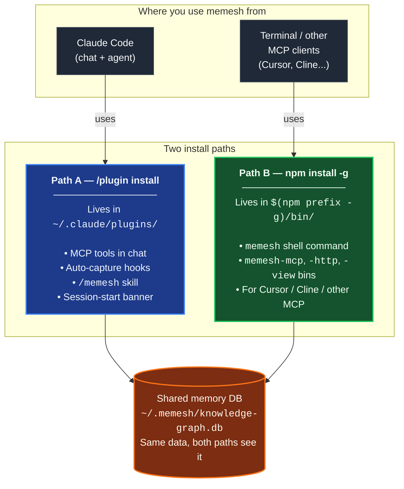
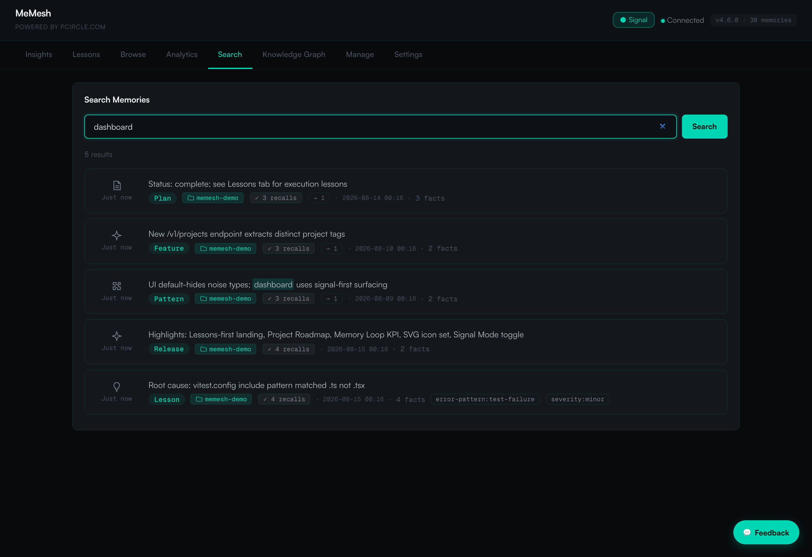
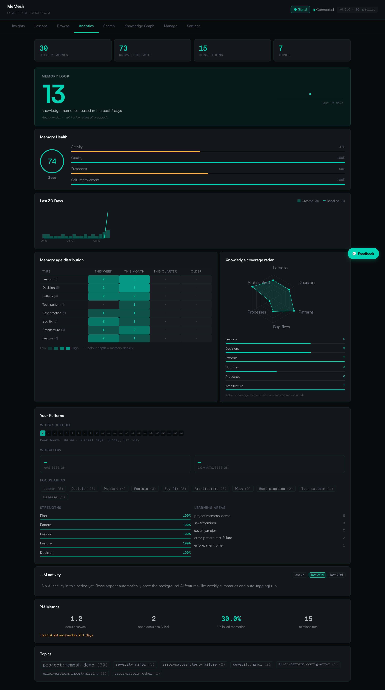
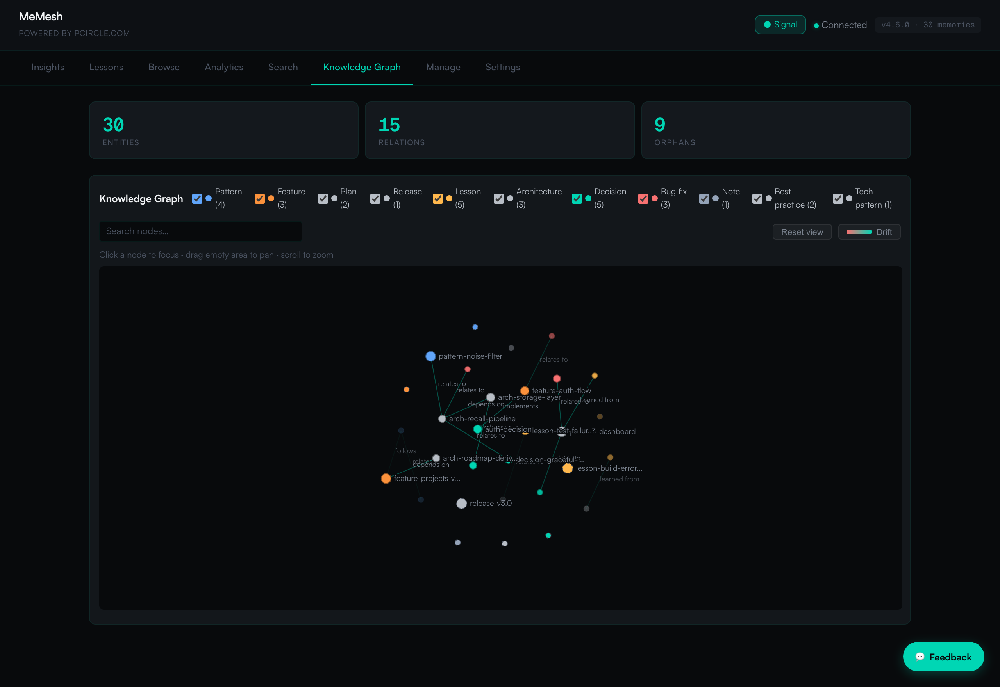

🌐 [English](README.md) | [繁體中文](README.zh-TW.md) | [简体中文](README.zh-CN.md) | [日本語](README.ja.md) | [한국어](README.ko.md) | [Português](README.pt.md) | [Français](README.fr.md) | [Deutsch](README.de.md) | [Tiếng Việt](README.vi.md) | [Español](README.es.md) | [ภาษาไทย](README.th.md)

<p align="center">
  <h1 align="center">MeMesh LLM Memory</h1>
  <p align="center">
    <strong>Mémoire locale pour Claude Code et les agents de codage MCP.</strong><br />
    Un fichier SQLite. Aucun Docker. Aucun cloud requis.
  </p>
  <p align="center">
    <a href="https://www.npmjs.com/package/@pcircle/memesh"></a>
    <a href="LICENSE"></a>
    <a href="https://nodejs.org"></a>
    <a href="https://modelcontextprotocol.io"></a>
  </p>
</p>

---

> [!IMPORTANT]
> **Projet en développement actif** — les fonctionnalités évoluent continuellement et peuvent changer entre les versions. En cas de bug ou de demande de fonctionnalité, merci d'[ouvrir une issue](https://github.com/PCIRCLE-AI/memesh-llm-memory/issues).

## Le Problème

Votre agent de codage oublie ce qui s'est passé d'une session à l'autre. Chaque décision architecturale, correction de bug, test échoué et leçon apprise difficilement doit être réexpliquée. Claude Code redémarre à zéro, redécouvre les anciennes contraintes et gaspille du contexte sur des éléments qu'il devrait déjà connaître.

**MeMesh offre aux agents de codage une mémoire locale persistante, consultable et évolutive.**

Ce package constitue la couche de mémoire locale de la famille de produits MeMesh. Il est volontairement léger et open-source : installez-le avec npm, conservez votre mémoire dans `~/.memesh/knowledge-graph.db` et connectez-le à Claude Code ou à tout client compatible MCP. Les produits d'espace de travail hébergé et les systèmes d'exploitation d'entreprise doivent rester distincts de ce README et de la feuille de route du package.

---

## Preuve — 95,60 % R@5 sur LongMemEval-S

Le moteur de récupération de MeMesh utilise **FTS5 seul** (pas de LLM, pas d'embeddings sur le chemin chaud), mesuré sur le benchmark public [LongMemEval-S](https://huggingface.co/datasets/xiaowu0162/longmemeval) (500 questions, licence MIT) :

| Système | R@5 | Source |
|---|---|---|
| **MeMesh (Mode A, via `recallEnhanced()`)** | **95,60 %** | [benchmarks/longmemeval/RESULTS.md](benchmarks/longmemeval/RESULTS.md) |
| MemPalace | 96,6 % | Auto-déclaration de l'éditeur |
| Supermemory | ~82 % | Estimation de l'éditeur |
| Zep | 63,8 % | Article LongMemEval |
| Mem0 | 49,0 % | Article LongMemEval |

Les commandes de reproduction, le SHA256 du jeu de données, les résultats bruts par question et l'analyse des échecs connus se trouvent tous dans [`benchmarks/longmemeval/`](benchmarks/longmemeval/). Réexécutable en environ 10 secondes.

---

## Aperçu des chemins d'installation

MeMesh a **deux chemins d'installation coexistants**. La plupart des utilisateurs veulent les deux. Ils écrivent dans la **même base de données mémoire** (`~/.memesh/knowledge-graph.db`), donc les mémoires capturées dans Claude Code apparaissent dans votre shell, et vice versa.



**Lequel vous faut-il ?**

| Ce que vous voulez faire | Chemin d'installation |
|---|---|
| Utiliser le skill `/memesh` dans une conversation Claude Code | Path A (plugin) |
| Auto-capture dans Claude Code (session → leçons → recall suivant) | Path A (plugin) |
| Exécuter `memesh remember` / `memesh recall` / `memesh doctor` dans n'importe quel terminal | Path B (npm-global) |
| Ouvrir le dashboard via `memesh serve` (sans délai de démarrage `npx`) | Path B (npm-global) |
| Brancher `memesh-mcp` à Cursor, Cline ou un autre client MCP | Path B (npm-global) |
| Tout ce qui précède | **Installez les deux** — ils ne sont pas en conflit |

> **Confusion courante** : le plugin Claude Code **ne** met **pas** `memesh` sur votre `PATH` shell. Si vous lancez seulement `/plugin install` puis tapez `memesh reindex` dans un terminal, vous verrez `command not found`. C'est normal — il faut aussi `npm install -g @pcircle/memesh` pour l'accès shell.

### ⚠️ Installer le plugin n'installe PAS le CLI

C'est la confusion la plus fréquente. Lisez ceci une fois et vous gagnerez du temps plus tard :

- `/plugin install memesh@pcircle-memesh` depuis Claude Code → installe **uniquement Path A**. Vous obtenez les outils MCP, les hooks, le skill `/memesh`. `memesh` n'est **PAS** ajouté à votre `PATH` shell.
- `memesh reindex` / `memesh update` / `memesh doctor` dans un terminal → nécessite **Path B** (npm-global). Sans : `zsh: command not found: memesh`.
- **Configuration recommandée pour les utilisateurs Claude Code** : **installez les deux**. Coexistent, partagent la même base de données, aucun conflit.

```bash
# Après /plugin install ..., exécutez aussi ceci :
npm install -g @pcircle/memesh
```

Si vous utilisez memesh uniquement via le chat Claude Code (jamais `memesh` dans un terminal), Path A suffit. Tous les autres : installez les deux.

---

## Démarrer en 60 Secondes

### Étape 1 : Installer

```bash
npm install -g @pcircle/memesh
```

### Étape 1,5 : Connecter MeMesh à Claude Code (recommandé, une seule fois)

`npm install -g` place la CLI dans le PATH et enregistre le serveur MCP, mais **ne connecte pas** automatiquement les hooks de session MeMesh à Claude Code. Sans ces hooks, vous pouvez utiliser `memesh remember` / `recall` manuellement, mais la **boucle d'auto-capture** (session → leçons → rappel proactif à la session suivante) reste silencieuse.

```bash
memesh install-hooks         # ajoute les hooks memesh à ~/.claude/settings.json
memesh doctor                # vérifie que « Hooks wired into Claude Code » passe
```

Ces hooks coexistent avec vos hooks personnalisés dans `~/.claude/hooks/` — `install-hooks` écrit de manière additive et n'écrase jamais les vôtres. Pour supprimer : `memesh uninstall-hooks`.

### Étape 2 : Mémoriser une décision

```bash
memesh remember --name "auth-decision" --type "decision" --obs "Use OAuth 2.0 with PKCE"
```

### Étape 3 : La rappeler plus tard

```bash
memesh recall "login security"
# → Trouve "OAuth 2.0 with PKCE" même si vous avez cherché des mots différents
```

**C'est tout.** MeMesh mémorise et rappelle désormais d'une session à l'autre.

Pour vérifier l'installation et la connexion locale de bout en bout :

```bash
memesh doctor
```

Ouvrez le tableau de bord pour explorer votre mémoire :

```bash
memesh serve
```

<p align="center">
  
</p>

<p align="center">
  
</p>

<p align="center">
  
</p>

---

## À Qui S'Adresse-T-Il ?

| Si vous êtes... | MeMesh vous aide à... |
|---|---|
| **Un développeur utilisant Claude Code** | Rappeler automatiquement les décisions du projet, les leçons spécifiques aux fichiers et les échecs passés au fur et à mesure du travail |
| **Un utilisateur avancé d'agent de codage** | Partager une couche de mémoire locale unique sur les outils compatibles MCP |
| **Une équipe expérimentant les workflows de codage IA** | Exporter/importer les connaissances du projet sans infrastructure hébergée |
| **Un développeur d'agent** | Ajouter la mémoire locale via MCP, HTTP ou la CLI |

---

## Conçu d'Abord Pour Les Agents De Codage

<table>
<tr>
<td width="33%" align="center">

**Claude Code / Desktop**
```bash
memesh-mcp
```
Outils MCP + hooks Claude Code

</td>
<td width="33%" align="center">

**N'Importe Quel Client HTTP**
```bash
curl localhost:3737/v1/recall \
  -H "Content-Type: application/json" \
  -d '{"query":"auth"}'
```
`memesh serve` (REST API)

</td>
<td width="33%" align="center">

**N'Importe Quel LLM (Format OpenAI)**
```bash
memesh export-schema \
  --format openai
```
Collez les outils dans n'importe quel appel API

</td>
</tr>
</table>

---

## Pourquoi Pas OpenMemory, Cursor Memories, Mem0 Ou Zep ?

| | **MeMesh** | OpenMemory | Cursor Memories | Mem0 | Zep / Graphiti |
|---|---|---|---|---|---|
| **Meilleur usage** | Mémoire locale pour agents de codage | Mémoire MCP locale/multi-client | Mémoire de projet Cursor native | Mémoire d'app/agent gérée | Graphes de connaissances temporels |
| **Installation** | `npm install -g @pcircle/memesh` | App/serveur local | Intégré à Cursor | API Cloud / SDK / MCP | Configuration service/framework |
| **Stockage** | Un seul fichier SQLite local | Pile de mémoire locale | Règles/mémoires gérés par Cursor | Stack hébergée ou auto-hébergée | Base de données graphe |
| **Cloud requis** | Non | Non pour le mode local | Dépend du compte/paramètres Cursor | Oui pour la plateforme | Généralement oui/auto-hébergée |
| **Hooks Claude Code** | Première classe | Outils MCP | Non | Outils MCP | Pas spécifique à Claude Code |
| **Tableau de bord** | Intégré | Intégré | Paramètres Cursor | Tableau de bord plateforme | Outils plateforme/graphe |
| **Tradeoff** | Coin simple et local, non adapté à l'échelle entreprise | Empreinte app locale plus large | Verrouillé à Cursor | Plateforme gérée puissante, moins local-first | Modèle graphe puissant, configuration plus lourde |

**MeMesh sacrifie l'infrastructure gérée à l'échelle entreprise pour une installation locale instantanée, un stockage inspectable et des hooks de workflow spécifiques aux agents de codage.**

---

## Ce Qui Se Passe Automatiquement Dans Claude Code

Vous n'avez pas besoin de tout mémoriser manuellement. MeMesh possède **7 hooks** qui capturent et injectent les connaissances au fur et à mesure que vous travaillez :

| Quand | Ce que MeMesh fait |
|---|---|
| **Au début de chaque session** | Charge vos mémoires les plus pertinentes + avertissements proactifs des leçons passées + banneau d'orchestration agentique |
| **Avant d'éditer des fichiers** | Rappelle les mémoires liées au fichier ou au projet avant que Claude ne rédige du code |
| **Avant les commandes bash** | Encourage Claude à dispatcher les commandes très vérifiables (test, build, lint, migrate, deploy, benchmark) en tant qu'agents de fond |
| **Lorsque vous demandez de mémoriser** | Détecte l'intention "remember this" / "記下來" et rappelle à Claude d'écrire en double (memesh + MEMORY.md) |
| **Après chaque `git commit`** | Enregistre ce que vous avez modifié, avec les statistiques de diff |
| **Quand Claude s'arrête** | Capture les fichiers édités, les erreurs corrigées et génère automatiquement des leçons structurées à partir des défaillances |
| **Avant la compaction de contexte** | Sauvegarde les connaissances avant qu'elles ne soient perdues aux limites de contexte |

> **Refuser à tout moment :** `export MEMESH_AUTO_CAPTURE=false`

---

## Configuration

Toute la configuration passe par des variables d'environnement. Les valeurs par défaut sont strictement locales et sans accès réseau — vous n'avez rien à définir pour obtenir un système fonctionnel.

| Variable | Défaut | Effet |
|---|---|---|
| `MEMESH_DB_PATH` | `~/.memesh/knowledge-graph.db` | Remplace l'emplacement de la base SQLite. |
| `MEMESH_AUTO_CAPTURE` | `true` | Désactive entièrement les hooks d'auto-capture (`Stop`, `PreCompact`). |
| `MEMESH_AUTO_DETECT_LLM` | non défini (détection auto **activée**) | Mettre à `0` pour empêcher memesh d'utiliser une clé API trouvée dans l'environnement du shell. Par défaut, si `ANTHROPIC_API_KEY` / `OPENAI_API_KEY` / `OLLAMA_HOST` est définie et qu'aucun fournisseur n'est configuré dans `~/.memesh/config.json`, memesh l'utilise pour les fonctions LLM d'écriture (extraction de leçons, auto-tagging, dream). Les embeddings ne sont pas affectés — ils restent en ONNX local (384-dim) sauf si vous définissez explicitement `embedder.provider`. |
| `MEMESH_ENABLE_AGENTIC_ORCHESTRATION` | non défini | Mettre à `1` pour activer un protocole de modèle de travail expérimental (cadre CTO / Orchestrateur / Agents). Ajoute une bannière en début de session, un nudge sur les commandes Bash et la télémétrie `verify_agent_work`. L'efficacité du protocole est instrumentée mais pas encore prouvée — activez-la si vous souhaitez participer. **Désactivé par défaut** : les fonctionnalités de mémoire principales fonctionnent sans ce flag. |
| `MEMESH_AUTO_UPDATE` | `off` | Politique de mise à jour automatique. `off` (défaut) ne met jamais à jour automatiquement ; `patch` autorise `X.Y.Z → X.Y.Z+N` ; `minor` ajoute `X.Y.Z → X.Y+1.0` ; `major` autorise tout incrément. Quand c'est permis, un `npm install -g` détaché s'exécute en fin de session (hook Stop) pour ne jamais bloquer votre travail — les résultats arrivent dans `~/.memesh/auto-update.log`. Configurable aussi via `autoUpdate` dans `~/.memesh/config.json` (la variable d'environnement l'emporte). Quand la version installée est dépréciée par les mainteneurs (alerte de sécurité), `patch` est forcé même en `off` — les incréments minor / major restent manuels pour éviter une dérive de comportement silencieuse. |
| `OPENAI_API_KEY` | non défini | Votre clé OpenAI. Utilisée automatiquement pour les fonctions LLM sauf si vous mettez `MEMESH_AUTO_DETECT_LLM=0` ou configurez un fournisseur explicitement. |
| `OLLAMA_HOST` | `http://localhost:11434` | Remplace l'endpoint Ollama lors de l'utilisation d'un fournisseur Ollama local. |

`memesh doctor` affiche la configuration résolue pour que vous puissiez voir ce qui est actif.

Lorsque npm signale une version installée comme dépréciée (typiquement une alerte de sécurité), le prochain démarrage de session ajoute en tête une bannière forte `⚠️ MeMesh <ver> is DEPRECATED` et `memesh update-status` affiche la même ligne jusqu'à la mise à jour. La vérification est mise en cache dans `~/.memesh/update-check.<version>.json` pour qu'une panne réseau transitoire ne puisse pas atténuer l'avertissement.

---

## Tableau De Bord

8 onglets, 11 langues, zéro dépendance externe. Accessible à `http://localhost:3737/dashboard` quand le serveur s'exécute.

| Onglet | Ce que vous voyez |
|---|---|
| **Insights** | Insights mémoire — résumés hebdomadaires et propositions de patterns du moteur dreamer ; accepter/rejeter en un clic |
| **Recherche** | Recherche par texte intégral + similarité vectorielle sur toutes les mémoires |
| **Parcourir** | Liste paginée de toutes les entités avec archivage/restauration |
| **Analytics** | Score de santé de la mémoire, frise chronologique 30 jours, vélocité PM + métriques de connectivité KG, motifs de travail, suggestions de nettoyage |
| **Graphe** | Graphe de connaissances force-directed interactif avec filtres de type, recherche, mode ego, carte thermique de récence |
| **Leçons** | Leçons structurées tirées des défaillances passées (erreur, cause racine, correctif, prévention) |
| **Gérer** | Archivez et restaurez les entités |
| **Paramètres** | Configuration du fournisseur LLM, sélecteur de langue instantané |

---

## Fonctionnalités Intelligentes

**🧠 Recherche Intelligente** — Cherchez « sécurité login » et trouvez des mémoires sur « OAuth PKCE ». MeMesh combine FTS5 et la similarité vectorielle sqlite-vec pour trouver des mémoires sémantiquement liées sans LLM sur le chemin chaud.

**🌏 Recherche dans les écritures sans espaces entre les mots** — Le chinois, le japonais, le coréen, le thaï, le lao, le khmer et les katakana demi-chasse sont indexés par paires de caractères qui se chevauchent. Un souvenir écrit 「資料庫遷移前一定要先備份」 se retrouve donc en cherchant 「備份」, et pas seulement par son texte intégral exact. Le texte est normalisé (NFC) à l'écriture comme à la recherche : un souvenir saisi sur macOS ou avec une méthode de saisie coréenne ou vietnamienne se retrouve dans les deux graphies.

**📊 Classement Avec Score** — Les résultats sont classés par pertinence (30 %) + récence (25 %) + fréquence (18 %) + confiance (17 %) + impact de rappel (10 %).

**🔄 Évolution Des Connaissances** — Les décisions changent. `forget` archive les anciennes mémoires (jamais supprimer). Les relations `supersedes` relient ancien → nouveau. Votre IA voit toujours la version la plus récente.

**⚠️ Détection De Conflits** — Si vous avez deux mémoires qui se contredisent, MeMesh vous avertit.

**🕸️ Connectivité du graphe de connaissances** — `memesh kg backfill-relations --all-rules` relie les entités orphelines par cooccurrence de tags, clustering de projets, contexte de session et similarité de noms — sans LLM.

**📦 Partage D'Équipe** — `memesh export > team-knowledge.json` → partagez avec votre équipe → `memesh import team-knowledge.json`
Les bundles importés restent consultables, mais MeMesh n'injecte pas automatiquement les mémoires importées dans les hooks Claude jusqu'à ce que vous les examiniez ou les rémémorisiez localement.

---

## Exemple D'Utilisation

> « MeMesh s'est souvenu que nous avions choisi PKCE plutôt que le flux implicite il y a trois semaines. Quand j'ai demandé à Claude à nouveau sur l'auth, il le savait déjà — pas besoin de réexpliquer. »
> — **Développeur seul, construisant une SaaS**

> « Nous exportons la mémoire de notre équipe tous les vendredis et l'importons le lundi. Chaque Claude de l'équipe commence la semaine en sachant ce que l'équipe a appris la semaine précédente. »
> — **Startup à 3 personnes, base de connaissances partagée**

> « Le tableau de bord m'a montré que 90 % de mes mémoires étaient des journaux de session auto-générés. J'ai commencé à utiliser `remember` délibérément pour les décisions architecturales. Un changement radical. »
> — **Développeur qui a découvert l'onglet Analytics**

---

## Déverrouiller Le Mode Smart (Optionnel)

MeMesh fonctionne hors ligne par défaut — le rappel reste strictement sans LLM (95,60 % R@5 sur LongMemEval-S dès l'installation). Ajoutez une clé API LLM uniquement si vous voulez des flux d'analyse augmentés par LLM par-dessus : extraction de session plus intelligente, auto-tagging des nouvelles mémoires, génération de leçons depuis les défaillances et compression `dream` :

```bash
memesh config set llm.provider anthropic
memesh config set llm.api-key sk-ant-...
```

Ou utilisez l'onglet Settings du tableau de bord (configuration visuelle) :

```bash
memesh serve  # ouvre le tableau de bord → onglet Settings
```

### Utilisez vos propres embeddings (optionnel)

Les embeddings utilisent par défaut un modèle ONNX local (`Xenova/all-MiniLM-L6-v2`, 384-dim) — aucune clé API, rien ne quitte votre machine, et le recall FTS5 par défaut n'en a pas besoin. Pour utiliser un embedder hébergé ou de serveur local :

```bash
memesh config set embedder.provider openai          # or: ollama
memesh config set embedder.model text-embedding-3-small
```

L'embedder se configure **indépendamment du LLM de chat** — changer `llm.provider` ne change jamais silencieusement vos embeddings. Si vous passez à une dimension différente (p. ex. 384 → 1536), MeMesh reconstruit l'index vectoriel automatiquement à la prochaine écriture. Valeurs `embedder.provider` prises en charge : `onnx` (par défaut, local), `openai`, `ollama`.

| | Niveau 0 (défaut) | Niveau 1 (Mode Smart) |
|---|---|---|
| **Recherche** | FTS5 + sqlite-vec, 95,60 % R@5 (~4 ms par rappel) | inchangé — le rappel est sans LLM à tous les niveaux |
| **Auto-capture** | Motifs basés sur les règles | + LLM extrait les décisions & leçons |
| **Auto-tagging** | Tags manuels uniquement | + LLM génère des tags pour les nouvelles mémoires |
| **Analyse de défaillance** | Indisponible | + LLM convertit les erreurs de session en leçons structurées |
| **Compression** | Indisponible | `dream` compressent les mémoires verbeux |
| **Coût** | Gratuit, aucune clé API | ~$0,0001 par appel d'analyse (Haiku) |

---

## Les 9 Outils De Mémoire

| Outil | Ce qu'il fait |
|---|---|
| `remember` | Stocker les connaissances avec observations, relations et tags |
| `recall` | Recherche FTS5 + sqlite-vec avec notation multi-facteurs (pertinence, récence, fréquence, confiance, impact de rappel) — pas de LLM sur le chemin chaud |
| `forget` | Soft-archivage (jamais supprimer) ou suppression d'observations spécifiques |
| `export` | Partager les mémoires au format JSON entre projets ou membres d'équipe |
| `import` | Importer les mémoires avec stratégies de fusion (skip / overwrite / append) |
| `learn` | Enregistrer les leçons structurées à partir des erreurs (erreur, cause racine, correctif, prévention) |
| `user_patterns` | Analyser vos motifs de travail — planning, outils, forces, domaines d'apprentissage |
| `verify_agent_work` | Persister un rapport de vérification pour le travail d'agent de fond ; reality-check les modifications de fichier revendiquées contre `git diff` |

---

## Architecture

```
                    ┌─────────────────┐
                    │   Core Engine   │
                    │  (8 operations) │
                    └────────┬────────┘
           ┌─────────────────┼─────────────────┐
           │                 │                 │
     CLI (memesh)    HTTP API (serve)    MCP (memesh-mcp)
           │                 │                 │
           └─────────────────┼─────────────────┘
                             │
                    SQLite + FTS5 + sqlite-vec
                    (~/.memesh/knowledge-graph.db)
```

Le cœur est agnostique du framework. La même logique s'exécute depuis le terminal, HTTP ou MCP.

---

## Mise à Jour

Le plugin marketplace de Claude Code fige les versions à l'installation et **ne** se met **pas** à jour automatiquement. Pour récupérer une nouvelle version :

**Option A — Interface `/plugin`** : désinstaller `memesh@pcircle-memesh`, puis réinstaller. Claude Code récupère la dernière version du marketplace.

**Option B — Script en une ligne** (sans cliquer dans l'UI, idempotent) :

```bash
# Si votre plugin est en v4.2.5 ou plus récent, le script est embarqué :
bash ~/.claude/plugins/cache/pcircle-memesh/memesh/<current-version>/scripts/upgrade-plugin.sh

# Si vous avez installé avant v4.2.5 (c.-à-d. v4.2.4 ou v4.2.3),
# le script n'est pas encore dans votre plugin. Utilisez la copie npm-global :
bash "$(npm prefix -g)/lib/node_modules/@pcircle/memesh/scripts/upgrade-plugin.sh"

# (Cela suppose que vous avez aussi exécuté `npm install -g @pcircle/memesh`. Sinon,
# c'est le bon moment — voir la section « Aperçu des chemins d'installation »
# ci-dessus pour comprendre pourquoi la plupart des utilisateurs veulent les deux.)
```

Le script fast-forward le cache marketplace, place la nouvelle version dans `~/.claude/plugins/cache/`, installe les runtime deps, et repointe `installed_plugins.json`. Redémarrez Claude Code ensuite pour que le serveur MCP se reconnecte.

**Les installations npm-global** (`npm install -g @pcircle/memesh`) peuvent s'auto-mettre à jour via `memesh update`. Source checkouts : `git pull && npm install && npm run build`.

Au démarrage de session, une bannière sur une ligne s'affiche (limitée à une fois par 24h par version) quand une nouvelle version est disponible, et `memesh doctor` indique la cible de mise à jour avec la commande adaptée au canal.

---

## Contribuer

```bash
git clone https://github.com/PCIRCLE-AI/memesh-llm-memory
cd memesh-llm-memory && npm install && npm run build
npm test
npm run test:e2e-dashboard
```

Tableau de bord : `cd dashboard && npm install && npm run dev`

---

<p align="center">
  <strong>MIT</strong> — Créé par <a href="https://pcircle.com">PCIRCLE AI</a>
</p>
