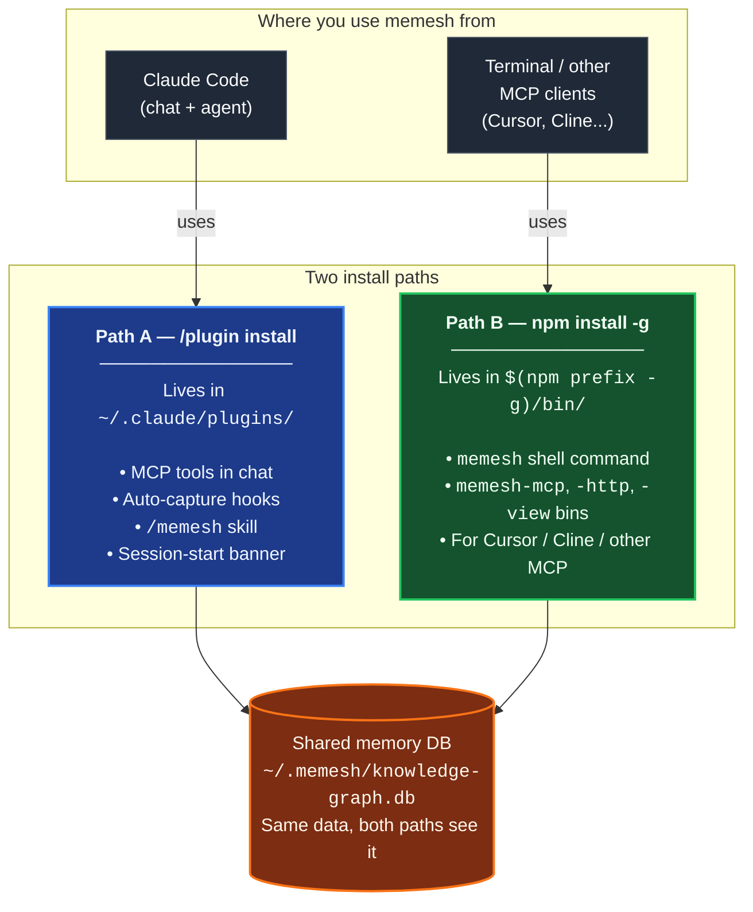

🌐 [English](README.md) | [繁體中文](README.zh-TW.md) | [简体中文](README.zh-CN.md) | [日本語](README.ja.md) | [한국어](README.ko.md) | [Português](README.pt.md) | [Français](README.fr.md) | [Deutsch](README.de.md) | [Tiếng Việt](README.vi.md) | [Español](README.es.md) | [ภาษาไทย](README.th.md)

<p align="center">
  <h1 align="center">MeMesh</h1>
  <p align="center">
    <strong>코딩 에이전트를 위한 에이전틱 메모리.</strong><br />
    SQLite 파일 하나. Docker 없음. 클라우드 필수 아님.
  </p>
  <p align="center">
    <a href="https://www.npmjs.com/package/@pcircle/memesh"></a>
    <a href="LICENSE"></a>
    <a href="https://nodejs.org"></a>
    <a href="https://modelcontextprotocol.io"></a>
  </p>
</p>

---

> [!IMPORTANT]
> **활발히 개발 중인 프로젝트** — 기능이 지속적으로 업데이트되며 릴리스 간에 변경될 수 있습니다. 버그나 기능 요청이 있으면 [issue를 열어주세요](https://github.com/PCIRCLE-AI/memesh-llm-memory/issues).

**MeMesh** — Claude Code와 MCP 코딩 에이전트를 위한 오픈소스 **에이전틱 메모리**: 에이전트의 실제 작업에서 캡처되고, 에이전트가 행동하는 순간에 주입되며, 스스로 모순될 때 정직하게 바로잡힙니다. SQLite 파일 하나. 클라우드 없음.

## 문제점

코딩 에이전트는 세션 사이에 사실만 잊어버리는 게 아니라 **작업을 반복합니다**. 지난달에 거절한 접근 방식을 다시 제안하고, 같은 실패하는 테스트에 다시 걸려 넘어지고, 3월에 프로덕션을 망가뜨린 제약 조건을 다시 발견하며, 자신이 설계를 도운 아키텍처를 다시 설명해 달라고 요청합니다.

이것은 채팅 기록의 문제가 아니라 에이전트 메모리의 문제입니다. 세션 사이에 살아남아야 하는 것은 *작업* 그 자체입니다: 이유가 담긴 결정, 수정 방법이 담긴 실패, 그리고 이들 사이의 연결 고리입니다.

**MeMesh가 바로 그 메모리입니다.** 훅이 에이전트가 실제로 수행하는 일(세션, 커밋, 실패 — 수동 메모가 아님)에서 메모리를 캡처하고, 회상이 에이전트가 행동하는 순간(세션 시작, 파일 편집 전)에 주입하며, 지식 그래프 레이어가 시간이 지나도 정직하게 유지합니다(대체(supersession), LLM이 판정하는 충돌 감지). npm으로 설치하고, 메모리는 `~/.memesh/knowledge-graph.db`에 보관하며, Claude Code 또는 MCP 호환 클라이언트와 연결합니다.

---

## 설치 경로 한눈에 보기

MeMesh에는 **공존하는 두 가지 설치 경로**가 있습니다. 대부분의 사용자는 둘 다 필요합니다. 동일한 **메모리 데이터베이스**(`~/.memesh/knowledge-graph.db`)에 기록되므로 Claude Code 채팅에서 저장한 기억이 셸에서도 보이고 그 반대도 마찬가지입니다.



**어느 쪽이 필요한가요?**

| 하고 싶은 일 | 설치 경로 |
|---|---|
| Claude Code 대화에서 `/memesh` skill 사용 | Path A(플러그인) |
| Claude Code에서 자동 캡처(session → 교훈 → 다음 recall) | Path A(플러그인) |
| 터미널에서 `memesh remember` / `memesh recall` / `memesh doctor` 실행 | Path B(npm-global) |
| `memesh serve`로 대시보드 바로 열기(`npx` 시작 지연 없음) | Path B(npm-global) |
| `memesh-mcp`를 Cursor, Cline 또는 기타 MCP 클라이언트에 연결 | Path B(npm-global) |
| 위 전부 | **둘 다 설치** — 충돌 없음 |

> **흔한 오해**: Claude Code 플러그인은 `memesh`를 셸 `PATH`에 **추가하지 않습니다**. `/plugin install`만 실행하고 터미널에 `memesh reindex`를 입력하면 `command not found`가 나옵니다. 정상입니다 — 셸 명령을 쓰려면 `npm install -g @pcircle/memesh`도 실행해야 합니다.

### ⚠️ 플러그인 설치만으로는 CLI가 설치되지 않습니다

가장 흔한 혼란입니다. 한 번만 읽어두면 됩니다:

- Claude Code에서 `/plugin install memesh@pcircle-memesh` → **Path A만** 설치. MCP 도구, hooks, `/memesh` skill을 제공. `memesh`를 셸 `PATH`에 **추가하지 않음**.
- 터미널에서 `memesh reindex` / `memesh update` / `memesh doctor` 입력 → **Path B**(npm-global)가 필요. 없으면 `zsh: command not found: memesh`.
- **Claude Code 사용자 권장 설정**: **둘 다 설치**. 공존하며 동일한 데이터베이스를 공유하고 충돌하지 않습니다.

```bash
# /plugin install ... 후에 이것도 실행:
npm install -g @pcircle/memesh
```

Claude Code 대화에서만 memesh를 사용한다면(터미널에서 `memesh`를 입력하지 않는다면) Path A만으로 충분합니다. 나머지는 둘 다 설치하세요.

---

## 60초 안에 시작하기

### 옵션 A — Claude Code 플러그인 (한 줄 설치)

Claude Code를 사용한다면 CLI 안에서 MeMesh를 플러그인으로 설치합니다:

```
/plugin marketplace add PCIRCLE-AI/memesh-llm-memory
/plugin install memesh@pcircle-memesh
```

Claude Code가 훅, 스킬, MCP 서버를 자동으로 연결합니다. 세션 내 자동 캡처, 능동적 회상, Claude Code 대화 내 `/memesh` 스킬(remember / recall / learn / forget), 그리고 에이전트가 사용할 수 있는 MCP 도구 `remember` / `recall` / `forget` / `learn`을 모두 얻을 수 있습니다. CLI와 로컬 대시보드도 추가 글로벌 설치 없이 완전히 접근 가능합니다 — `npx @pcircle/memesh <command>`로 모든 CLI 명령을 실행하고, `npx @pcircle/memesh`로 `localhost:3737`의 대시보드를 시작합니다. MCP 서버는 플러그인에 번들된 컴파일 결과물에서 직접 실행됩니다 — `npx` 조회, `npm install -g`, 빌드 단계가 모두 필요 없습니다. memesh는 Node에 내장된 `node:sqlite`(22.13+)에 데이터를 저장하므로, Node를 업그레이드해도 잘못된 런타임용으로 빌드된 바이너리가 남지 않습니다.

### 옵션 B — npm 글로벌 (선택적 최적화)

바이너리를 셸 `PATH`에 직접 두고 싶거나(매 호출마다 `npx` 조회 없이 모든 터미널에서 단순 `memesh`, `memesh-mcp` 등이 작동), `memesh-mcp`를 **Claude Code 이외의 MCP 클라이언트**(Cursor, Cline, 터미널 전용 워크플로우)에 고정 경로 stdio 명령으로 노출하고 싶다면:

```bash
npm install -g @pcircle/memesh
```

> **첫 설치 안내(일회성):**
> - **컴파일러가 필요 없습니다** — 데이터베이스 엔진은 Node 자체의 `node:sqlite`입니다. 의미 기반 검색을 담당하는 `sqlite-vec`는 macOS(arm64/x64), Linux(x64/arm64), Windows x64용 사전 빌드 파일로 제공됩니다. 그 외 플랫폼에서는 그냥 없으며, 회상은 키워드 검색으로 유지됩니다. 여기에는 설치 스크립트를 실행하는 것이 전혀 없으므로 `npm install --ignore-scripts`로도 완전히 동작하는 memesh가 설치됩니다.
> - **시맨틱 검색은 선택 사항** — 기본 검색 경로는 키워드 검색(FTS5)으로, 모델도 다운로드도 필요 없습니다. 의미 기반 검색에는 임베더가 필요합니다: 로컬에서 [Ollama](https://ollama.com)를 실행하거나 클라우드 임베더를 구성하세요(아래 "임베딩" 참조). 없으면 memesh는 키워드 검색만 사용합니다.

### 1.5단계: MeMesh를 Claude Code에 연결 (npm 경로만)

**옵션 A**(`/plugin install memesh@pcircle-memesh`)로 설치했다면, 이 단계를 건너뜁니다 — Claude Code가 플러그인 훅을 자동으로 연결합니다.

**옵션 B**(`npm install -g`)로 설치했다면, CLI는 PATH에 있고 MCP 서버는 등록되지만, Claude Code 세션 훅은 자동으로 연결되지 않습니다. 훅이 없으면 `memesh remember` / `recall`을 수동으로 사용할 수 있지만, **자동 캡처 루프**(세션 → 교훈 → 다음 세션에서 회상)는 작동하지 않습니다.

```bash
memesh install-hooks         # ~/.claude/settings.json에 memesh 훅 추가
memesh doctor                # "Hooks wired into Claude Code" PASS 확인
```

이 훅들은 기존 `~/.claude/hooks/` 사용자 훅과 공존합니다 — `install-hooks`는 추가 방식으로 작성하며 기존 항목을 덮어쓰지 않습니다. 제거하려면: `memesh uninstall-hooks`.

### 2단계: 의사결정 저장

> 아래 bash 예제는 `memesh`가 `PATH`에 있다고 가정합니다(옵션 B). 옵션 A(플러그인 전용) 사용자는 두 가지 동등한 경로가 있습니다: Claude Code 대화에서 직접 요청하거나(`/memesh` 스킬 + MCP 도구가 동일한 흐름을 커버), 셸에서 `memesh`를 `npx @pcircle/memesh`로 대체합니다 — 동일한 플래그, 글로벌 설치 불필요.

```bash
memesh remember "Use OAuth 2.0 with PKCE for the new auth"
```

또는 나중에 필터링할 수 있도록 안정적인 이름과 타입을 원하면 명시적 형식을 사용합니다:

```bash
memesh remember --name "auth-decision" --type "decision" --obs "Use OAuth 2.0 with PKCE"
```

### 3단계: 나중에 회상

```bash
memesh recall "login security"
# → 다른 단어를 검색했어도 "OAuth 2.0 with PKCE"를 찾습니다
```

**이게 전부입니다.** MeMesh가 이제 세션 간에 기억하고 회상합니다.

설치와 로컬 연결을 엔드 투 엔드로 확인하려면:

```bash
memesh doctor
```

대시보드를 열어서 메모리를 탐색합니다:

```bash
memesh serve
```

<p align="center">
  
</p>

<p align="center">
  
</p>

<p align="center">
  
</p>

---

## 누가 사용할까요?

| 이런 개발자라면 | MeMesh가 도와줍니다 |
|---|---|
| **Claude Code를 사용 중** | 프로젝트 결정, 파일별 교훈, 과거 실패를 작업 중에 자동으로 회상 |
| **코딩 에이전트 파워 유저** | MCP 호환 도구 전체에서 하나의 로컬 메모리 레이어 공유 |
| **팀이 AI 코딩 워크플로우 실험 중** | 호스팅 인프라 도입 없이 프로젝트 지식 내보내기/가져오기 |
| **에이전트 개발자** | MCP, HTTP, CLI를 통해 로컬 메모리 추가 |

---

## 코딩 에이전트를 우선으로 설계

<table>
<tr>
<td width="33%" align="center">

**Claude Code / Desktop**
```bash
memesh-mcp
```
MCP 도구 + Claude Code 훅

</td>
<td width="33%" align="center">

**모든 HTTP 클라이언트**
```bash
curl localhost:3737/v1/recall \
  -H "Content-Type: application/json" \
  -d '{"query":"auth"}'
```
`memesh serve` (REST API)

</td>
<td width="33%" align="center">

**모든 LLM (OpenAI 형식)**
```bash
memesh export-schema \
  --format openai
```
모든 API 호출에 도구 붙여넣기

</td>
</tr>
</table>

---

## OpenMemory, Cursor Memories, Mem0, Zep와는 왜 다를까요?

| | **MeMesh** | OpenMemory | Cursor Memories | Mem0 | Zep / Graphiti |
|---|---|---|---|---|---|
| **최적화 대상** | 코딩 에이전트 로컬 메모리 | 로컬/크로스 클라이언트 MCP 메모리 | Cursor 네이티브 프로젝트 메모리 | 관리형 앱/에이전트 메모리 | 시계열 지식 그래프 |
| **설치 방식** | `npm install -g @pcircle/memesh` | 로컬 앱/서버 흐름 | Cursor 내장 | 클라우드 API / SDK / MCP | 서비스/프레임워크 구성 |
| **저장소** | 로컬 SQLite 파일 하나 | 로컬 메모리 스택 | Cursor 관리 규칙/메모리 | 호스팅 또는 셀프 호스팅 스택 | 그래프 데이터베이스 |
| **클라우드 필수** | 아니오 | 로컬 모드는 아니오 | Cursor 계정/설정에 따라 | 플랫폼을 위해서 필수 | 보통 필수/셀프 호스팅 |
| **Claude Code 훅** | 1순위 | MCP 도구 | 없음 | MCP 도구 | Claude Code 특화 아님 |
| **대시보드** | 내장 | 내장 | Cursor 설정 | 플랫폼 대시보드 | 플랫폼/그래프 도구 |
| **트레이드오프** | 간단한 로컬 솔루션, 엔터프라이즈 규모 아님 | 더 넓은 로컬 앱 풋프린트 | Cursor에 종속 | 강력한 관리형 플랫폼, 로컬 우선 아님 | 강력한 그래프 모델, 복잡한 구성 |

**MeMesh는 엔터프라이즈급 관리 인프라를 포기하고 즉각적인 로컬 구성, 검사 가능한 저장소, 코딩 에이전트 워크플로우 훅을 얻습니다.**

---

## 벤치마크 — 95.60% R@5 on LongMemEval-S

MeMesh의 검색 엔진은 **FTS5 단독**(핫 패스에 LLM 없음, 임베딩 없음)이며, 공개 [LongMemEval-S](https://huggingface.co/datasets/xiaowu0162/longmemeval) 벤치마크(500개 질문, MIT 라이선스)로 측정되었습니다:

| 시스템 | R@5 | 출처 |
|---|---|---|
| **MeMesh (Mode A, via `recallEnhanced()`)** | **95.60%** | [benchmarks/longmemeval/RESULTS.md](benchmarks/longmemeval/RESULTS.md) |
| MemPalace | 96.6% | 벤더 자체 보고 |
| Supermemory | ~82% | 벤더 추정치 |
| Zep | 63.8% | LongMemEval 논문 |
| Mem0 | 49.0% | LongMemEval 논문 |

재현 명령어, 데이터셋 SHA256, 질문별 원시 결과, 알려진 실패 분석이 모두 [`benchmarks/longmemeval/`](benchmarks/longmemeval/)에 있습니다. 약 10초 내에 재실행 가능합니다.

---

## Claude Code에서 자동으로 일어나는 일

모든 것을 수동으로 기억할 필요는 없습니다. MeMesh는 작업 중에 지식을 캡처하고 주입하는 **6가지 훅**이 있습니다:

| 시점 | MeMesh가 수행하는 작업 |
|------|---|
| **매 세션 시작** | 가장 관련 있는 메모리 + 과거 교훈의 사전 경고 로드 |
| **파일 편집 전** | Claude가 코드를 작성하기 전에 파일 또는 프로젝트와 연결된 메모리 회상 |
| **기억 요청 시** | "remember this" / "guardar en memesh" / "sauvegarder dans memesh" / "記下來" 의도(5개 언어)를 감지하고 Claude가 memesh를 사용하도록 알림 |
| **모든 `git commit` 후** | 변경 사항을 diff 통계와 함께 기록 |
| **Claude가 멈출 때** | 편집된 파일, 수정된 에러, 실패로부터 자동 생성된 구조화된 교훈 캡처 |
| **컨텍스트 압축 전** | 컨텍스트 제한으로 손실되기 전에 지식 저장 |

> **언제든 해제 가능:** `export MEMESH_AUTO_CAPTURE=false`

---

## 구성

모든 구성은 환경 변수를 통해 이루어집니다. 기본값은 로컬 전용이고 네트워크 사용이 없습니다 — 작동하는 시스템을 얻기 위해 아무것도 설정할 필요가 없습니다.

| 변수 | 기본값 | 역할 |
|---|---|---|
| `MEMESH_DB_PATH` | `~/.memesh/knowledge-graph.db` | SQLite 데이터베이스 위치를 재정의합니다. |
| `MEMESH_AUTO_CAPTURE` | `true` | 자동 캡처 훅(`Stop`, `PreCompact`)을 완전히 비활성화합니다. |
| `MEMESH_AUTO_DETECT_LLM` | 미설정(자동 감지 **켜짐**) | `0`으로 설정하면 memesh가 셸 환경에서 발견한 API 키를 사용하지 않습니다. 기본적으로 `ANTHROPIC_API_KEY` / `OPENAI_API_KEY` / `OLLAMA_HOST`가 설정되어 있고 `~/.memesh/config.json`에 프로바이더를 구성하지 않았다면, memesh는 쓰기 측 LLM 기능(통합, 교훈 추출, 자동 태깅, dream)에 이를 사용합니다. 임베딩은 영향을 받지 않습니다 — `embedder.provider`를 `ollama` 또는 `openai`로 명시하지 않는 한 키워드 전용(FTS5)으로 유지됩니다. |
| `MEMESH_AUTO_UPDATE` | `off` | 자동 업데이트 정책. `off`(기본값)는 자동 업데이트하지 않습니다; `patch`는 `X.Y.Z → X.Y.Z+N`을 허용합니다; `minor`는 `X.Y.Z → X.Y+1.0`을 추가합니다; `major`는 모든 bump를 허용합니다. 허용된 경우, 분리된 `npm install -g`가 세션 종료 시(Stop 훅) 실행되어 작업을 차단하지 않습니다 — 결과는 `~/.memesh/auto-update.log`에 기록됩니다. `~/.memesh/config.json`에서도 `autoUpdate`로 설정 가능합니다(env가 우선). 설치된 버전이 메인테이너에 의해 deprecated된 경우(보안 권고), `off`에서도 `patch`가 강제 허용됩니다 — minor / major bump는 조용한 동작 변화를 피하기 위해 수동으로 유지됩니다. |
| `OPENAI_API_KEY` | 미설정 | OpenAI 키. `MEMESH_AUTO_DETECT_LLM=0`을 설정하거나 프로바이더를 명시적으로 구성하지 않는 한 LLM 기능에 자동으로 사용됩니다. |
| `OLLAMA_HOST` | `http://localhost:11434` | 로컬 Ollama 프로바이더를 사용할 때 Ollama 엔드포인트를 재정의합니다. |

`memesh doctor`는 활성화된 항목을 볼 수 있도록 해결된 구성을 출력합니다.

npm이 설치된 버전을 deprecated로 플래그하면(일반적으로 보안 권고), 다음 세션 시작 시 강력한 `⚠️ MeMesh <ver> is DEPRECATED` 배너가 앞에 추가되고, 업그레이드할 때까지 `memesh update-status`가 동일한 라인을 표시합니다. 일시적인 네트워크 실패가 경고를 흐리지 않도록 검사가 `~/.memesh/update-check.<version>.json`에 캐시됩니다.

**폴백 LLM 제공자(Smart Mode).** dashboard의 **Settings → “Fallback providers”**에서 순서가 있는 페일오버 체인을 설정할 수 있습니다 — 기본 제공자가 다운되면 memesh가 목록의 다음 것을 차례로 시도합니다. 로컬 [Ollama](https://ollama.com) 폴백이나 클라우드(OpenAI / Anthropic, API 키 필요)를 추가하세요. 프라이버시 트레이드오프: 클라우드 폴백이 사용되면 메모리 텍스트(비공개일 수 있음)가 해당 제공자로 전송되므로, 프라이버시를 위해 로컬 전용으로 운영한다면 유의하세요.

---

## 대시보드

8개 탭, 11개 언어, 외부 의존성 없음. 서버 실행 중 `http://localhost:3737/dashboard`에서 접근합니다.

| 탭 | 내용 |
|------|---|
| **Insights** | 메모리 인사이트 — dreamer 엔진의 주간 요약 및 패턴 제안; 원클릭 수락/거절 |
| **Search** | 모든 메모리에 걸친 전체 텍스트 + 벡터 유사성 검색 |
| **Browse** | 보관 및 복구 옵션이 있는 모든 엔티티 페이지 리스트 |
| **Analytics** | 메모리 건강 점수, 30일 타임라인, PM 속도 + KG 연결성 지표, 작업 패턴, 정리 제안 |
| **Graph** | 타입 필터, 검색, 에고 모드, 최근성 히트맵이 있는 인터랙티브 포스 디렉션 지식 그래프 |
| **Lessons** | 과거 실패로부터 구조화된 교훈(에러, 근본 원인, 수정, 예방) |
| **Manage** | 엔티티 보관 및 복구 |
| **Settings** | LLM 프로바이더 설정, 즉시 언어 선택기 |

---

## 스마트 기능

**🧠 스마트 검색** — "login security"를 검색하면 "OAuth PKCE"에 대한 메모리를 찾습니다. MeMesh는 핫 패스에서 FTS5 + sqlite-vec를 사용하며(LLM-free), 벡터 보완이 관련된 표현까지 도달합니다.

**🌏 띄어쓰기를 하지 않는 문자 검색** — 중국어, 일본어, 한국어, 태국어, 라오어, 크메르어, 반각 가타카나는 인접한 두 글자 묶음으로 색인됩니다. 따라서 「資料庫遷移前一定要先備份」으로 저장한 기억은 전체 문장을 그대로 입력하지 않아도 「備份」으로 찾을 수 있습니다. 저장할 때와 검색할 때 모두 NFC 정규화를 거치므로, macOS나 한국어·베트남어 IME로 입력한 기억도 어느 쪽 표기로든 찾을 수 있습니다.

**📊 점수 순위 매김** — 결과는 관련성(30%) + 최근성(25%) + 빈도(18%) + 신뢰도(17%) + 회상 영향(10%)으로 순위 매겨집니다.

**🔄 지식 진화** — 결정은 변합니다. `forget`으로 오래된 메모리 보관(절대 삭제 안 함). `supersedes` 관계가 구 → 신을 연결합니다. AI는 항상 최신 버전을 봅니다.

**⚠️ 충돌 감지** — 서로 모순되는 메모리 두 개가 있으면 MeMesh가 경고합니다.

**🕸️ 지식 그래프 연결성** — `memesh kg backfill-relations --all-rules`는 태그 공동 발생, 프로젝트 클러스터링, 세션 컨텍스트, 이름 유사성을 사용해 고아 엔티티를 연결 — LLM 불필요.

**📦 팀 공유** — `memesh export > team-knowledge.json` → 팀과 공유 → `memesh import team-knowledge.json`
임포트된 번들은 계속 검색 가능하지만, MeMesh는 검토하거나 로컬에 다시 저장할 때까지 Claude 훅에 임포트된 메모리를 자동 주입하지 않습니다.

---

## 사용 예시

> "MeMesh가 3주 전에 암시적 흐름보다 PKCE를 선택했다는 것을 기억했습니다. 다시 인증에 대해 Claude에게 물었을 때, 이미 알고 있었습니다 — 설명할 필요 없었습니다."
> — **SaaS를 만드는 개별 개발자**

> "매주 금요일 팀 메모리를 내보내고 월요일에 임포트합니다. 모든 Claude가 주간 시작 시 팀이 지난주에 배운 것을 알고 시작합니다."
> — **3명 스타트업, 공유 지식베이스**

> "대시보드를 보니 메모리의 90%가 자동 생성된 세션 로그였습니다. `remember`를 의식적으로 사용해서 아키텍처 결정을 저장하기 시작했습니다. 정말 바뀌었습니다."
> — **Analytics 탭을 발견한 개발자**

---

## 스마트 모드 언락 (선택)

MeMesh는 기본적으로 오프라인에서 작동합니다 — 회상은 엄격히 LLM-free로 유지됩니다(기본 설치만으로 LongMemEval-S에서 R@5 95.60%). LLM API 키는 그 위에 LLM 증강 분석 흐름을 원할 때만 추가합니다: 더 스마트한 세션 추출, 새 메모리의 자동 태그 부여, 실패로부터의 교훈 생성, `dream` 압축:

```bash
memesh config set llm.provider anthropic
memesh config set llm.api-key sk-ant-...
```

또는 대시보드 Settings 탭 사용 (비주얼 설정):

```bash
memesh serve  # 대시보드 열기 → Settings 탭
```

**과거 세션을 메모리로 캐내기.** `memesh dream run --from-transcripts`는 이 프로젝트의 Claude Code 세션 기록을 읽고, 대화에 묻힌 결정과 교훈을 LLM에게 물어 제안으로 스테이징합니다 — 지식 그래프에는 자동으로 들어가지 않습니다. `memesh dream show <id>`로 하나씩 검토하고 남길 가치가 있는 것을 accept하세요.

### 자체 임베딩 사용 (선택)

기본적으로 MeMesh는 **키워드 전용** 리콜(FTS5)을 수행합니다 — API 키 불필요, 모델 다운로드 불필요, 데이터가 기기를 벗어나지 않습니다. 시맨틱(의미 기반) 검색은 선택 사항이며 임베더가 필요합니다. 하나를 구성하세요:

```bash
memesh config set embedder.provider openai          # or: ollama
memesh config set embedder.model text-embedding-3-small
```

임베더는 **채팅 LLM과 독립적으로** 구성됩니다 — `llm.provider`를 바꿔도 임베딩이 조용히 바뀌지 않습니다. 다른 차원(예: 768 → 1536)으로 전환하면 MeMesh가 다음 쓰기 시 벡터 인덱스를 자동으로 재구축합니다. 지원되는 `embedder.provider`: `ollama`(로컬), `openai`(호스팅형). 둘 다 없으면 리콜은 키워드 검색으로 유지됩니다.

| | Level 0 (기본) | Level 1 (스마트 모드) |
|---|---|---|
| **검색** | FTS5 + sqlite-vec, R@5 95.60% | 변경 없음 — 회상은 모든 레벨에서 LLM-free |
| **자동 캡처** | 규칙 기반 패턴 | + LLM이 결정과 교훈 추출 |
| **자동 태그 부여** | 수동 태그만 | + LLM이 새 메모리에 태그 생성 |
| **실패 분석** | 사용 불가 | + LLM이 세션 에러를 구조화된 교훈으로 변환 |
| **압축** | 사용 불가 | `dream`이 장황한 메모리 압축 |
| **비용** | 무료, API 키 불필요 | ~$0.0001 분석 호출당 (Haiku) |

---

## 7가지 메모리 도구 전체

| 도구 | 역할 |
|---|---|
| `remember` | 관찰, 관계, 태그를 포함한 지식 저장 |
| `recall` | 다중 요소 점수 매김(관련성, 최근성, 빈도, 신뢰도, 회상 영향)이 있는 FTS5 + sqlite-vec 검색 — 핫 패스에 LLM 없음 |
| `forget` | 소프트 보관(절대 삭제 안 함) 또는 특정 관찰 제거 |
| `export` | 프로젝트나 팀 멤버 간 메모리 JSON 공유 |
| `import` | 병합 전략(스킵/덮어쓰기/추가)이 있는 메모리 임포트 |
| `learn` | 실수로부터 구조화된 교훈 기록(에러, 근본 원인, 수정, 예방) |
| `user_patterns` | 작업 패턴 분석 — 일정, 도구, 강점, 학습 영역 |

---

## 아키텍처

```
                    ┌─────────────────┐
                    │   Core Engine   │
                    │  (7 operations) │
                    └────────┬────────┘
           ┌─────────────────┼─────────────────┐
           │                 │                 │
     CLI (memesh)    HTTP API (serve)    MCP (memesh-mcp)
           │                 │                 │
           └─────────────────┼─────────────────┘
                             │
                    SQLite + FTS5 + sqlite-vec
                    (~/.memesh/knowledge-graph.db)
```

코어는 프레임워크에 구애받지 않습니다. 같은 로직이 터미널, HTTP, MCP에서 실행됩니다.

---

## 업그레이드

Claude Code의 plugin marketplace는 설치 시 버전을 고정하며 **자동으로 업데이트되지 않습니다**. 새 릴리스를 가져오려면:

**옵션 A — `/plugin` UI**: `memesh@pcircle-memesh`를 제거한 후 다시 설치합니다. Claude Code가 marketplace의 최신 버전을 가져옵니다.

**옵션 B — 한 줄 스크립트** (UI 클릭 불필요, 멱등):

```bash
# plugin이 v4.2.5 이상이면 스크립트가 함께 제공됩니다:
bash ~/.claude/plugins/cache/pcircle-memesh/memesh/<current-version>/scripts/upgrade-plugin.sh

# v4.2.5 이전 버전(즉 v4.2.4 또는 v4.2.3)을 설치한 경우,
# 스크립트가 plugin에 아직 없습니다. npm-global 사본을 사용하세요:
bash "$(npm prefix -g)/lib/node_modules/@pcircle/memesh/scripts/upgrade-plugin.sh"

# (이는 `npm install -g @pcircle/memesh`도 실행했다고 가정합니다. 아직 안 했다면
# 지금이 적기입니다 — 위의 "설치 경로 한눈에 보기" 섹션에서 대부분의 사용자가
# 두 경로를 모두 원하는 이유를 확인하세요.)
```

스크립트는 marketplace cache를 fast-forward하고, 새 버전을 `~/.claude/plugins/cache/`에 스테이징하고, runtime deps를 설치하고, `installed_plugins.json`을 새 버전으로 다시 가리킵니다. 완료 후 MCP server가 다시 연결되도록 Claude Code를 재시작하세요.

**npm-global 설치**(`npm install -g @pcircle/memesh`)는 `memesh update`로 자체 업데이트할 수 있습니다. Source checkouts: `git pull && npm install && npm run build`.

세션 시작 시 새 릴리스가 있으면 한 줄 배너가 표시됩니다(버전당 24시간 스로틀). `memesh doctor`는 업그레이드 대상과 채널별 명령을 보고합니다.

---

## 기여하기

```bash
git clone https://github.com/PCIRCLE-AI/memesh-llm-memory
cd memesh-llm-memory && npm install && npm run build
npm test
npm run test:e2e-dashboard
```

대시보드: `cd dashboard && npm install && npm run dev`

---

<p align="center">
  <strong>MIT</strong> — Made by <a href="https://pcircle.com">PCIRCLE AI</a>
</p>
