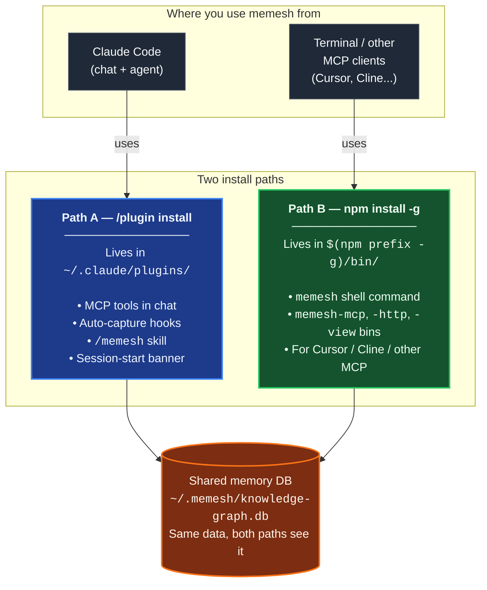

🌐 [English](README.md) | [繁體中文](README.zh-TW.md) | [简体中文](README.zh-CN.md) | [日本語](README.ja.md) | [한국어](README.ko.md) | [Português](README.pt.md) | [Français](README.fr.md) | [Deutsch](README.de.md) | [Tiếng Việt](README.vi.md) | [Español](README.es.md) | [ภาษาไทย](README.th.md)

<p align="center">
  <h1 align="center">MeMesh LLM Memory</h1>
  <p align="center">
    <strong>Local memory for Claude Code and MCP coding agents.</strong><br />
    One SQLite file. No Docker. No cloud required.
  </p>
  <p align="center">
    <a href="https://www.npmjs.com/package/@pcircle/memesh"></a>
    <a href="LICENSE"></a>
    <a href="https://nodejs.org"></a>
    <a href="https://modelcontextprotocol.io"></a>
  </p>
</p>

---

**MeMesh** — the open-source **memory layer** for Claude Code & MCP agents. One SQLite file. No cloud. Plugs into any LLM.

## 95.60% R@5 on LongMemEval-S — beats Mem0 by 46 points

MeMesh's retrieval is **FTS5 alone** — no LLM, no embeddings on the hot path. Measured against the public [LongMemEval-S](https://huggingface.co/datasets/xiaowu0162/longmemeval) benchmark (500 questions, MIT-licensed):

| System | R@5 | Source |
|---|---|---|
| **MeMesh (Mode A, via `recallEnhanced()`)** | **95.60%** | [benchmarks/longmemeval/RESULTS.md](benchmarks/longmemeval/RESULTS.md) |
| MemPalace | 96.6% | Vendor self-report |
| Supermemory | ~82% | Vendor estimate |
| Zep | 63.8% | LongMemEval paper |
| Mem0 | 49.0% | LongMemEval paper |

Re-runnable in ~10 seconds. Full instructions, dataset SHA256, raw per-question results, and known-failure analysis: [`benchmarks/longmemeval/REPRODUCE.md`](benchmarks/longmemeval/REPRODUCE.md).

---

## The Problem

Your coding agent forgets between sessions. Every architecture decision, bug fix, failed test, and hard-won lesson has to be re-explained. Claude Code starts fresh, re-discovers old constraints, and burns context on things it should already know.

**MeMesh gives coding agents persistent, searchable, evolving local memory.** Install with npm, memory lives in `~/.memesh/knowledge-graph.db`, plug into Claude Code or any MCP-compatible client.

> [!IMPORTANT]
> Actively developed — features may change between releases. [Open an issue](https://github.com/PCIRCLE-AI/memesh-llm-memory/issues) for bugs or feature requests.

---

## Install paths at a glance

MeMesh has **two install paths that coexist**. Most users want both. They write to the **same memory database** (`~/.memesh/knowledge-graph.db`), so memories captured in Claude Code chat appear in your shell, and vice versa.



**Which one do you need?**

| What you want to do | Install path |
|---|---|
| Use the `/memesh` skill inside a Claude Code conversation | Path A (plugin) |
| Get auto-capture (sessions → lessons → recall) in Claude Code | Path A (plugin) |
| Run `memesh remember` / `memesh recall` / `memesh doctor` in any terminal | Path B (npm-global) |
| Open the local dashboard via `memesh serve` (no `npx` lookup delay) | Path B (npm-global) |
| Plug `memesh-mcp` into Codex CLI, Gemini CLI, Cursor, or another MCP client | Path B (npm-global) |
| All of the above | **Install both** — they don't conflict |

### ⚠️ Installing the plugin does NOT install the CLI

This is the most common confusion. Read this once and you'll save yourself the loop:

- `/plugin install memesh@pcircle-memesh` from inside Claude Code → installs **Path A only**. Gives you MCP tools, hooks, the `/memesh` skill. Does **NOT** put `memesh` on your shell `PATH`.
- `memesh reindex` / `memesh update` / `memesh doctor` typed in a normal terminal → needs **Path B** (npm-global). Without it: `zsh: command not found: memesh`.
- **Recommended setup for Claude Code users**: install **both**. They coexist, share the same database, never conflict.

```bash
# After /plugin install ..., also run this:
npm install -g @pcircle/memesh
```

If you only use memesh through Claude Code chat (never type `memesh` in a terminal), Path A alone is enough. Everyone else: install both.

---

## Get Started in 60 Seconds

### Option A — Claude Code plugin (one-line install)

If you use Claude Code, install MeMesh as a plugin from inside the CLI:

```
/plugin marketplace add PCIRCLE-AI/memesh-llm-memory
/plugin install memesh@pcircle-memesh
```

Claude Code wires hooks, skills, and the MCP server automatically. You get in-session auto-capture, proactive recall, the `/memesh` skill (remember / recall / learn / forget) inside the Claude Code conversation, and `remember` / `recall` / `forget` / `learn` available as MCP tools to the agent.

The MCP server runs directly from the plugin's bundled compiled output — no `npx` lookup, no build step, and nothing to compile. memesh stores its data through `node:sqlite`, which is part of Node itself (22.13+), so a Node upgrade cannot leave it with a binary built for the wrong runtime.

> **This installs the plugin only.** You can run CLI commands via `npx @pcircle/memesh <command>` if you absolutely don't want a global install, but typing plain `memesh` in a terminal will report `command not found`. To get a real shell `memesh` command, also run **Option B** below — both paths coexist and share the same memory database. The "Install paths at a glance" diagram above covers this.

### Option B — npm global (optional optimisation)

If you want the binary directly on your shell `PATH` (so plain `memesh`, `memesh-mcp`, etc. work in any terminal without the per-call `npx` lookup), or you want to expose `memesh-mcp` as a fixed-path stdio command to **non-Claude-Code MCP clients** (Codex CLI, Gemini CLI, Cursor, Cline, terminal-only flows):

```bash
npm install -g @pcircle/memesh
```

> **First-install notes (one-time):**
> - **No compiler needed** — the database engine is Node's own `node:sqlite`. `sqlite-vec`, which adds meaning-based search, ships as a prebuilt file for macOS (arm64/x64), Linux (x64/arm64) and Windows x64; on any other platform it is simply absent and recall stays on keyword search. Nothing here runs an install script, so `npm install --ignore-scripts` installs a fully working memesh.
> - **Semantic (meaning-based) search is optional** — the default recall path is FTS5 keyword search, which needs no model and no download. Meaning-based search needs an embedder: run [Ollama](https://ollama.com) locally, or configure a cloud embedder (see "Bring-your-own embeddings" below). Without one, memesh uses keyword search only.

### Step 1.5: Wire MeMesh into Claude Code (npm path only)

If you installed via **Option A** (`/plugin install memesh@pcircle-memesh`), skip this step — Claude Code wires plugin hooks automatically.

If you installed via **Option B** (`npm install -g`), the CLI is on your PATH and the MCP server is registered, but the Claude Code session hooks are not auto-wired. Without them you can still use `memesh remember` / `recall` manually, but the **auto-capture loop** (sessions → lessons → recall on next session) is silent.

```bash
memesh install-hooks         # adds memesh's hooks to ~/.claude/settings.json
memesh doctor                # verifies "Hooks wired into Claude Code" passes
```

The hooks coexist with any custom hooks you already have under `~/.claude/hooks/` — `install-hooks` writes additive entries and never overwrites yours. To remove later: `memesh uninstall-hooks`.

### Same memory from Codex CLI and Gemini CLI

`memesh-mcp` is a plain stdio MCP server, so any MCP-capable host can talk to it — not just Claude Code. With Option B installed (`memesh-mcp` on your `PATH`), register it once per host:

```bash
# OpenAI Codex CLI — writes [mcp_servers.memesh] into ~/.codex/config.toml
codex mcp add memesh -- memesh-mcp

# Google Gemini CLI — user scope, so it works in every folder
gemini mcp add -s user memesh memesh-mcp
```

Every host reads and writes the same `~/.memesh/knowledge-graph.db`, so a memory stored from a Claude Code session is recallable from Codex or Gemini, and the other way around. Verify from either host by asking it to call the `recall` tool, or from a terminal:

```bash
codex mcp list       # memesh should be listed as enabled
gemini mcp list      # memesh should show "Connected"
```

> **Use `memesh-mcp`, not `npx -p @pcircle/memesh`, as the configured command.** `npx -p` resolves to the *local* package whenever the host's working directory is inside a checkout of this repository, silently running whatever state that working tree is in instead of the installed release.

### Step 2: Store a decision

> The bash examples below assume `memesh` is on your `PATH` (Option B). Option A (plugin-only) users have two equivalent paths: ask in the Claude Code conversation (the `/memesh` skill + MCP tools cover the same flows), or replace `memesh` with `npx @pcircle/memesh` in any shell — same flags, no global install needed.

```bash
memesh remember "Use OAuth 2.0 with PKCE for the new auth"
```

Or use the explicit form when you want a stable name and type for later filtering:

```bash
memesh remember --name "auth-decision" --type "decision" --obs "Use OAuth 2.0 with PKCE"
```

### Step 3: Recall it later

```bash
memesh recall "login security"
# → Finds "OAuth 2.0 with PKCE" even though you searched different words
```

**That's it.** MeMesh is now remembering and recalling across sessions.

If you want to verify the install and local wiring end to end:

```bash
memesh doctor
```

Open the dashboard to explore your memory:

```bash
memesh serve
```

<p align="center">
  
</p>

<p align="center">
  
</p>

<p align="center">
  
</p>

---

## Who Is This For?

| If you are... | MeMesh helps you... |
|---------------|---------------------|
| **A developer using Claude Code** | Auto-recall project decisions, file-specific lessons, and past failures as you work |
| **A coding-agent power user** | Share one local memory layer across MCP-compatible tools |
| **A team experimenting with AI coding workflows** | Export/import project knowledge without introducing hosted infrastructure |
| **An agent developer** | Add local memory through MCP, HTTP, or the CLI |

---

## Designed For Coding Agents First

<table>
<tr>
<td width="33%" align="center">

**Claude Code / Desktop**
```bash
memesh-mcp
```
MCP tools + Claude Code hooks

</td>
<td width="33%" align="center">

**Any HTTP Client**
```bash
curl localhost:3737/v1/recall \
  -H "Content-Type: application/json" \
  -d '{"query":"auth"}'
```
`memesh serve` (REST API)

</td>
<td width="33%" align="center">

**Any LLM (OpenAI format)**
```bash
memesh export-schema \
  --format openai
```
Paste tools into any API call

</td>
</tr>
</table>

---

## Why Not OpenMemory, Cursor Memories, Mem0, Or Zep?

| | **MeMesh** | OpenMemory | Cursor Memories | Mem0 | Zep / Graphiti |
|---|---|---|---|---|---|
| **Best fit** | Local memory for coding agents | Local/cross-client MCP memory | Cursor-native project memory | Managed app/agent memory | Temporal knowledge graphs |
| **Install shape** | `npm install -g @pcircle/memesh` | Local app/server flow | Built into Cursor | Cloud API / SDK / MCP | Service/framework setup |
| **Storage** | One local SQLite file | Local memory stack | Cursor-managed rules/memories | Hosted or self-hosted stack | Graph database |
| **Cloud required** | No | No for local mode | Depends on Cursor account/settings | Yes for platform | Usually yes/self-hosted |
| **Claude Code hooks** | First-class | MCP tools | No | MCP tools | Not Claude Code-specific |
| **Dashboard** | Built in | Built in | Cursor settings | Platform dashboard | Platform/graph tooling |
| **Tradeoff** | Simple local wedge, not enterprise scale | Broader local app footprint | Locked to Cursor | Strong managed platform, less local-first | Strong graph model, heavier setup |

**MeMesh trades enterprise-scale managed infrastructure for instant local setup, inspectable storage, and coding-agent workflow hooks.**

---

## What Happens Automatically In Claude Code

You don't need to manually remember everything. MeMesh has **6 hooks** that capture and inject knowledge while you work:

| When | What MeMesh does |
|------|------------------|
| **Every session start** | Loads your most relevant memories + proactive warnings from past lessons |
| **Before editing files** | Recalls memories tied to the file or project before Claude writes code |
| **When you ask to remember** | Detects "remember this" / "guardar en memesh" / "sauvegarder dans memesh" / "記下來" intent (5 languages) and reminds Claude to use memesh |
| **After every `git commit`** | Records what you changed, with diff stats |
| **When Claude stops** | Captures files edited, errors fixed, and auto-generates structured lessons from failures |
| **Before context compaction** | Saves knowledge before it's lost to context limits |

> **Opt out anytime:** `export MEMESH_AUTO_CAPTURE=false`

---

## Configuration

All configuration is via environment variables. Defaults are local-only and zero-network — you don't need to set anything to get a working system.

| Variable | Default | What it does |
|---|---|---|
| `MEMESH_DB_PATH` | `~/.memesh/knowledge-graph.db` | Override the SQLite database location. |
| `MEMESH_AUTO_CAPTURE` | `true` | Disable the auto-capture hooks (`Stop`, `PreCompact`) entirely. |
| `MEMESH_AUTO_DETECT_LLM` | unset (auto-detect **on**) | Set to `0` to stop memesh using an API key it finds in your shell env. By default, if `ANTHROPIC_API_KEY` / `OPENAI_API_KEY` / `OLLAMA_HOST` is set and you have not configured a provider in `~/.memesh/config.json`, memesh uses it for write-side LLM features (lesson extraction, auto-tagging, dream). Embeddings are unaffected — they stay keyword-only (FTS5) unless you explicitly set `embedder.provider` to `ollama` or `openai`. |
| `MEMESH_AUTO_UPDATE` | `off` | Auto-update policy. `off` (default) never auto-updates; `patch` allows `X.Y.Z → X.Y.Z+N`; `minor` adds `X.Y.Z → X.Y+1.0`; `major` allows any bump. When permitted, a detached `npm install -g` fires at session end (Stop hook) so it never blocks your work — outcomes land in `~/.memesh/auto-update.log`. Also settable as `autoUpdate` in `~/.memesh/config.json` (env wins). When the installed version is deprecated by maintainers (security advisory), `patch` is force-allowed even on `off` — minor / major bumps still stay manual to avoid silent behaviour drift. |
| `OPENAI_API_KEY` | unset | Your OpenAI key. Used automatically for LLM features unless you set `MEMESH_AUTO_DETECT_LLM=0` or configure a provider explicitly. |
| `OLLAMA_HOST` | `http://localhost:11434` | Override the Ollama endpoint when using a local Ollama provider. |

`memesh doctor` prints the resolved configuration so you can see what's active.

**Fallback LLM providers (Smart Mode).** In the dashboard **Settings → "Fallback providers"** you can set an ordered failover chain — memesh tries each provider in turn when your primary is down. Add a local [Ollama](https://ollama.com) fallback, or a cloud one (OpenAI / Anthropic, with an API key). Privacy tradeoff: when a cloud fallback is used, memory text — which can be private — is sent to that provider, so it matters if you run local-only for privacy.

When npm flags an installed version as deprecated (typically a security advisory), the next session-start prepends a strong `⚠️ MeMesh <ver> is DEPRECATED` banner and `memesh update-status` surfaces the same line until you upgrade. The check is cached at `~/.memesh/update-check.<version>.json` so a transient network failure can't dim the warning.

---

## Dashboard

8 tabs, 11 languages, zero external dependencies. Access at `http://localhost:3737/dashboard` when the server is running.

| Tab | What you see |
|-----|-------------|
| **Insights** | Memory insights — weekly recaps and pattern proposals from the dreamer engine; one-click accept/reject |
| **Search** | Full-text + vector similarity search across all memories |
| **Browse** | Paginated list of all entities with archive/restore |
| **Analytics** | Memory Health Score, 30-day timeline, PM velocity + KG connectivity metrics, work patterns, cleanup suggestions |
| **Graph** | Interactive force-directed knowledge graph with type filters, search, ego mode, recency heatmap |
| **Lessons** | Structured lessons from past failures (error, root cause, fix, prevention) |
| **Manage** | Archive and restore entities |
| **Settings** | LLM provider config, instant language selector |

---

## Smart Features

**🧠 Smart Search** — Search "login security" and find memories about "OAuth PKCE". MeMesh uses FTS5 + sqlite-vec on the hot path, LLM-free, and the vector supplement still reaches across related wording.

**🌏 Search in scripts that don't use spaces** — Chinese, Japanese, Korean, Thai, Lao, Khmer and half-width katakana are indexed as overlapping character pairs, so a memory written as 「資料庫遷移前一定要先備份」 is found by searching 「備份」 — not only by its exact full text. Text is normalised (NFC) on both the write and the query side, so memories typed on macOS or with a Korean or Vietnamese IME are found in either spelling.

**📊 Scored Ranking** — Results ranked by relevance (30%) + recency (25%) + frequency (18%) + confidence (17%) + recall impact (10%).

**🔄 Knowledge Evolution** — Decisions change. `forget` archives old memories (never deletes). `supersedes` relations link old → new. Your AI always sees the latest version.

**⚠️ Conflict Detection** — If you have two memories that contradict each other, MeMesh warns you.

**🕸️ Knowledge Graph Connectivity** — `memesh kg backfill-relations --all-rules` links orphan entities using tag co-occurrence, project clustering, session context, and name similarity — no LLM required.

**📦 Team Sharing** — `memesh export > team-knowledge.json` → share with your team → `memesh import team-knowledge.json`
Imported bundles stay searchable, but MeMesh does not auto-inject imported memories into Claude hooks until you review or re-store them locally.

---

## Example Usage

> "MeMesh remembered that we chose PKCE over implicit flow three weeks ago. When I asked Claude about auth again, it already knew — no re-explaining needed."
> — **Solo developer, building a SaaS**

> "We export our team's memory every Friday and import it Monday. Everyone's Claude starts the week knowing what the team learned last week."
> — **3-person startup, shared knowledge base**

> "The dashboard showed me that 90% of my memories were auto-generated session logs. I started using `remember` deliberately for architecture decisions. Game changer."
> — **Developer who discovered the Analytics tab**

---

## Unlock Smart Mode (Optional)

MeMesh works offline by default — recall stays strictly LLM-free (95.60% R@5 on LongMemEval-S out of the box). Add an LLM API key only if you want LLM-augmented analysis flows on top: smarter session extraction, auto-tagging of new memories, lesson generation from failures, and `dream` compression:

```bash
memesh config set llm.provider anthropic
memesh config set llm.api-key sk-ant-...
```

Or use the dashboard Settings tab (visual setup):

```bash
memesh serve  # opens dashboard → Settings tab
```

**Mine your past sessions into memory.** `memesh dream run --from-transcripts` reads this project's Claude Code session transcripts, asks the LLM for the decisions and lessons buried in the conversation, and stages them as proposals — nothing enters your graph automatically. Review each with `memesh dream show <id>` and accept the ones worth keeping. To run it on a schedule, enable `memesh config set transcriptMining true` and point a cron/launchd entry at `memesh dream run --from-transcripts --if-due` — it self-throttles (default once every 24h per project) and stays staging-only. See [API_REFERENCE](docs/api/API_REFERENCE.md#memesh-dream).

### Semantic search / embeddings (optional)

By default MeMesh does **keyword-only** recall (FTS5) — no API key, no model download, nothing leaves your machine. Semantic (meaning-based) search is opt-in and needs an embedder. Point one of these at it:

```bash
memesh config set embedder.provider ollama          # local, needs `ollama serve`
memesh config set embedder.model nomic-embed-text
# or, for a hosted embedder:
memesh config set embedder.provider openai
memesh config set embedder.model text-embedding-3-small
```

The embedder is configured **independently of the chat LLM** — changing `llm.provider` never silently changes your embeddings. If you switch to an embedder with a different dimension (e.g. 768 → 1536), MeMesh rebuilds the vector index automatically on the next write. Supported `embedder.provider` values: `ollama` (local), `openai` (hosted). With none set, recall stays on keyword search.

| | Level 0 (default) | Level 1 (Smart Mode) |
|---|---|---|
| **Search** | FTS5 + sqlite-vec, 95.60% R@5 | unchanged — recall is LLM-free at every level |
| **Auto-capture** | Rule-based patterns | + LLM extracts decisions & lessons |
| **Auto-tagging** | Manual tags only | + LLM generates tags for new memories |
| **Failure analysis** | Not available | + LLM converts session errors into structured lessons |
| **Compression** | Not available | `dream` compress verbose memories |
| **Cost** | Free, no API key | ~$0.0001 per analysis call (Haiku) |

---

## All 7 Memory Tools

| Tool | What it does |
|------|-------------|
| `remember` | Store knowledge with observations, relations, and tags |
| `recall` | FTS5 + sqlite-vec search with multi-factor scoring (relevance, recency, frequency, confidence, recall impact) — no LLM in the hot path |
| `forget` | Soft-archive (never deletes) or remove specific observations |
| `export` | Share memories as JSON between projects or team members |
| `import` | Import memories with merge strategies (skip / overwrite / append) |
| `learn` | Record structured lessons from mistakes (error, root cause, fix, prevention) |
| `user_patterns` | Analyze your work patterns — schedule, tools, strengths, learning areas |

---

## Architecture

```
                    ┌─────────────────┐
                    │   Core Engine   │
                    │  (7 operations) │
                    └────────┬────────┘
           ┌─────────────────┼─────────────────┐
           │                 │                 │
     CLI (memesh)    HTTP API (serve)    MCP (memesh-mcp)
           │                 │                 │
           └─────────────────┼─────────────────┘
                             │
                    SQLite + FTS5 + sqlite-vec
                    (~/.memesh/knowledge-graph.db)
```

Core is framework-agnostic. Same logic runs from terminal, HTTP, or MCP.

---

## Upgrading

Claude Code's plugin marketplace pins versions at install time and does **not** auto-update. To pick up a new release:

**Option A — `/plugin` UI**: uninstall `memesh@pcircle-memesh`, then reinstall. Claude Code fetches the latest marketplace version.

**Option B — one-line script** (no UI clicking, idempotent):

```bash
# If your plugin install is v4.2.5 or newer, the script ships inside it:
bash ~/.claude/plugins/cache/pcircle-memesh/memesh/<current-version>/scripts/upgrade-plugin.sh

# If you installed before v4.2.5 (i.e. you're on v4.2.4 or v4.2.3),
# the script isn't in your plugin yet. Use the npm-global copy instead:
bash "$(npm prefix -g)/lib/node_modules/@pcircle/memesh/scripts/upgrade-plugin.sh"

# (That assumes you've also run `npm install -g @pcircle/memesh`. If you
# haven't, this is also a good moment to — see the "Install paths at a
# glance" section above for why most users want both paths.)
```

The script fast-forwards the marketplace cache, stages the new version under `~/.claude/plugins/cache/`, installs runtime deps, and re-points `installed_plugins.json`. Restart Claude Code afterwards so the MCP server reconnects.

**npm-global installs** (`npm install -g @pcircle/memesh`) can self-update via `memesh update`. Source checkouts: `git pull && npm install && npm run build`.

Session start surfaces a one-line banner (throttled to once per 24h per version) when a newer release is available, and `memesh doctor` reports the upgrade target with the channel-specific command.

---

## Contributing

```bash
git clone https://github.com/PCIRCLE-AI/memesh-llm-memory
cd memesh-llm-memory && npm install && npm run build
npm test
npm run test:e2e-dashboard
```

Dashboard: `cd dashboard && npm install && npm run dev`

---

<p align="center">
  <strong>MIT</strong> — Made by <a href="https://pcircle.com">PCIRCLE AI</a>
</p>
