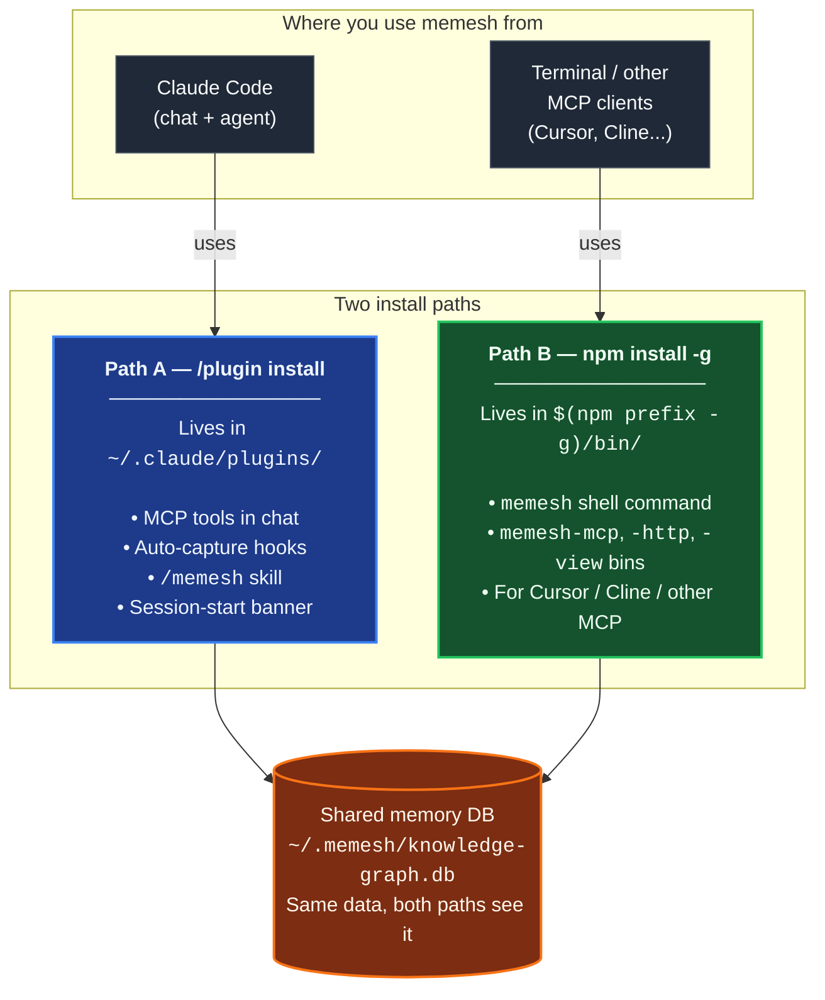

🌐 [English](README.md) | [繁體中文](README.zh-TW.md) | [简体中文](README.zh-CN.md) | [日本語](README.ja.md) | [한국어](README.ko.md) | [Português](README.pt.md) | [Français](README.fr.md) | [Deutsch](README.de.md) | [Tiếng Việt](README.vi.md) | [Español](README.es.md) | [ภาษาไทย](README.th.md)

<p align="center">
  <h1 align="center">MeMesh LLM Memory</h1>
  <p align="center">
    <strong>Memória local para Claude Code e agentes de codificação MCP.</strong><br />
    Um arquivo SQLite. Sem Docker. Sem dependência de nuvem.
  </p>
  <p align="center">
    <a href="https://www.npmjs.com/package/@pcircle/memesh"></a>
    <a href="LICENSE"></a>
    <a href="https://nodejs.org"></a>
    <a href="https://modelcontextprotocol.io"></a>
  </p>
</p>

---

> [!IMPORTANT]
> **Projeto em desenvolvimento ativo** — funcionalidades evoluem continuamente e podem mudar entre releases. Em caso de bug ou pedido de funcionalidade, por favor [abra uma issue](https://github.com/PCIRCLE-AI/memesh-llm-memory/issues).

## O Problema

Seu agente de código esquece tudo entre sessões. Toda decisão arquitetônica, correção de bug, teste que falhou e lição conquistada na marra precisa ser re-explicada. Claude Code sempre começa do zero, redescobre restrições antigas e queima contexto em coisas que já deveria saber.

**MeMesh oferece memória local persistente, pesquisável e evolutiva para agentes de código.**

Este pacote é a camada de memória local da família de produtos MeMesh. É propositalmente pequeno e open-source: instale via npm, mantenha sua memória em `~/.memesh/knowledge-graph.db` e conecte ao Claude Code ou qualquer cliente compatível com MCP. Produtos de workspace hospedado e sistemas operacionais corporativos devem se manter separados do roadmap e README deste pacote.

---

## Prova — 95,60% R@5 no LongMemEval-S

O motor de recuperação do MeMesh é **apenas FTS5** (sem LLM, sem embeddings no hot path), medido contra o benchmark público [LongMemEval-S](https://huggingface.co/datasets/xiaowu0162/longmemeval) (500 perguntas, licença MIT):

| Sistema | R@5 | Fonte |
|---|---|---|
| **MeMesh (Mode A, via `recallEnhanced()`)** | **95,60%** | [benchmarks/longmemeval/RESULTS.md](benchmarks/longmemeval/RESULTS.md) |
| MemPalace | 96,6% | Auto-relato do fornecedor |
| Supermemory | ~82% | Estimativa do fornecedor |
| Zep | 63,8% | Paper LongMemEval |
| Mem0 | 49,0% | Paper LongMemEval |

Comandos de reprodução, SHA256 do dataset, resultados brutos por pergunta e análise de falhas conhecidas estão todos em [`benchmarks/longmemeval/`](benchmarks/longmemeval/). Reexecutável em ~10 segundos.

---

## Caminhos de instalação resumidos

MeMesh tem **dois caminhos de instalação que coexistem**. A maioria dos usuários quer ambos. Ambos escrevem no **mesmo banco de dados de memória** (`~/.memesh/knowledge-graph.db`), então memórias capturadas no chat do Claude Code aparecem no seu shell, e vice-versa.



**Qual você precisa?**

| O que você quer fazer | Caminho de instalação |
|---|---|
| Usar o skill `/memesh` numa conversa do Claude Code | Path A (plugin) |
| Auto-captura no Claude Code (sessão → lições → recall seguinte) | Path A (plugin) |
| Rodar `memesh remember` / `memesh recall` / `memesh doctor` em qualquer terminal | Path B (npm-global) |
| Abrir o dashboard via `memesh` (sem atraso de inicialização do `npx`) | Path B (npm-global) |
| Conectar `memesh-mcp` ao Cursor, Cline ou outro cliente MCP | Path B (npm-global) |
| Tudo acima | **Instale ambos** — não conflitam |

> **Confusão comum**: o plugin do Claude Code **não** coloca `memesh` no `PATH` do seu shell. Se você só rodar `/plugin install` e depois digitar `memesh reindex` num terminal, vai ver `command not found`. É normal — adicione `npm install -g @pcircle/memesh` também para acesso pelo shell.

### ⚠️ Instalar o plugin NÃO instala o CLI

É a confusão mais comum. Leia uma vez e economize tempo no futuro:

- `/plugin install memesh@pcircle-memesh` no Claude Code → instala **apenas Path A**. Te dá ferramentas MCP, hooks, o skill `/memesh`. **NÃO** coloca `memesh` no `PATH` do seu shell.
- `memesh reindex` / `memesh update` / `memesh doctor` num terminal → precisa do **Path B** (npm-global). Sem ele: `zsh: command not found: memesh`.
- **Configuração recomendada para usuários do Claude Code**: **instale ambos**. Coexistem, compartilham o mesmo banco, sem conflito.

```bash
# Depois de /plugin install ..., rode também isto:
npm install -g @pcircle/memesh
```

Se você só usa memesh pelo chat do Claude Code (nunca digita `memesh` num terminal), Path A sozinho basta. Os demais: instale ambos.

---

## Comece em 60 Segundos

### Passo 1: Instale

```bash
npm install -g @pcircle/memesh
```

### Passo 1.5: Conecte o MeMesh ao Claude Code (recomendado, uma só vez)

`npm install -g` coloca a CLI no PATH e registra o servidor MCP, mas **não** conecta automaticamente os hooks de sessão do MeMesh ao Claude Code. Sem esses hooks você pode usar `memesh remember` / `recall` manualmente, mas o **loop de auto-captura** (sessão → lições → recall proativo na próxima sessão) fica silencioso.

```bash
memesh install-hooks         # adiciona os hooks do memesh em ~/.claude/settings.json
memesh doctor                # confirma que "Hooks wired into Claude Code" passou
```

Os hooks coexistem com qualquer hook customizado em `~/.claude/hooks/` — `install-hooks` escreve de forma aditiva e nunca sobrescreve. Para remover: `memesh uninstall-hooks`.

### Passo 2: Armazene uma decisão

```bash
memesh remember --name "auth-decision" --type "decision" --obs "Use OAuth 2.0 with PKCE"
```

### Passo 3: Recupere depois

```bash
memesh recall "login security"
# → Encontra "OAuth 2.0 with PKCE" mesmo com palavras de busca diferentes
```

**É só isso.** MeMesh já está lembrando e recuperando entre sessões.

Se quiser verificar a instalação e toda a configuração local de ponta a ponta:

```bash
memesh doctor
```

Abra o dashboard para explorar sua memória:

```bash
memesh serve
```

<p align="center">
  
</p>

<p align="center">
  
</p>

<p align="center">
  
</p>

---

## Para Quem é Isso?

| Se você é... | MeMesh te ajuda a... |
|---------------|---------------------|
| **Um dev usando Claude Code** | Recuperar automaticamente decisões de projeto, lições por arquivo e falhas passadas enquanto trabalha |
| **Um power user de agentes de código** | Compartilhar uma camada de memória local entre ferramentas compatíveis com MCP |
| **Uma equipe experimentando workflows de IA para código** | Exportar/importar conhecimento de projeto sem precisar de infraestrutura hospedada |
| **Um desenvolvedor de agentes** | Adicionar memória local via MCP, HTTP ou CLI |

---

## Pensado Primeiro para Agentes de Código

<table>
<tr>
<td width="33%" align="center">

**Claude Code / Desktop**
```bash
memesh-mcp
```
Ferramentas MCP + hooks do Claude Code

</td>
<td width="33%" align="center">

**Qualquer cliente HTTP**
```bash
curl localhost:3737/v1/recall \
  -H "Content-Type: application/json" \
  -d '{"query":"auth"}'
```
`memesh serve` (REST API)

</td>
<td width="33%" align="center">

**Qualquer LLM (formato OpenAI)**
```bash
memesh export-schema \
  --format openai
```
Cole as ferramentas em qualquer chamada de API

</td>
</tr>
</table>

---

## Por Que Não OpenMemory, Cursor Memories, Mem0 Ou Zep?

| | **MeMesh** | OpenMemory | Cursor Memories | Mem0 | Zep / Graphiti |
|---|---|---|---|---|---|
| **Melhor para** | Memória local para agentes de código | Memória local/cross-client MCP | Memória de projeto nativa do Cursor | Memória gerenciada de app/agent | Grafos de conhecimento temporal |
| **Forma de instalar** | `npm install -g @pcircle/memesh` | Fluxo de app local/server | Integrado no Cursor | Cloud API / SDK / MCP | Setup de serviço/framework |
| **Armazenamento** | Um arquivo SQLite local | Stack de memória local | Regras/memórias gerenciadas pelo Cursor | Stack hospedada ou self-hosted | Banco de dados de grafo |
| **Requer nuvem** | Não | Não em modo local | Depende de conta Cursor/configurações | Sim para plataforma | Geralmente sim/self-hosted |
| **Hooks Claude Code** | Primeira classe | Ferramentas MCP | Não | Ferramentas MCP | Não específico para Claude Code |
| **Dashboard** | Integrado | Integrado | Configurações do Cursor | Dashboard da plataforma | Ferramentas de plataforma/grafo |
| **Trade-off** | Cunha local simples, não em escala corporativa | Footprint de app local mais amplo | Preso ao Cursor | Plataforma gerenciada forte, menos local-first | Modelo de grafo forte, setup mais pesado |

**MeMesh troca infraestrutura gerenciada em escala corporativa por setup local instantâneo, armazenamento inspeionável e hooks de workflow para agentes de código.**

---

## O Que Acontece Automaticamente no Claude Code

Você não precisa lembrar tudo manualmente. MeMesh tem **7 hooks** que capturam e injetam conhecimento enquanto você trabalha:

| Quando | O que MeMesh faz |
|------|------------------|
| **Início de cada sessão** | Carrega suas memórias mais relevantes + alertas proativos de lições passadas + banner de orquestração de agentes |
| **Antes de editar arquivos** | Recupera memórias vinculadas ao arquivo ou projeto antes de Claude escrever código |
| **Antes de comandos bash** | Incentiva Claude a despachar comandos de alta verificabilidade (test, build, lint, migrate, deploy, benchmark) como agentes de background |
| **Quando você pede para lembrar** | Detecta intenção "remember this" / "記下來" e lembra Claude de escrever dual (memesh + MEMORY.md) |
| **Depois de cada `git commit`** | Registra o que você mudou, com estatísticas de diff |
| **Quando Claude para** | Captura arquivos editados, erros corrigidos e gera automaticamente lições estruturadas de falhas |
| **Antes da compactação de contexto** | Salva conhecimento antes de ser perdido nos limites de contexto |

> **Desative quando quiser:** `export MEMESH_AUTO_CAPTURE=false`

---

## Configuração

Toda a configuração é feita por variáveis de ambiente. Os padrões são local-only e zero-network — você não precisa configurar nada para ter um sistema funcional.

| Variável | Padrão | O que faz |
|---|---|---|
| `MEMESH_DB_PATH` | `~/.memesh/knowledge-graph.db` | Sobrescreve a localização do banco SQLite. |
| `MEMESH_AUTO_CAPTURE` | `true` | Desativa completamente os hooks de auto-captura (`Stop`, `PreCompact`). |
| `MEMESH_AUTO_DETECT_LLM` | não definido (autodetecção **ligada**) | Defina como `0` para que o memesh NÃO use uma chave de API encontrada no ambiente do shell. Por padrão, se `ANTHROPIC_API_KEY` / `OPENAI_API_KEY` / `OLLAMA_HOST` estiver definida e você não tiver configurado um provedor em `~/.memesh/config.json`, o memesh a usa para as funções LLM de escrita (consolidação, extração de lições, autotagging, dream). Os embeddings não são afetados — permanecem em ONNX local (384-dim) a menos que você defina `embedder.provider` explicitamente. |
| `MEMESH_ENABLE_AGENTIC_ORCHESTRATION` | unset | Defina como `1` para habilitar um protocolo experimental de modelo de trabalho (enquadramento CTO / Orchestrator / Agents). Adiciona um banner de início de sessão, um nudge para comandos Bash e telemetria `verify_agent_work`. A eficácia do protocolo está sendo instrumentada, ainda não comprovada — opte se quiser participar. **Padrão é OFF**: as funcionalidades de memória core funcionam sem essa flag. |
| `MEMESH_AUTO_UPDATE` | `off` | Política de auto-update. `off` (padrão) nunca faz auto-update; `patch` permite `X.Y.Z → X.Y.Z+N`; `minor` adiciona `X.Y.Z → X.Y+1.0`; `major` permite qualquer bump. Quando permitido, um `npm install -g` desanexado dispara no fim da sessão (hook Stop) para nunca bloquear seu trabalho — os resultados aparecem em `~/.memesh/auto-update.log`. Também configurável como `autoUpdate` em `~/.memesh/config.json` (env vence). Quando a versão instalada é depreciada pelos mantenedores (advisory de segurança), `patch` é forçado mesmo em `off` — bumps minor / major continuam manuais para evitar drift silencioso de comportamento. |
| `OPENAI_API_KEY` | não definido | Sua chave da OpenAI. Usada automaticamente para as funções LLM a menos que você defina `MEMESH_AUTO_DETECT_LLM=0` ou configure um provedor explicitamente. |
| `OLLAMA_HOST` | `http://localhost:11434` | Sobrescreve o endpoint do Ollama ao usar um provedor Ollama local. |

`memesh doctor` imprime a configuração resolvida para você ver o que está ativo.

Quando o npm sinaliza uma versão instalada como depreciada (tipicamente um advisory de segurança), o próximo início de sessão antepõe um banner forte `⚠️ MeMesh <ver> is DEPRECATED` e `memesh update-status` mostra a mesma linha até você atualizar. A verificação fica em cache em `~/.memesh/update-check.<version>.json` para que uma falha de rede transitória não atenue o aviso.

---

## Dashboard

8 abas, 11 idiomas, zero dependências externas. Acesse em `http://localhost:3737/dashboard` quando o servidor estiver rodando.

| Aba | O que você vê |
|-----|-------------|
| **Insights** | Insights de memória — resumos semanais e propostas de padrões do motor dreamer; aceitar/rejeitar com um clique |
| **Search** | Busca full-text + similaridade vetorial em todas as memórias |
| **Browse** | Lista paginada de todas as entidades com archive/restore |
| **Analytics** | Memory Health Score, timeline de 30 dias, velocidade PM + métricas de conectividade KG, padrões de trabalho, sugestões de limpeza |
| **Graph** | Grafo de conhecimento interativo force-directed com filtros por tipo, busca, modo ego, heatmap de recência |
| **Lessons** | Lições estruturadas de falhas passadas (erro, causa raiz, fix, prevenção) |
| **Manage** | Archive e restore de entidades |
| **Settings** | Config do provedor LLM, seletor de idioma instantâneo |

---

## Funcionalidades Inteligentes

**🧠 Busca Inteligente** — Busque "login security" e encontre memórias sobre "OAuth PKCE". MeMesh usa FTS5 + sqlite-vec no caminho quente, sem LLM; o complemento vetorial ainda alcança termos relacionados.

**🌏 Busca em escritas que não separam palavras por espaços** — Chinês, japonês, coreano, tailandês, laosiano, khmer e katakana de meia largura são indexados como pares de caracteres sobrepostos. Assim, uma memória escrita como 「資料庫遷移前一定要先備份」 é encontrada buscando 「備份」, e não apenas pelo texto completo exato. O texto é normalizado (NFC) tanto na escrita quanto na consulta, então uma memória digitada no macOS ou com um IME coreano ou vietnamita é encontrada em qualquer das duas grafias.

**📊 Ranking Pontuado** — Resultados ranqueados por relevância (30%) + recência (25%) + frequência (18%) + confiança (17%) + impacto de recall (10%).

**🔄 Evolução de Conhecimento** — Decisões mudam. `forget` arquiva memórias antigas (nunca deleta). Relações `supersedes` vinculam antigas → novas. Sua IA sempre vê a versão mais recente.

**⚠️ Detecção de Conflitos** — Se você tem duas memórias que se contradizem, MeMesh te avisa.

**🕸️ Conectividade do grafo de conhecimento** — `memesh kg backfill-relations --all-rules` liga entidades órfãs usando co-ocorrência de tags, agrupamento de projetos, contexto de sessão e similaridade de nomes — sem LLM.

**📦 Compartilhamento em Equipe** — `memesh export > team-knowledge.json` → compartilhe com sua equipe → `memesh import team-knowledge.json`
Bundles importados permanecem pesquisáveis, mas MeMesh não injeta automaticamente memórias importadas nos hooks do Claude até você revisar ou re-armazená-las localmente.

---

## Exemplos de Uso

> "MeMesh lembrou que escolhemos PKCE em vez de implicit flow há três semanas. Quando pedi ao Claude sobre auth de novo, ele já sabia — sem need de re-explicar."
> — **Dev solo, construindo um SaaS**

> "Exportamos a memória da equipe toda sexta e importamos segunda. O Claude de todo mundo começa a semana sabendo o que a equipe aprendeu na semana passada."
> — **Startup com 3 pessoas, base de conhecimento compartilhada**

> "O dashboard mostrou que 90% das minhas memórias eram logs de sessão auto-gerados. Comecei a usar `remember` deliberadamente para decisões arquitetônicas. Game changer."
> — **Dev que descobriu a aba Analytics**

---

## Desbloqueie Smart Mode (Opcional)

MeMesh funciona offline por padrão — o recall permanece estritamente LLM-free (95,60% R@5 no LongMemEval-S, sem LLM). Adicione uma chave de API de LLM apenas se quiser fluxos de análise LLM-augmented adicionais: extração de sessão mais inteligente, auto-tagging de novas memórias, geração de lessons a partir de falhas, e compressão `dream`:

```bash
memesh config set llm.provider anthropic
memesh config set llm.api-key sk-ant-...
```

Ou use a aba Settings do dashboard (setup visual):

```bash
memesh  # abre dashboard → aba Settings
```

### Use seus próprios embeddings (opcional)

Os embeddings usam por padrão um modelo ONNX local (`Xenova/all-MiniLM-L6-v2`, 384-dim) — sem chave de API, nada sai da sua máquina, e o recall FTS5 padrão nem precisa deles. Para usar um embedder hospedado ou de servidor local:

```bash
memesh config set embedder.provider openai          # or: ollama
memesh config set embedder.model text-embedding-3-small
```

O embedder é configurado **independentemente do LLM de chat** — mudar `llm.provider` nunca muda seus embeddings silenciosamente. Se você trocar para uma dimensão diferente (ex.: 384 → 1536), o MeMesh reconstrói o índice vetorial automaticamente na próxima escrita. Valores de `embedder.provider` suportados: `onnx` (padrão, local), `openai`, `ollama`.

| | Level 0 (padrão) | Level 1 (Smart Mode) |
|---|---|---|
| **Busca** | FTS5 + sqlite-vec, 95,60% R@5 | inalterado — recall é LLM-free em todos os níveis |
| **Auto-capture** | Padrões baseados em regras | + LLM extrai decisões & lições |
| **Auto-tagging** | Apenas tags manuais | + LLM gera tags para novas memórias |
| **Análise de falhas** | Não disponível | + LLM converte erros de sessão em structured lessons |
| **Compressão** | Não disponível | `dream` comprimem memórias verbosas |
| **Custo** | Grátis, sem chave de API | ~$0.0001 por analysis call (Haiku) |

---

## Todas as 9 Ferramentas de Memória

| Ferramenta | O que faz |
|------|-------------|
| `remember` | Armazena conhecimento com observações, relações e tags |
| `recall` | Busca FTS5 + sqlite-vec com scoring multi-fator (relevância, recência, frequência, confiança, impacto de recall) — sem LLM no hot path |
| `forget` | Soft-archive (nunca deleta) ou remove observações específicas |
| `export` | Compartilha memórias como JSON entre projetos ou membros da equipe |
| `import` | Importa memórias com estratégias de merge (skip / overwrite / append) |
| `learn` | Registra lições estruturadas de erros (erro, causa raiz, fix, prevenção) |
| `user_patterns` | Analisa seus padrões de trabalho — schedule, ferramentas, pontos fortes, áreas de aprendizado |
| `verify_agent_work` | Persiste um relatório de verificação para trabalho de background-agent; reality-checks mudanças de arquivo declaradas contra `git diff` |

---

## Arquitetura

```
                    ┌─────────────────┐
                    │   Core Engine   │
                    │  (8 operations) │
                    └────────┬────────┘
           ┌─────────────────┼─────────────────┐
           │                 │                 │
     CLI (memesh)    HTTP API (serve)    MCP (memesh-mcp)
           │                 │                 │
           └─────────────────┼─────────────────┘
                             │
                    SQLite + FTS5 + sqlite-vec
                    (~/.memesh/knowledge-graph.db)
```

Core é agnóstico a framework. A mesma lógica roda de terminal, HTTP ou MCP.

---

## Atualizando

O plugin marketplace do Claude Code fixa versões no momento da instalação e **não** atualiza automaticamente. Para obter uma nova versão:

**Opção A — UI `/plugin`**: desinstale `memesh@pcircle-memesh`, depois reinstale. O Claude Code busca a versão mais recente do marketplace.

**Opção B — Script de uma linha** (sem cliques na UI, idempotente):

```bash
# Se o seu plugin instalado for v4.2.5 ou mais recente, o script já está incluído:
bash ~/.claude/plugins/cache/pcircle-memesh/memesh/<current-version>/scripts/upgrade-plugin.sh

# Se você instalou antes de v4.2.5 (ou seja, v4.2.4 ou v4.2.3),
# o script ainda não está no seu plugin. Use a cópia npm-global no lugar:
bash "$(npm prefix -g)/lib/node_modules/@pcircle/memesh/scripts/upgrade-plugin.sh"

# (Isso assume que você também executou `npm install -g @pcircle/memesh`. Se não,
# este é um bom momento para fazê-lo — veja a seção "Caminhos de instalação resumidos"
# acima para entender por que a maioria dos usuários quer ambos os caminhos.)
```

O script fast-forwarded o cache do marketplace, prepara a nova versão em `~/.claude/plugins/cache/`, instala runtime deps e repõe o ponteiro de `installed_plugins.json`. Reinicie o Claude Code depois para o MCP server reconectar.

**Instalações npm-global** (`npm install -g @pcircle/memesh`) podem se auto-atualizar via `memesh update`. Source checkouts: `git pull && npm install && npm run build`.

No início da sessão aparece um banner de uma linha (limitado a uma vez por 24h por versão) quando há uma nova versão disponível, e `memesh doctor` reporta o alvo de upgrade com o comando específico do canal.

---

## Contribuindo

```bash
git clone https://github.com/PCIRCLE-AI/memesh-llm-memory
cd memesh-llm-memory && npm install && npm run build
npm test
npm run test:e2e-dashboard
```

Dashboard: `cd dashboard && npm install && npm run dev`

---

<p align="center">
  <strong>MIT</strong> — Feito por <a href="https://pcircle.com">PCIRCLE AI</a>
</p>
