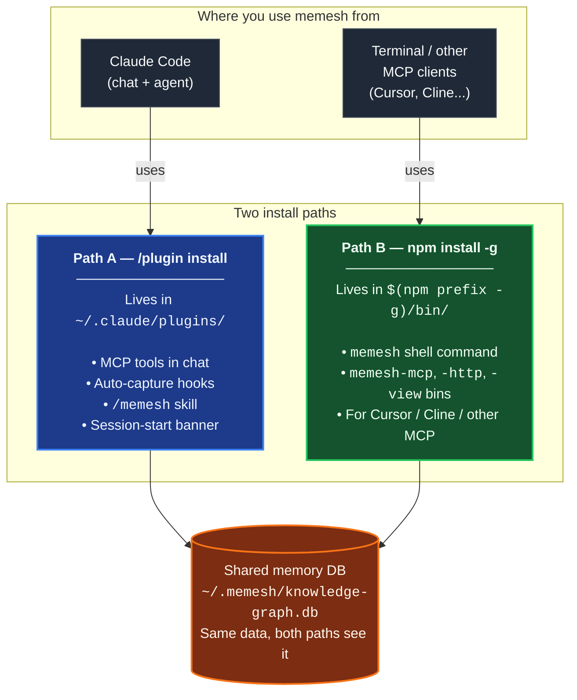

🌐 [English](README.md) | [繁體中文](README.zh-TW.md) | [简体中文](README.zh-CN.md) | [日本語](README.ja.md) | [한국어](README.ko.md) | [Português](README.pt.md) | [Français](README.fr.md) | [Deutsch](README.de.md) | [Tiếng Việt](README.vi.md) | [Español](README.es.md) | [ภาษาไทย](README.th.md)

<p align="center">
  <h1 align="center">MeMesh LLM Memory</h1>
  <p align="center">
    <strong>หน่วยความจำภายในเครื่องสำหรับ Claude Code และเอเจนต์ MCP</strong><br />
    ไฟล์ SQLite เพียงตัวเดียว ไม่ต้อง Docker ไม่ต้องบริการบนคลาวด์
  </p>
  <p align="center">
    <a href="https://www.npmjs.com/package/@pcircle/memesh"></a>
    <a href="LICENSE"></a>
    <a href="https://nodejs.org"></a>
    <a href="https://modelcontextprotocol.io"></a>
  </p>
</p>

---

> [!IMPORTANT]
> **โปรเจกต์อยู่ระหว่างพัฒนาอย่างต่อเนื่อง** — ฟีเจอร์มีการอัปเดตอย่างต่อเนื่องและอาจเปลี่ยนแปลงระหว่างเวอร์ชัน หากพบบักหรือมีคำขอฟีเจอร์ กรุณา[เปิด issue](https://github.com/PCIRCLE-AI/memesh-llm-memory/issues)

## ปัญหา

เอเจนต์คิดโค้ดลืมสิ่งที่เกิดขึ้นระหว่างเซสชัน ทุกการตัดสินใจด้านสถาปัตยกรรม การแก้บั๊ก การทดสอบที่ล้มเหลว และบทเรียนที่ยากที่สุดต้องอธิบายซ้ำ Claude Code เริ่มต้นใหม่ ค้นพบข้อจำกัดเดิม และใช้ context ไปกับสิ่งที่น่าจะรู้อยู่แล้ว

**MeMesh ให้หน่วยความจำภายในเครื่องที่ยั่งยืน ค้นหาได้ และวิวัฒนาได้สำหรับเอเจนต์คิดโค้ด**

แพคเกจนี้เป็นชั้นหน่วยความจำภายในของผลิตภัณฑ์ MeMesh ออกแบบให้เล็กและเปิดต้นฉบับ ติดตั้งด้วย npm เก็บหน่วยความจำในไฟล์ `~/.memesh/knowledge-graph.db` และเชื่อมต่อกับ Claude Code หรือไคลเอนต์ที่รองรับ MCP ผลิตภัณฑ์เวิร์กสเปซบนคลาวด์และระบบปฏิบัติการขององค์กรควรแยกออกจาก README และแผนพัฒนาของแพคเกจนี้

---

## หลักฐาน — 95.60% R@5 บน LongMemEval-S

เครื่องมือเรียกคืนของ MeMesh ใช้ **FTS5 เพียงอย่างเดียว** (ไม่มี LLM ไม่มี embedding บนเส้นทางหลัก) วัดผลด้วยเบนช์มาร์กสาธารณะ [LongMemEval-S](https://huggingface.co/datasets/xiaowu0162/longmemeval) (500 คำถาม สัญญาอนุญาต MIT):

| ระบบ | R@5 | ที่มา |
|---|---|---|
| **MeMesh (Mode A, via `recallEnhanced()`)** | **95.60%** | [benchmarks/longmemeval/RESULTS.md](benchmarks/longmemeval/RESULTS.md) |
| MemPalace | 96.6% | รายงานของผู้พัฒนาเอง |
| Supermemory | ~82% | ประมาณการของผู้พัฒนา |
| Zep | 63.8% | เปเปอร์ LongMemEval |
| Mem0 | 49.0% | เปเปอร์ LongMemEval |

คำสั่งสำหรับทำซ้ำ SHA256 ของชุดข้อมูล ผลดิบรายคำถาม และการวิเคราะห์ความล้มเหลวที่รู้จัก ทั้งหมดอยู่ใน [`benchmarks/longmemeval/`](benchmarks/longmemeval/) รันซ้ำได้ใน ~10 วินาที

---

## ภาพรวมเส้นทางการติดตั้ง

MeMesh มี **เส้นทางการติดตั้งสองเส้นที่อยู่ร่วมกันได้** ผู้ใช้ส่วนใหญ่ต้องการทั้งคู่ ทั้งสองเขียนลงใน **ฐานข้อมูลความจำเดียวกัน** (`~/.memesh/knowledge-graph.db`) ดังนั้นความจำที่บันทึกในแชท Claude Code จะปรากฏใน shell และในทางกลับกัน



**คุณต้องการเส้นทางไหน?**

| สิ่งที่คุณต้องการทำ | เส้นทางการติดตั้ง |
|---|---|
| ใช้ skill `/memesh` ในการสนทนา Claude Code | Path A (plugin) |
| Auto-capture ใน Claude Code (session → บทเรียน → recall ครั้งถัดไป) | Path A (plugin) |
| รัน `memesh remember` / `memesh recall` / `memesh doctor` ใน terminal | Path B (npm-global) |
| เปิด dashboard ผ่าน `memesh` (ไม่มีดีเลย์ของ `npx`) | Path B (npm-global) |
| เสียบ `memesh-mcp` เข้ากับ Cursor, Cline หรือ MCP client อื่น | Path B (npm-global) |
| ทั้งหมดข้างต้น | **ติดตั้งทั้งสอง** — ไม่ขัดแย้งกัน |

> **ความเข้าใจผิดที่พบบ่อย**: plugin ของ Claude Code **ไม่** ใส่ `memesh` ลงใน `PATH` ของ shell ถ้าคุณรันแค่ `/plugin install` แล้วพิมพ์ `memesh reindex` ใน terminal คุณจะเห็น `command not found` — เป็นเรื่องปกติ ต้องเพิ่ม `npm install -g @pcircle/memesh` ด้วย เพื่อใช้คำสั่งใน shell

### ⚠️ การติดตั้ง plugin ไม่ได้ติดตั้ง CLI

นี่คือความสับสนที่พบบ่อยที่สุด อ่านครั้งเดียวจะประหยัดเวลาในอนาคต:

- `/plugin install memesh@pcircle-memesh` จากภายใน Claude Code → ติดตั้ง **เฉพาะ Path A**ให้ MCP tools, hooks, skill `/memesh`**ไม่ได้** ใส่ `memesh` ลงใน `PATH` ของ shell
- `memesh reindex` / `memesh update` / `memesh doctor` ใน terminal → ต้องใช้ **Path B** (npm-global) ถ้าไม่มี: `zsh: command not found: memesh`
- **การติดตั้งที่แนะนำสำหรับผู้ใช้ Claude Code**: **ติดตั้งทั้งสอง** อยู่ร่วมกัน ใช้ DB เดียวกัน ไม่ขัดแย้งกัน

```bash
# หลังจาก /plugin install ... ให้รันคำสั่งนี้ด้วย:
npm install -g @pcircle/memesh
```

ถ้าคุณใช้ memesh ผ่านแชท Claude Code เท่านั้น (ไม่เคยพิมพ์ `memesh` ใน terminal), Path A อย่างเดียวก็พอ คนอื่นๆ ให้ติดตั้งทั้งสอง

---

## เริ่มต้นใน 60 วินาที

### ตัวเลือก A — Claude Code plugin (ติดตั้งด้วยบรรทัดเดียว)

ถ้าใช้ Claude Code ติดตั้ง MeMesh เป็น plugin จากใน CLI ได้เลย:

```
/plugin marketplace add PCIRCLE-AI/memesh-llm-memory
/plugin install memesh@pcircle-memesh
```

Claude Code จะเชื่อม hooks, skills และ MCP server ให้อัตโนมัติ คุณจะได้ auto-capture ในระหว่าง session, การเรียกคืนแบบเชิงรุก, `/memesh` skill (remember / recall / learn / forget) ในบทสนทนา Claude Code และเครื่องมือ `remember` / `recall` / `forget` / `learn` แบบ MCP สำหรับเอเจนต์ — โดยไม่ต้องลง global หรือสั่ง build เพิ่ม

### ตัวเลือก B — npm global (ตัวเลือกเสริม)

ถ้าต้องการ binary บน shell `PATH` (เพื่อให้ `memesh`, `memesh-mcp` ฯลฯ ใช้ได้ใน terminal ใดก็ได้โดยไม่ต้องผ่าน `npx`) หรือต้องการเปิด `memesh-mcp` ให้ MCP client อื่น (Cursor, Cline, terminal-only flows):

```bash
npm install -g @pcircle/memesh
```

### ขั้นตอนที่ 1.5: เชื่อม MeMesh เข้ากับ Claude Code (เฉพาะเส้นทาง npm)

ถ้าติดตั้งผ่าน **ตัวเลือก A** (`/plugin install memesh@pcircle-memesh`) ข้ามขั้นนี้ไปได้ — Claude Code เชื่อม plugin hooks ให้แล้ว

ถ้าติดตั้งผ่าน **ตัวเลือก B** (`npm install -g`) CLI อยู่บน PATH และ MCP server ลงทะเบียนแล้ว แต่ session hooks ของ Claude Code **ไม่ได้** เชื่อมอัตโนมัติ ถ้าไม่มี hooks เหล่านี้ คุณยังใช้ `memesh remember` / `recall` แบบ manual ได้ แต่**วงรอบจับข้อมูลอัตโนมัติ** (session → บทเรียน → เรียกคืนเชิงรุกใน session ถัดไป) จะเงียบ

```bash
memesh install-hooks         # เพิ่ม hooks ของ memesh ลงใน ~/.claude/settings.json
memesh doctor                # ยืนยันว่า "Hooks wired into Claude Code" PASS
```

Hooks เหล่านี้อยู่ร่วมกับ custom hooks ที่คุณมีใน `~/.claude/hooks/` — `install-hooks` เขียนแบบเพิ่ม ไม่เขียนทับของคุณ หากต้องการลบ: `memesh uninstall-hooks`

### ขั้นตอนที่ 2: เก็บการตัดสินใจ

```bash
memesh remember --name "auth-decision" --type "decision" --obs "Use OAuth 2.0 with PKCE"
```

### ขั้นตอนที่ 3: เรียกใช้ภายหลัง

```bash
memesh recall "login security"
# → Finds "OAuth 2.0 with PKCE" even though you searched different words
```

**เพียงเท่านี้** MeMesh จำและเรียกคืนข้อมูลข้ามเซสชันได้แล้ว

หากต้องการตรวจสอบการติดตั้งและเส้นทางการเชื่อมต่อภายในตั้งแต่ต้นจนจบ:

```bash
memesh doctor
```

เปิดแดชบอร์ดเพื่อสำรวจหน่วยความจำ:

```bash
memesh
```

<p align="center">
  
</p>

<p align="center">
  
</p>

<p align="center">
  
</p>

---

## สำหรับใครบ้าง

| ถ้าคุณเป็น... | MeMesh ช่วยคุณ... |
|---|---|
| **นักพัฒนาที่ใช้ Claude Code** | เรียกคืนการตัดสินใจโครงการ บทเรียนเฉพาะไฟล์ และความล้มเหลวที่ผ่านมาโดยอัตโนมัติขณะทำงาน |
| **ผู้ใช้เอเจนต์คิดโค้ดขั้นสูง** | ใช้ชั้นหน่วยความจำภายในตัวเดียวร่วมกันบนเครื่องมือที่รองรับ MCP |
| **ทีมทดลองเวิร์กโฟลว์คิดโค้ด AI** | ส่งออก/นำเข้าความรู้โครงการโดยไม่ต้องสถาปัตยกรรมบนคลาวด์ |
| **นักพัฒนาเอเจนต์** | เพิ่มหน่วยความจำภายในผ่าน MCP HTTP หรือ CLI |

---

## ออกแบบสำหรับเอเจนต์คิดโค้ดตั้งแต่แรก

<table>
<tr>
<td width="33%" align="center">

**Claude Code / Desktop**
```bash
memesh-mcp
```
เครื่องมือ MCP + hook Claude Code

</td>
<td width="33%" align="center">

**ไคลเอนต์ HTTP ใด ๆ**
```bash
curl localhost:3737/v1/recall \
  -H "Content-Type: application/json" \
  -d '{"query":"auth"}'
```
`memesh serve` (REST API)

</td>
<td width="33%" align="center">

**LLM ใด ๆ (รูปแบบ OpenAI)**
```bash
memesh export-schema \
  --format openai
```
วางเครื่องมือในการเรียก API ใด ๆ

</td>
</tr>
</table>

---

## ทำไมไม่ใช้ OpenMemory Cursor Memories Mem0 หรือ Zep

| | **MeMesh** | OpenMemory | Cursor Memories | Mem0 | Zep / Graphiti |
|---|---|---|---|---|---|
| **เหมาะสมสุด** | หน่วยความจำภายในสำหรับเอเจนต์คิดโค้ด | หน่วยความจำ MCP ข้ามไคลเอนต์ | หน่วยความจำโครงการ Cursor | หน่วยความจำแอปพลิเคชัน/เอเจนต์ที่มีการจัดการ | กราฟความรู้ชั่วคราว |
| **รูปแบบการติดตั้ง** | `npm install -g @pcircle/memesh` | ไหลของแอปพลิเคชัน/เซิร์ฟเวอร์ภายใน | สร้างเข้า Cursor | Cloud API / SDK / MCP | การตั้งค่าบริการ/เฟรมเวิร์ก |
| **ที่เก็บข้อมูล** | ไฟล์ SQLite ภายในตัวเดียว | สแต็คหน่วยความจำภายใน | กฎ/หน่วยความจำที่จัดการโดย Cursor | สแต็กบนคลาวด์หรือโครงการของตนเอง | ฐานข้อมูลกราฟ |
| **ต้องใช้คลาวด์** | ไม่ | ไม่สำหรับโหมดภายใน | ขึ้นอยู่กับการตั้งค่าบัญชี/หน่วยความจำ Cursor | ใช่สำหรับแพลตฟอร์ม | บ่อยครั้งใช่/โครงการของตนเอง |
| **hook Claude Code** | ระดับแรก | เครื่องมือ MCP | ไม่ | เครื่องมือ MCP | ไม่เฉพาะ Claude Code |
| **แดชบอร์ด** | สร้างเข้า | สร้างเข้า | การตั้งค่า Cursor | แดชบอร์ดแพลตฟอร์ม | เครื่องมือแพลตฟอร์ม/กราฟ |
| **การสลับกัน** | ชั้นภายในที่เรียบง่าย ไม่ใช่ขนาดองค์กร | ขอบเขตแอปพลิเคชันภายในที่กว้างขึ้น | ล็อคอยู่กับ Cursor | แพลตฟอร์มที่มีการจัดการแข็งแกร่ง ลดความเป็นท้องถิ่น | โมเดลกราฟแข็งแกร่ง การตั้งค่าที่หนัก |

**MeMesh เปลี่ยนโครงสร้างพื้นฐาน Enterprise Scale ที่มีการจัดการเป็นการตั้งค่าภายในแบบทันที ที่เก็บข้อมูลที่ตรวจสอบได้ และ hook เวิร์กโฟลว์เอเจนต์คิดโค้ด**

---

## สิ่งที่เกิดขึ้นโดยอัตโนมัติใน Claude Code

ไม่ต้องจำข้อมูลทุกอย่างด้วยตนเอง MeMesh มี **7 hook** ที่บันทึกและแทรกความรู้ขณะทำงาน:

| เมื่อ | MeMesh ทำอะไร |
|---|---|
| **เริ่มเซสชันทุกครั้ง** | โหลดหน่วยความจำที่เกี่ยวข้องมากที่สุด + คำเตือนจากบทเรียนที่ผ่านมา + แบนเนอร์การ orchestrate เอเจนต์ |
| **ก่อนแก้ไขไฟล์** | เรียกคืนหน่วยความจำที่เชื่อมโยงกับไฟล์หรือโครงการก่อนที่ Claude เขียนโค้ด |
| **ก่อนคำสั่ง bash** | แนะนำให้ Claude สั่งคำสั่งที่ยืนยันได้สูง (test build lint migrate deploy benchmark) เป็นเอเจนต์พื้นหลัง |
| **เมื่อคุณขอให้จำ** | ตรวจจับความตั้งใจ "remember this" / "記下來" และเตือน Claude ให้เขียนแบบสองทาง (memesh + MEMORY.md) |
| **หลังทุก `git commit`** | บันทึกสิ่งที่เปลี่ยนแปลง พร้อมสถิติ diff |
| **เมื่อ Claude หยุด** | บันทึกไฟล์ที่แก้ไข บั๊กที่แก้ไข และสร้างบทเรียนโครงสร้างจากความล้มเหลวโดยอัตโนมัติ |
| **ก่อนการบีบอัด context** | บันทึกความรู้ก่อนที่จะหายไปจากขีดจำกัด context |

> **ปิด ได้ตลอดเวลา:** `export MEMESH_AUTO_CAPTURE=false`

---

## การตั้งค่า

การตั้งค่าทั้งหมดทำผ่านตัวแปรสภาพแวดล้อม ค่าเริ่มต้นทำงานภายในเครื่องล้วน ๆ และไม่มีเครือข่าย — ไม่ต้องตั้งค่าอะไรเพื่อให้ระบบใช้งานได้

| ตัวแปร | ค่าเริ่มต้น | ทำอะไร |
|---|---|---|
| `MEMESH_DB_PATH` | `~/.memesh/knowledge-graph.db` | เปลี่ยนตำแหน่งฐานข้อมูล SQLite |
| `MEMESH_AUTO_CAPTURE` | `true` | ปิดการใช้ hook จับข้อมูลอัตโนมัติทั้งหมด (`Stop`, `PreCompact`) |
| `MEMESH_AUTO_DETECT_LLM` | ไม่ได้ตั้งค่า (ตรวจจับอัตโนมัติ **เปิด**) | ตั้งเป็น `0` เพื่อไม่ให้ memesh ใช้คีย์ API ที่พบในสภาพแวดล้อมของเชลล์ โดยค่าเริ่มต้น หากตั้ง `ANTHROPIC_API_KEY` / `OPENAI_API_KEY` / `OLLAMA_HOST` ไว้ และคุณยังไม่ได้กำหนดผู้ให้บริการใน `~/.memesh/config.json` memesh จะใช้คีย์นั้นสำหรับฟีเจอร์ LLM ฝั่งเขียน (การสกัดบทเรียน, auto-tagging, dream) ส่วน embeddings ไม่ได้รับผลกระทบ — ยังคงเป็น ONNX ในเครื่อง (384 มิติ) เว้นแต่คุณจะตั้ง `embedder.provider` อย่างชัดเจน |
| `MEMESH_ENABLE_AGENTIC_ORCHESTRATION` | ไม่ตั้ง | ตั้งเป็น `1` เพื่อเปิดใช้โปรโตคอล working-model เชิงทดลอง (กรอบ CTO / Orchestrator / Agents) เพิ่มแบนเนอร์ตอนเริ่มเซสชัน การเตือนคำสั่ง Bash และเทเลเมตรี `verify_agent_work` ประสิทธิผลของโปรโตคอลกำลังถูกเก็บข้อมูล ยังไม่ได้พิสูจน์ — opt-in ถ้าต้องการเข้าร่วม **ค่าเริ่มต้นปิด**: ฟีเจอร์หน่วยความจำหลักทำงานได้โดยไม่ต้องเปิดธงนี้ |
| `MEMESH_AUTO_UPDATE` | `off` | นโยบายอัปเดตอัตโนมัติ `off` (ค่าเริ่มต้น) ไม่อัปเดตเลย; `patch` อนุญาต `X.Y.Z → X.Y.Z+N`; `minor` เพิ่ม `X.Y.Z → X.Y+1.0`; `major` อนุญาตทุกการเพิ่มเวอร์ชัน เมื่ออนุญาต `npm install -g` แบบ detached จะทำงานเมื่อจบเซสชัน (Stop hook) เพื่อไม่บล็อกงานของคุณ — ผลลัพธ์ลงใน `~/.memesh/auto-update.log` ตั้งใน `~/.memesh/config.json` ผ่านคีย์ `autoUpdate` ก็ได้ (env ชนะ) เมื่อเวอร์ชันที่ติดตั้งถูก deprecate (security advisory) `patch` จะถูกบังคับเปิดแม้ตั้งเป็น `off` — minor / major ยังต้องทำมือเพื่อหลีกเลี่ยงการเปลี่ยนพฤติกรรมเงียบ ๆ |
| `OPENAI_API_KEY` | ไม่ได้ตั้งค่า | คีย์ OpenAI ของคุณ ใช้โดยอัตโนมัติสำหรับฟีเจอร์ LLM เว้นแต่คุณจะตั้ง `MEMESH_AUTO_DETECT_LLM=0` หรือกำหนดผู้ให้บริการอย่างชัดเจน |
| `OLLAMA_HOST` | `http://localhost:11434` | เปลี่ยนปลายทาง Ollama เมื่อใช้ผู้ให้บริการ Ollama ภายในเครื่อง |

`memesh doctor` พิมพ์การตั้งค่าที่ resolve แล้วเพื่อให้คุณเห็นว่าอะไรทำงานอยู่

เมื่อ npm ระบุว่าเวอร์ชันที่ติดตั้งถูก deprecate (โดยทั่วไปคือ security advisory) เซสชันถัดไปจะแสดงแบนเนอร์ `⚠️ MeMesh <ver> is DEPRECATED` แบบหนักนำหน้า และ `memesh update-status` จะแสดงบรรทัดเดียวกันจนกว่าคุณจะอัปเกรด การตรวจสอบถูก cache ที่ `~/.memesh/update-check.<version>.json` เพื่อไม่ให้ความล้มเหลวเครือข่ายชั่วคราวลดความสว่างของคำเตือน

---

## แดชบอร์ด

8 แท็บ 11 ภาษา ไม่มีการพึ่งพิ่นภายนอก เข้าถึงได้ที่ `http://localhost:3737/dashboard` เมื่อเซิร์ฟเวอร์ทำงาน

| แท็บ | เห็นอะไร |
|---|---|
| **Insights** | ข้อมูลเชิงลึกเกี่ยวกับหน่วยความจำ — บทสรุปรายสัปดาห์และข้อเสนอรูปแบบจากเครื่องมือ dreamer; ยอมรับ/ปฏิเสธด้วยคลิกเดียว |
| **Search** | ค้นหาข้อความแบบเต็มรูป + ความคล้ายคลึงเวกเตอร์ข้ามหน่วยความจำทั้งหมด |
| **Browse** | รายการหน่วยความจำทั้งหมดแบบหน้าต่อหน้า พร้อมเก็บ/คืนสถานะ |
| **Analytics** | Memory Health Score ไทม์ไลน์ 30 วัน ความเร็ว PM + ตัวชี้วัดการเชื่อมต่อ KG รูปแบบการทำงาน คำแนะนำการทำความสะอาด |
| **Graph** | กราฟความรู้แบบโต้ตอบด้วยแรงโดยตรง พร้อมตัวกรองประเภท ค้นหา โหมด ego แผนความร้อนความเสมียน |
| **Lessons** | บทเรียนโครงสร้างจากความล้มเหลวที่ผ่านมา (ข้อผิดพลาด สาเหตุ การแก้ไข การป้องกัน) |
| **Manage** | เก็บและคืนสถานะอักษร |
| **Settings** | การตั้งค่าผู้ให้บริการ LLM ตัวเลือกภาษาแบบทันที |

---

## คุณสมบัติอัจฉริยะ

**🧠 ค้นหาอัจฉริยะ** — ค้นหา "login security" และค้นหาหน่วยความจำเกี่ยวกับ "OAuth PKCE" MeMesh ใช้ FTS5 + sqlite-vec บนเส้นทางหลัก โดยไม่ใช้ LLM ส่วนเสริมเวกเตอร์ยังเข้าถึงถ้อยคำที่เกี่ยวข้องได้

**🌏 ค้นหาในภาษาที่ไม่เว้นวรรคระหว่างคำ** — ภาษาจีน ญี่ปุ่น เกาหลี ไทย ลาว เขมร และคาตากานะครึ่งความกว้าง จะถูกทำดัชนีเป็นคู่อักขระที่ต่อเนื่องกัน ดังนั้นความทรงจำที่บันทึกว่า "สำรองข้อมูลก่อนย้ายฐานข้อมูล" จึงค้นเจอได้ด้วยคำว่า "สำรอง" ไม่ต้องพิมพ์ข้อความเต็มให้ตรงทุกตัวอักษร ข้อความจะถูกทำให้เป็นรูปแบบมาตรฐาน (NFC) ทั้งตอนบันทึกและตอนค้นหา ความทรงจำที่พิมพ์บน macOS หรือด้วย IME ภาษาเกาหลีหรือเวียดนามจึงค้นเจอได้ทั้งสองรูปแบบ

**📊 การจัดอันดับแบบให้คะแนน** — ผลลัพธ์อันดับตามความเกี่ยวข้อง (30%) + ความเพิ่งพ้อง (25%) + ความถี่ (18%) + ความมั่นใจ (17%) + ผลกระทบการเรียกคืน (10%)

**🔄 วิวัฒนาการของความรู้** — การตัดสินใจเปลี่ยนแปลง `forget` เก็บหน่วยความจำเก่า (ไม่เคยลบ) `supersedes` ความสัมพันธ์เชื่อมโยงเก่า → ใหม่ AI เห็นรุ่นล่าสุดเสมอ

**⚠️ การตรวจจับความขัดแย้ง** — ถ้าคุณมีหน่วยความจำสองอันที่ขัดแย้งกัน MeMesh เตือนคุณ

**🕸️ การเชื่อมต่อกราฟความรู้** — `memesh kg backfill-relations --all-rules` เชื่อมโยงเอนทิตีกำพร้าโดยใช้การร่วมเกิดของแท็ก การจัดกลุ่มโครงการ บริบทเซสชัน และความคล้ายคลึงของชื่อ — ไม่ต้องใช้ LLM

**📦 การแบ่งปันทีม** — `memesh export > team-knowledge.json` → แบ่งปันกับทีม → `memesh import team-knowledge.json`
บันเดิลนำเข้าสามารถค้นหาได้ แต่ MeMesh ไม่ได้แทรกหน่วยความจำนำเข้าโดยอัตโนมัติลงใน hook Claude จนกว่าคุณจะตรวจสอบหรือเก็บเป็นท้องถิ่นอีกครั้ง

---

## ตัวอย่างการใช้งาน

> "MeMesh จำได้ว่าเราเลือก PKCE แทน implicit flow เมื่อสามสัปดาห์ที่แล้ว เมื่อฉันถามคำถาม Claude เกี่ยวกับการตรวจสอบสิทธิ์อีกครั้ง มันรู้อยู่แล้ว ไม่ต้องอธิบายใหม่"
> — **นักพัฒนาคนเดียว สร้าง SaaS**

> "เราส่งออกหน่วยความจำของทีมทุกวันศุกร์และนำเข้าจันทร์ Claude ของทุกคนเริ่มสัปดาห์รู้ว่าทีมเรียนรู้อะไรสัปดาห์ที่แล้ว"
> — **เริ่มต้นขนาด 3 คน ฐานความรู้ร่วมกัน**

> "แดชบอร์ดแสดงให้เห็นว่า 90% ของหน่วยความจำของฉันเป็นบันทึกเซสชันที่สร้างอัตโนมัติ ฉันเริ่มใช้ `remember` อย่างตั้งใจสำหรับการตัดสินใจด้านสถาปัตยกรรม เปลี่ยนเกม"
> — **นักพัฒนาที่ค้นพบแท็บ Analytics**

---

## ปลดล็อค Smart Mode (ทางเลือก)

MeMesh ทำงานแบบออฟไลน์โดยค่าเริ่มต้น — การเรียกคืนไม่ใช้ LLM เลย (95.60% R@5 บน LongMemEval-S ทันทีที่ติดตั้ง) เพิ่มคีย์ API LLM เฉพาะเมื่อต้องการโฟลว์วิเคราะห์ที่เสริมด้วย LLM เท่านั้น ได้แก่ การสกัดเซสชันที่ฉลาดขึ้น การติดแท็กหน่วยความจำใหม่อัตโนมัติ การสร้างบทเรียนจากความล้มเหลว และการบีบอัดด้วย `dream`:

```bash
memesh config set llm.provider anthropic
memesh config set llm.api-key sk-ant-...
```

หรือใช้แท็บ Settings แดชบอร์ด (การตั้งค่าสายตา):

```bash
memesh  # opens dashboard → Settings tab
```

### ใช้ embeddings ของคุณเอง (ไม่บังคับ)

โดยค่าเริ่มต้น embeddings ใช้โมเดล ONNX ในเครื่อง (`Xenova/all-MiniLM-L6-v2`, 384 มิติ) — ไม่ต้องใช้คีย์ API ไม่มีข้อมูลออกจากเครื่อง และการ recall แบบ FTS5 เริ่มต้นก็ไม่ต้องใช้เลย หากต้องการใช้ embedder แบบโฮสต์หรือเซิร์ฟเวอร์ในเครื่อง:

```bash
memesh config set embedder.provider openai          # or: ollama
memesh config set embedder.model text-embedding-3-small
```

embedder ถูกตั้งค่า**แยกจาก LLM แชท** — การเปลี่ยน `llm.provider` จะไม่เปลี่ยน embeddings ของคุณอย่างเงียบ ๆ หากเปลี่ยนไปใช้มิติที่ต่างกัน (เช่น 384 → 1536) MeMesh จะสร้างดัชนีเวกเตอร์ใหม่โดยอัตโนมัติในการเขียนครั้งถัดไป ค่า `embedder.provider` ที่รองรับ: `onnx` (ค่าเริ่มต้น ในเครื่อง), `openai`, `ollama`

| | ระดับ 0 (ค่าเริ่มต้น) | ระดับ 1 (Smart Mode) |
|---|---|---|
| **Search** | FTS5 + sqlite-vec, 95.60% R@5 | คงเดิม — recall ไม่ใช้ LLM ในทุก level |
| **Auto-capture** | รูปแบบตามกฎ | + LLM สกัดการตัดสินใจ & บทเรียน |
| **Auto-tagging** | แท็กด้วยตนเองเท่านั้น | + LLM สร้างแท็กให้ entity ใหม่ |
| **วิเคราะห์ความล้มเหลว** | ไม่พร้อมใช้ | + LLM แปลง session errors เป็น structured lessons |
| **Compression** | ไม่พร้อมใช้ | `dream` บีบอัดหน่วยความจำ |
| **Cost** | ฟรี ไม่ต้องคีย์ API | ~$0.0001 ต่อ analysis call (Haiku) |

---

## เครื่องมือหน่วยความจำทั้ง 9 ตัว

| เครื่องมือ | ทำอะไร |
|---|---|
| `remember` | เก็บความรู้พร้อมการสังเกต ความสัมพันธ์ และแท็ก |
| `recall` | ค้นหา FTS5 + sqlite-vec พร้อมการให้คะแนนหลายปัจจัย (ความเกี่ยวข้อง, ความเพิ่งพ้อง, ความถี่, ความมั่นใจ, ผลกระทบการเรียกคืน) — ไม่ใช้ LLM ใน hot path |
| `forget` | เก็บแบบนุ่ม (ไม่เคยลบ) หรือลบการสังเกตเฉพาะ |
| `export` | แบ่งปันหน่วยความจำเป็น JSON ระหว่างโครงการหรือสมาชิกทีม |
| `import` | นำเข้าหน่วยความจำพร้อมกลยุทธ์ผสาน (ข้าม / เขียนทับ / ผนวก) |
| `learn` | บันทึกบทเรียนโครงสร้างจากข้อผิดพลาด (ข้อผิดพลาด สาเหตุ การแก้ไข การป้องกัน) |
| `user_patterns` | วิเคราะห์รูปแบบการทำงาน — ตารางเวลา เครื่องมือ จุดแข็ง พื้นที่เรียนรู้ |
| `verify_agent_work` | คงรายงานการยืนยันสำหรับงานเอเจนต์พื้นหลัง ตรวจสอบความเป็นจริงการเปลี่ยนแปลงไฟล์ที่อ้างสิทธิ์เทียบกับ `git diff` |

---

## สถาปัตยกรรม

```
                    ┌─────────────────┐
                    │   Core Engine   │
                    │  (8 operations) │
                    └────────┬────────┘
           ┌─────────────────┼─────────────────┐
           │                 │                 │
     CLI (memesh)    HTTP API (serve)    MCP (memesh-mcp)
           │                 │                 │
           └─────────────────┼─────────────────┘
                             │
                    SQLite + FTS5 + sqlite-vec
                    (~/.memesh/knowledge-graph.db)
```

Core เป็นอิสระจากเฟรมเวิร์ก ตรรมชาติเดียวกันทำงานจากเทอร์มินัล HTTP หรือ MCP

---

## การอัปเกรด

Claude Code plugin marketplace ปักหมุดเวอร์ชันตอนติดตั้ง และ **ไม่** อัปเดตอัตโนมัติ วิธีรับเวอร์ชันใหม่:

**ตัวเลือก A — `/plugin` UI**: ถอนการติดตั้ง `memesh@pcircle-memesh` แล้วติดตั้งใหม่ Claude Code จะดึงเวอร์ชันล่าสุดจาก marketplace

**ตัวเลือก B — สคริปต์บรรทัดเดียว** (ไม่ต้องคลิก UI, idempotent):

```bash
# ถ้า plugin ของคุณเป็น v4.2.5 ขึ้นไป สคริปต์อยู่ในนั้นแล้ว:
bash ~/.claude/plugins/cache/pcircle-memesh/memesh/<current-version>/scripts/upgrade-plugin.sh

# ถ้าคุณติดตั้งก่อน v4.2.5 (คือ v4.2.4 หรือ v4.2.3)
# สคริปต์ยังไม่อยู่ใน plugin ของคุณ ใช้สำเนา npm-global แทน:
bash "$(npm prefix -g)/lib/node_modules/@pcircle/memesh/scripts/upgrade-plugin.sh"

# (สมมติว่าคุณรัน `npm install -g @pcircle/memesh` แล้ว ถ้ายังก็ทำตอนนี้เลย —
# ผู้ใช้ส่วนใหญ่ต้องการทั้งสองเส้นทาง ดู "ภาพรวมเส้นทางการติดตั้ง" ด้านบน)
```

สคริปต์จะ fast-forward marketplace cache, ติดตั้งเวอร์ชันใหม่ใน `~/.claude/plugins/cache/`, ลง runtime deps และชี้ `installed_plugins.json` ไปยังเวอร์ชันใหม่ รีสตาร์ท Claude Code เพื่อให้ MCP server reconnect

**การติดตั้งแบบ npm-global** (`npm install -g @pcircle/memesh`) อัปเดตได้ด้วย `memesh update` Source checkouts: `git pull && npm install && npm run build`

ตอนเริ่ม session ระบบแสดง banner บรรทัดเดียว (throttle ทุก 24 ชั่วโมงต่อเวอร์ชัน) เมื่อมีเวอร์ชันใหม่ และ `memesh doctor` รายงานเวอร์ชันเป้าหมายพร้อมคำสั่งที่เหมาะกับ channel นั้น

---

## การร่วมพัฒนา

```bash
git clone https://github.com/PCIRCLE-AI/memesh-llm-memory
cd memesh-llm-memory && npm install && npm run build
npm test
npm run test:e2e-dashboard
```

Dashboard: `cd dashboard && npm install && npm run dev`

---

<p align="center">
  <strong>MIT</strong> — สร้างโดย <a href="https://pcircle.ai">PCIRCLE AI</a>
</p>
