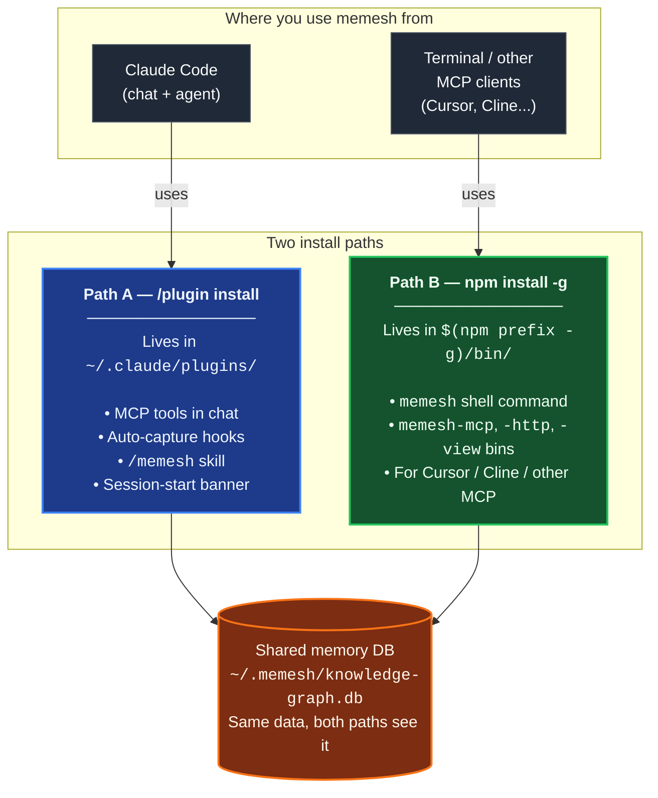

🌐 [English](README.md) | [繁體中文](README.zh-TW.md) | [简体中文](README.zh-CN.md) | [日本語](README.ja.md) | [한국어](README.ko.md) | [Português](README.pt.md) | [Français](README.fr.md) | [Deutsch](README.de.md) | [Tiếng Việt](README.vi.md) | [Español](README.es.md) | [ภาษาไทย](README.th.md)

<p align="center">
  <h1 align="center">MeMesh</h1>
  <p align="center">
    <strong>Bộ nhớ agentic cho các agent coding.</strong><br />
    Một file SQLite. Không Docker. Không cần cloud.
  </p>
  <p align="center">
    <a href="https://www.npmjs.com/package/@pcircle/memesh"></a>
    <a href="LICENSE"></a>
    <a href="https://nodejs.org"></a>
    <a href="https://modelcontextprotocol.io"></a>
  </p>
</p>

---

> [!IMPORTANT]
> **Dự án đang phát triển tích cực** — tính năng cập nhật liên tục và có thể thay đổi giữa các bản phát hành. Nếu gặp lỗi hoặc có yêu cầu tính năng, vui lòng [mở issue](https://github.com/PCIRCLE-AI/memesh/issues).

**MeMesh** — **bộ nhớ agentic** mã nguồn mở cho Claude Code & các agent coding MCP: được capture từ công việc thực tế của agent, được inject đúng lúc agent hành động, và được giữ trung thực khi nó tự mâu thuẫn. Một file SQLite. Không cần cloud.

## Vấn đề

Agent coding của bạn không chỉ quên các sự kiện giữa các phiên làm việc — nó còn **lặp lại công việc**. Nó đề xuất lại cách tiếp cận bạn đã bác bỏ tháng trước, vấp phải đúng bài test thất bại cũ, khám phá lại ràng buộc từng làm hỏng production hồi tháng Ba, và yêu cầu bạn giải thích lại kiến trúc mà chính nó đã góp phần thiết kế.

Đó không phải là vấn đề về lịch sử chat; đó là vấn đề về bộ nhớ agent. Thứ cần sống sót giữa các phiên làm việc chính là *công việc*: các quyết định kèm lý do, các thất bại kèm cách sửa, và những liên kết giữa chúng.

**MeMesh chính là bộ nhớ đó.** Hooks capture nó từ những gì agent thực sự làm (phiên làm việc, commit, thất bại — không phải ghi chú thủ công), recall inject nó đúng lúc agent hành động (khi bắt đầu phiên, trước khi sửa file), và tầng knowledge-graph giữ nó trung thực theo thời gian (supersession, phát hiện xung đột do LLM phán định). Cài đặt qua npm, bộ nhớ nằm trong `~/.memesh/knowledge-graph.db`, kết nối với Claude Code hoặc bất kỳ client tương thích MCP nào.

---

## Tổng quan các đường cài đặt

MeMesh có **hai đường cài đặt cùng tồn tại**. Hầu hết người dùng muốn cả hai. Chúng ghi vào **cùng một cơ sở dữ liệu bộ nhớ** (`~/.memesh/knowledge-graph.db`), nên ký ức ghi trong chat Claude Code sẽ xuất hiện ở shell, và ngược lại.



**Bạn cần đường nào?**

| Bạn muốn làm gì | Đường cài đặt |
|---|---|
| Dùng skill `/memesh` trong cuộc trò chuyện Claude Code | Path A (plugin) |
| Tự động capture trong Claude Code (session → bài học → recall lần sau) | Path A (plugin) |
| Chạy `memesh remember` / `memesh recall` / `memesh doctor` ở bất kỳ terminal nào | Path B (npm-global) |
| Mở dashboard qua `memesh serve` (không bị trễ khởi động `npx`) | Path B (npm-global) |
| Cắm `memesh-mcp` vào Cursor, Cline hoặc client MCP khác | Path B (npm-global) |
| Tất cả các mục trên | **Cài cả hai** — không xung đột |

> **Nhầm lẫn phổ biến**: plugin Claude Code **không** đặt `memesh` lên `PATH` của shell. Nếu bạn chỉ chạy `/plugin install` rồi gõ `memesh reindex` trong terminal, bạn sẽ thấy `command not found`. Đó là điều bình thường — thêm `npm install -g @pcircle/memesh` để có lệnh shell.

### ⚠️ Cài plugin KHÔNG cài CLI

Đây là nhầm lẫn phổ biến nhất. Đọc một lần để tiết kiệm thời gian sau này:

- `/plugin install memesh@pcircle-memesh` từ Claude Code → chỉ cài **Path A**. Bạn có công cụ MCP, hooks, skill `/memesh`. **KHÔNG** đặt `memesh` lên `PATH` shell.
- `memesh reindex` / `memesh update` / `memesh doctor` gõ trong terminal → cần **Path B** (npm-global). Không có nó: `zsh: command not found: memesh`.
- **Thiết lập khuyến nghị cho người dùng Claude Code**: **cài cả hai**. Cùng tồn tại, chia sẻ cùng DB, không xung đột.

```bash
# Sau khi /plugin install ..., chạy luôn dòng này:
npm install -g @pcircle/memesh
```

Nếu bạn chỉ dùng memesh qua chat Claude Code (không bao giờ gõ `memesh` trong terminal), Path A đủ rồi. Còn lại: cài cả hai.

---

## Bắt đầu trong 60 giây

### Lựa chọn A — Plugin Claude Code (cài một dòng)

Nếu bạn dùng Claude Code, cài MeMesh dưới dạng plugin ngay trong CLI:

```
/plugin marketplace add PCIRCLE-AI/memesh
/plugin install memesh@pcircle-memesh
```

Claude Code tự động kết nối hooks, skills và MCP server. Bạn có auto-capture trong phiên, recall chủ động, skill `/memesh` trong cuộc trò chuyện, và `remember` / `recall` / `forget` / `learn` dưới dạng công cụ MCP cho agent.

### Lựa chọn B — npm global (tối ưu tuỳ chọn)

Nếu bạn muốn binary nằm thẳng trên `PATH` (để `memesh` chạy được ở bất kỳ terminal nào mà không có độ trễ `npx`), hoặc muốn expose `memesh-mcp` như lệnh stdio đường dẫn cố định cho các MCP client ngoài Claude Code (Cursor, Cline):

```bash
npm install -g @pcircle/memesh
```

### Bước 1.5: Kết nối MeMesh vào Claude Code (khuyến nghị, một lần)

`npm install -g` đặt CLI vào PATH và đăng ký MCP server, nhưng **không** tự động kết nối các session hooks của MeMesh vào Claude Code. Không có hooks, bạn vẫn dùng được `memesh remember` / `recall` thủ công, nhưng **vòng tự động ghi nhận** (session → bài học → gọi lại chủ động ở session sau) sẽ im lặng.

```bash
memesh install-hooks         # thêm hooks memesh vào ~/.claude/settings.json
memesh doctor                # xác nhận "Hooks wired into Claude Code" PASS
```

Các hooks này cùng tồn tại với bất kỳ hook tùy chỉnh nào trong `~/.claude/hooks/` — `install-hooks` ghi theo kiểu thêm, không bao giờ ghi đè của bạn. Để gỡ: `memesh uninstall-hooks`.

### Bước 2: Lưu một quyết định

```bash
memesh remember "Use OAuth 2.0 with PKCE for the new auth"
```

Hoặc dùng dạng tường minh khi bạn muốn một tên và kiểu ổn định để lọc về sau:

```bash
memesh remember --name "auth-decision" --type "decision" --obs "Use OAuth 2.0 with PKCE"
```

### Bước 3: Gọi lại sau này

```bash
memesh recall "login security"
# → Tìm "OAuth 2.0 with PKCE" dù bạn tìm kiếm bằng từ khác
```

**Vậy thôi.** MeMesh giờ đã nhớ và gọi lại thông tin qua các phiên làm việc.

Nếu bạn muốn kiểm tra cài đặt và dây điều khiển cục bộ từ đầu đến cuối:

```bash
memesh doctor
```

Mở dashboard để khám phá bộ nhớ của bạn:

```bash
memesh serve
```

<p align="center">
  
</p>

<p align="center">
  
</p>

<p align="center">
  
</p>

---

## Dành cho ai?

| Nếu bạn là... | MeMesh giúp bạn... |
|---------------|---------------------|
| **Nhà phát triển sử dụng Claude Code** | Tự động gọi lại các quyết định dự án, bài học cụ thể theo file, và những lỗi trong quá khứ khi bạn làm việc |
| **Power user của coding agent** | Chia sẻ một tầng bộ nhớ cục bộ qua các công cụ tương thích MCP |
| **Nhóm thử nghiệm workflow AI coding** | Export/import kiến thức dự án mà không cần hạ tầng được quản lý |
| **Nhà phát triển agent** | Thêm bộ nhớ cục bộ thông qua MCP, HTTP, hoặc CLI |

---

## Thiết kế cho Coding Agent trước hết

<table>
<tr>
<td width="33%" align="center">

**Claude Code / Desktop**
```bash
memesh-mcp
```
MCP tools + Claude Code hooks

</td>
<td width="33%" align="center">

**Bất kỳ HTTP Client**
```bash
curl localhost:3737/v1/recall \
  -H "Content-Type: application/json" \
  -d '{"query":"auth"}'
```
`memesh serve` (REST API)

</td>
<td width="33%" align="center">

**Bất kỳ LLM (định dạng OpenAI)**
```bash
memesh export-schema \
  --format openai
```
Dán tools vào bất kỳ API call nào

</td>
</tr>
</table>

---

## Tại sao không dùng OpenMemory, Cursor Memories, Mem0, hay Zep?

| | **MeMesh** | OpenMemory | Cursor Memories | Mem0 | Zep / Graphiti |
|---|---|---|---|---|---|
| **Phù hợp nhất cho** | Bộ nhớ cục bộ cho coding agent | Bộ nhớ MCP cục bộ/cross-client | Bộ nhớ dự án native Cursor | Bộ nhớ app/agent được quản lý | Temporal knowledge graphs |
| **Hình thức cài đặt** | `npm install -g @pcircle/memesh` | Local app/server flow | Tích hợp vào Cursor | Cloud API / SDK / MCP | Service/framework setup |
| **Lưu trữ** | Một file SQLite cục bộ | Local memory stack | Cursor-managed rules/memories | Hosted hoặc self-hosted stack | Graph database |
| **Cloud cần thiết** | Không | Không ở chế độ local | Tuỳ thuộc vào cài đặt tài khoản Cursor | Có cho platform | Thường có/self-hosted |
| **Claude Code hooks** | First-class | MCP tools | Không | MCP tools | Không dành riêng cho Claude Code |
| **Dashboard** | Tích hợp sẵn | Tích hợp sẵn | Cài đặt Cursor | Platform dashboard | Platform/graph tooling |
| **Tradeoff** | Wedge cục bộ đơn giản, không phải quy mô enterprise | Footprint local app rộng hơn | Bị khóa vào Cursor | Platform được quản lý mạnh mẽ, local-first ít hơn | Strong graph model, heavier setup |

**MeMesh đánh đổi hạ tầng được quản lý quy mô enterprise để có setup cục bộ tức thì, lưu trữ có thể kiểm tra, và coding-agent workflow hooks.**

---

## Benchmark — 95.60% R@5 on LongMemEval-S

Engine truy hồi của MeMesh là **chỉ FTS5** (không LLM, không embeddings trên hot path), được đo trên benchmark công khai [LongMemEval-S](https://huggingface.co/datasets/xiaowu0162/longmemeval) (500 câu hỏi, giấy phép MIT):

| Hệ thống | R@5 | Nguồn |
|---|---|---|
| **MeMesh (Mode A, via `recallEnhanced()`)** | **95.60%** | [benchmarks/longmemeval/RESULTS.md](benchmarks/longmemeval/RESULTS.md) |
| MemPalace | 96.6% | Vendor self-report |
| Supermemory | ~82% | Vendor estimate |
| Zep | 63.8% | LongMemEval paper |
| Mem0 | 49.0% | LongMemEval paper |

Lệnh tái hiện, SHA256 của dataset, kết quả thô theo từng câu hỏi, và phân tích các lỗi đã biết đều có trong [`benchmarks/longmemeval/`](benchmarks/longmemeval/). Có thể chạy lại trong ~10 giây.

---

## Điều gì xảy ra tự động trong Claude Code

Bạn không cần phải manually nhớ mọi thứ. MeMesh có **6 hooks** để capture và inject kiến thức khi bạn làm việc:

| Khi nào | MeMesh làm gì |
|------|------------------|
| **Mỗi lần session bắt đầu** | Load những memories liên quan nhất + cảnh báo chủ động từ bài học trong quá khứ + agentic-orchestration banner |
| **Trước khi chỉnh sửa file** | Gọi lại memories liên quan đến file hoặc dự án trước khi Claude viết code |
| **Khi bạn yêu cầu ghi nhớ** | Phát hiện ý định "remember this" / "記下來" và nhắc nhở (use memesh|ghi memesh) |
| **Sau mỗi `git commit`** | Ghi lại những gì bạn thay đổi, với diff stats |
| **Khi Claude dừng** | Capture những file đã chỉnh sửa, lỗi đã sửa, và auto-generate structured lessons từ failures |
| **Trước khi context compact** | Lưu kiến thức trước khi nó bị mất do context limits |

> **Opt out bất kỳ lúc nào:** `export MEMESH_AUTO_CAPTURE=false`

---

## Cấu hình

Toàn bộ cấu hình thông qua biến môi trường. Các giá trị mặc định là local-only và zero-network — bạn không cần thiết lập gì để có một hệ thống hoạt động.

| Biến | Mặc định | Tác dụng |
|---|---|---|
| `MEMESH_DB_PATH` | `~/.memesh/knowledge-graph.db` | Ghi đè vị trí của database SQLite. |
| `MEMESH_AUTO_CAPTURE` | `true` | Tắt hoàn toàn các hooks auto-capture (`Stop`, `PreCompact`). |
| `MEMESH_AUTO_DETECT_LLM` | chưa đặt (tự động phát hiện **bật**) | Đặt `0` để memesh KHÔNG dùng khóa API tìm thấy trong môi trường shell. Mặc định, nếu `ANTHROPIC_API_KEY` / `OPENAI_API_KEY` / `OLLAMA_HOST` được đặt và bạn chưa cấu hình nhà cung cấp trong `~/.memesh/config.json`, memesh sẽ dùng nó cho các tính năng LLM phía ghi (hợp nhất, trích xuất bài học, tự gắn thẻ, dream). Embeddings không bị ảnh hưởng — vẫn chỉ tìm kiếm theo từ khóa (FTS5) trừ khi bạn đặt `embedder.provider` thành `ollama` hoặc `openai`. |
| `MEMESH_AUTO_UPDATE` | `off` | Chính sách auto-update. `off` (mặc định) không bao giờ tự cập nhật; `patch` cho phép `X.Y.Z → X.Y.Z+N`; `minor` thêm `X.Y.Z → X.Y+1.0`; `major` cho phép mọi bump. Khi được phép, một `npm install -g` detached chạy ở cuối session (Stop hook) để không bao giờ chặn công việc của bạn — kết quả lưu vào `~/.memesh/auto-update.log`. Cũng có thể đặt là `autoUpdate` trong `~/.memesh/config.json` (env thắng). Khi phiên bản đã cài bị maintainers đánh dấu deprecated (security advisory), `patch` sẽ được force-allowed ngay cả khi `off` — minor / major bumps vẫn manual để tránh behaviour drift im lặng. |
| `OPENAI_API_KEY` | chưa đặt | Khóa OpenAI của bạn. Được dùng tự động cho các tính năng LLM trừ khi bạn đặt `MEMESH_AUTO_DETECT_LLM=0` hoặc cấu hình nhà cung cấp một cách rõ ràng. |
| `OLLAMA_HOST` | `http://localhost:11434` | Ghi đè endpoint Ollama khi dùng local Ollama provider. |

`memesh doctor` in ra cấu hình đã resolve để bạn thấy cái gì đang active.

**Nhà cung cấp LLM dự phòng (Smart Mode).** Trong dashboard, tại **Settings → “Fallback providers”**, bạn có thể đặt một chuỗi failover có thứ tự — memesh thử lần lượt từng nhà cung cấp khi cái chính bị hỏng. Thêm một fallback cục bộ [Ollama](https://ollama.com), hoặc một cái trên cloud (OpenAI / Anthropic, cần API key). Đánh đổi về quyền riêng tư: khi dùng fallback cloud, văn bản bộ nhớ — vốn có thể riêng tư — sẽ được gửi tới nhà cung cấp đó, điều này quan trọng nếu bạn chạy hoàn toàn cục bộ vì quyền riêng tư.

Khi npm gắn cờ phiên bản đã cài là deprecated (thường là security advisory), session-start kế tiếp sẽ thêm banner mạnh `⚠️ MeMesh <ver> is DEPRECATED` ở đầu và `memesh update-status` hiển thị cùng dòng đó cho đến khi bạn nâng cấp. Kết quả check được cache tại `~/.memesh/update-check.<version>.json` để một lỗi mạng tạm thời không làm mờ cảnh báo.

---

## Dashboard

8 tabs, 11 ngôn ngữ, không phụ thuộc bên ngoài. Truy cập tại `http://localhost:3737/dashboard` khi server đang chạy.

| Tab | Bạn thấy gì |
|-----|-------------|
| **Insights** | Thông tin chi tiết về bộ nhớ — tóm tắt hàng tuần và đề xuất mẫu từ công cụ dreamer; chấp nhận/từ chối một cú nhấp |
| **Search** | Full-text + vector similarity search trên tất cả memories |
| **Browse** | Danh sách paginated tất cả entities với archive/restore |
| **Analytics** | Memory Health Score, timeline 30 ngày, tốc độ PM + chỉ số kết nối KG, work patterns, cleanup suggestions |
| **Graph** | Interactive force-directed knowledge graph với type filters, search, ego mode, recency heatmap |
| **Lessons** | Structured lessons từ những lỗi trong quá khứ (error, root cause, fix, prevention) |
| **Manage** | Archive và restore entities |
| **Settings** | LLM provider config, instant language selector |

---

## Tính năng thông minh

**🧠 Smart Search** — Tìm "login security" và tìm thấy memories về "OAuth PKCE". MeMesh dùng FTS5 + sqlite-vec trên hot path, không dùng LLM; phần bổ sung vector vẫn tiếp cận được các cách diễn đạt liên quan.

**🌏 Tìm kiếm trong các hệ chữ không dùng khoảng trắng** — Tiếng Trung, Nhật, Hàn, Thái, Lào, Khmer và katakana nửa chiều rộng được lập chỉ mục theo từng cặp ký tự liền nhau, nên một ghi nhớ viết là 「資料庫遷移前一定要先備份」 sẽ tìm thấy bằng 「備份」 — không cần gõ lại đúng nguyên văn. Văn bản được chuẩn hóa (NFC) ở cả phía ghi lẫn phía truy vấn, nên ghi nhớ gõ trên macOS hoặc bằng IME tiếng Hàn, tiếng Việt đều tìm được ở cả hai cách viết.

**📊 Scored Ranking** — Kết quả được xếp hạng theo relevance (30%) + recency (25%) + frequency (18%) + confidence (17%) + recall impact (10%).

**🔄 Knowledge Evolution** — Quyết định thay đổi. `forget` archives old memories (không bao giờ xóa). `supersedes` relations liên kết old → new. AI của bạn luôn thấy phiên bản mới nhất.

**⚠️ Conflict Detection** — Nếu bạn có hai memories mâu thuẫn với nhau, MeMesh cảnh báo bạn.

**🕸️ Kết nối đồ thị tri thức** — `memesh kg backfill-relations --all-rules` liên kết các thực thể cô lập bằng cách sử dụng đồng xuất hiện thẻ, phân cụm dự án, ngữ cảnh phiên và độ tương đồng tên — không cần LLM.

**📦 Team Sharing** — `memesh export > team-knowledge.json` → chia sẻ với team → `memesh import team-knowledge.json`
Các imported bundles vẫn có thể tìm kiếm được, nhưng MeMesh không auto-inject imported memories vào Claude hooks cho đến khi bạn review hoặc re-store chúng locally.

---

## Ví dụ sử dụng

> "MeMesh đã nhớ rằng chúng tôi chọn PKCE thay vì implicit flow ba tuần trước. Khi tôi hỏi Claude về auth lại, nó đã biết — không cần giải thích lại."
> — **Nhà phát triển solo, xây dựng SaaS**

> "Chúng tôi export team memory mỗi thứ Sáu và import thứ Hai. Claude của mỗi người bắt đầu tuần biết những gì team đã học tuần trước."
> — **Startup 3 người, knowledge base được chia sẻ**

> "Dashboard cho tôi thấy 90% memories của tôi là auto-generated session logs. Tôi bắt đầu sử dụng `remember` có ý định cho architectural decisions. Game changer."
> — **Nhà phát triển khám phá ra Analytics tab**

---

## Mở khóa Smart Mode (Tuỳ chọn)

MeMesh hoạt động offline theo mặc định — recall luôn LLM-free (95.60% R@5 trên LongMemEval-S, không cần LLM). Thêm LLM API key chỉ nếu bạn muốn các luồng phân tích LLM-augmented bổ sung: trích xuất session thông minh hơn, auto-tagging cho memories mới, phân tích lỗi thành lessons có cấu trúc, và compression `dream`:

```bash
memesh config set llm.provider anthropic
memesh config set llm.api-key sk-ant-...
```

Hoặc dùng dashboard Settings tab (visual setup):

```bash
memesh serve  # mở dashboard → Settings tab
```

**Khai thác các phiên trước thành bộ nhớ.** `memesh dream run --from-transcripts` đọc bản ghi phiên Claude Code của dự án này, hỏi LLM về các quyết định và bài học ẩn trong cuộc trò chuyện, rồi lưu tạm chúng dưới dạng đề xuất — không có gì tự động vào đồ thị của bạn. Xem lại từng cái bằng `memesh dream show <id>` và chấp nhận những cái đáng giữ.

### Dùng embeddings của riêng bạn (tùy chọn)

Mặc định MeMesh recall **chỉ theo từ khóa** (FTS5) — không cần khóa API, không tải mô hình, không có gì rời khỏi máy bạn. Tìm kiếm ngữ nghĩa (theo ý nghĩa) là tùy chọn và cần một embedder. Hãy cấu hình một trong số:

```bash
memesh config set embedder.provider openai          # or: ollama
memesh config set embedder.model text-embedding-3-small
```

Embedder được cấu hình **độc lập với LLM chat** — thay đổi `llm.provider` không bao giờ âm thầm thay đổi embeddings của bạn. Nếu bạn chuyển sang chiều khác (ví dụ 768 → 1536), MeMesh tự động xây dựng lại chỉ mục vector ở lần ghi tiếp theo. Các giá trị `embedder.provider` được hỗ trợ: `ollama` (cục bộ), `openai` (đám mây). Không đặt gì thì recall vẫn là tìm kiếm theo từ khóa.

| | Level 0 (default) | Level 1 (Smart Mode) |
|---|---|---|
| **Tìm kiếm** | FTS5 + sqlite-vec, 95.60% R@5 | giữ nguyên — recall luôn LLM-free ở mọi level |
| **Auto-capture** | Rule-based patterns | + LLM extracts decisions & lessons |
| **Auto-tagging** | Chỉ thẻ thủ công | + LLM tự động gắn nhãn entity mới |
| **Phân tích lỗi** | Không có sẵn | + LLM chuyển session errors thành structured lessons |
| **Compression** | Không có sẵn | `dream` nén verbose memories |
| **Chi phí** | Free, no API key | ~$0.0001 mỗi analysis call (Haiku) |

---

## Cả 7 Memory Tools

| Tool | Nó làm gì |
|------|-------------|
| `remember` | Lưu trữ kiến thức với observations, relations, và tags |
| `recall` | Tìm kiếm FTS5 + sqlite-vec với multi-factor scoring (relevance, recency, frequency, confidence, recall impact) — không có LLM trong hot path |
| `forget` | Soft-archive (không bao giờ xóa) hoặc xóa observations cụ thể |
| `export` | Chia sẻ memories dưới dạng JSON giữa các dự án hoặc thành viên team |
| `import` | Import memories với merge strategies (skip / overwrite / append) |
| `learn` | Ghi lại structured lessons từ những sai lầm (error, root cause, fix, prevention) |
| `user_patterns` | Phân tích work patterns của bạn — schedule, tools, strengths, learning areas |

---

## Kiến trúc

```
                    ┌─────────────────┐
                    │   Core Engine   │
                    │  (7 operations) │
                    └────────┬────────┘
           ┌─────────────────┼─────────────────┐
           │                 │                 │
     CLI (memesh)    HTTP API (serve)    MCP (memesh-mcp)
           │                 │                 │
           └─────────────────┼─────────────────┘
                             │
                    SQLite + FTS5 + sqlite-vec
                    (~/.memesh/knowledge-graph.db)
```

Core là framework-agnostic. Logic tương tự chạy từ terminal, HTTP, hoặc MCP.

---

## Nâng cấp

Plugin marketplace của Claude Code ghim phiên bản lúc cài đặt và **không** tự động cập nhật. Để lấy bản phát hành mới:

**Tùy chọn A — Giao diện `/plugin`**: gỡ cài `memesh@pcircle-memesh`, rồi cài lại. Claude Code sẽ kéo phiên bản mới nhất từ marketplace.

**Tùy chọn B — Script một dòng** (không cần click UI, idempotent):

```bash
# Nếu bản plugin đã cài là v4.2.5 trở lên, script đã có sẵn:
bash ~/.claude/plugins/cache/pcircle-memesh/memesh/<current-version>/scripts/upgrade-plugin.sh

# Nếu bạn cài trước v4.2.5 (tức là v4.2.4 hoặc v4.2.3),
# script chưa nằm trong plugin của bạn. Dùng bản sao npm-global thay thế:
bash "$(npm prefix -g)/lib/node_modules/@pcircle/memesh/scripts/upgrade-plugin.sh"

# (Giả định bạn cũng đã chạy `npm install -g @pcircle/memesh`. Nếu chưa, đây là
# thời điểm tốt để cài — xem phần "Tổng quan các đường cài đặt" ở trên để hiểu
# vì sao đa số người dùng muốn có cả hai đường.)
```

Script sẽ fast-forward marketplace cache, đặt phiên bản mới vào `~/.claude/plugins/cache/`, cài runtime deps, rồi trỏ lại `installed_plugins.json`. Khởi động lại Claude Code sau đó để MCP server kết nối lại.

**Bản cài npm-global** (`npm install -g @pcircle/memesh`) có thể tự cập nhật qua `memesh update`. Source checkouts: `git pull && npm install && npm run build`.

Khi bắt đầu session, banner một dòng (throttle mỗi 24h mỗi version) hiện ra khi có bản phát hành mới, và `memesh doctor` báo cáo phiên bản nâng cấp với lệnh tương ứng kênh cài đặt.

---

## Đóng góp

```bash
git clone https://github.com/PCIRCLE-AI/memesh
cd memesh && npm install && npm run build
npm test
npm run test:e2e-dashboard
```

Dashboard: `cd dashboard && npm install && npm run dev`

---

<p align="center">
  <strong>MIT</strong> — Được tạo bởi <a href="https://pcircle.com">PCIRCLE AI</a>
</p>
