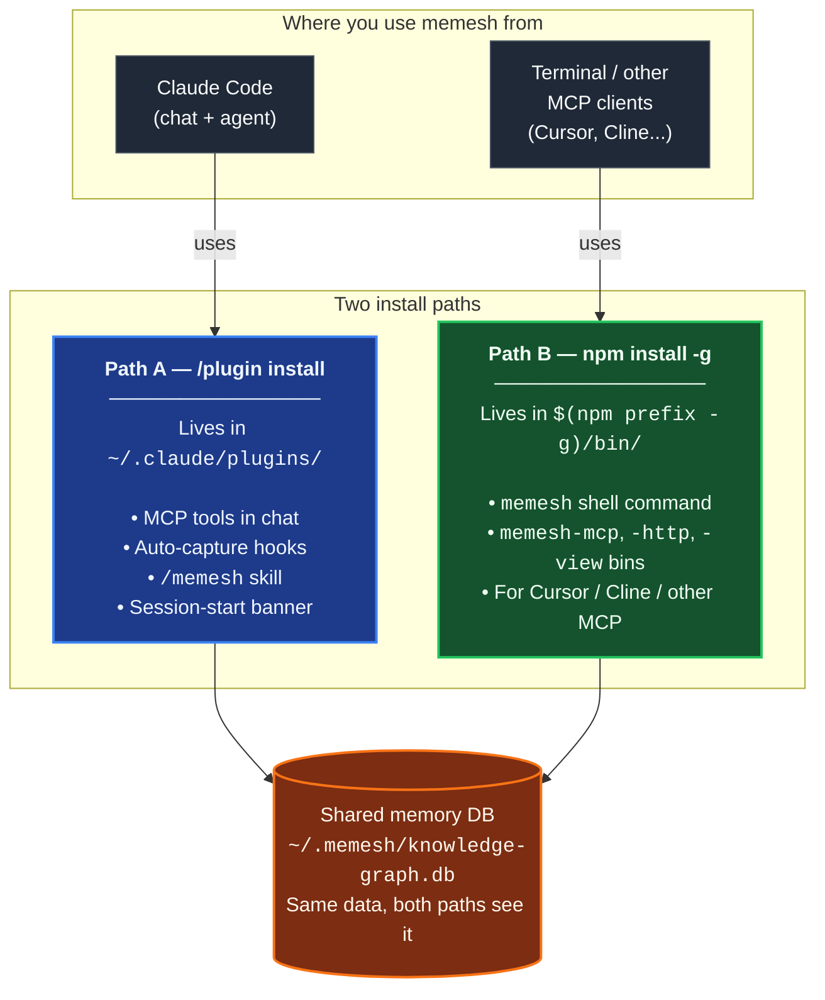

🌐 [English](README.md) | [繁體中文](README.zh-TW.md) | [简体中文](README.zh-CN.md) | [日本語](README.ja.md) | [한국어](README.ko.md) | [Português](README.pt.md) | [Français](README.fr.md) | [Deutsch](README.de.md) | [Tiếng Việt](README.vi.md) | [Español](README.es.md) | [ภาษาไทย](README.th.md)

<p align="center">
  <h1 align="center">MeMesh LLM Memory</h1>
  <p align="center">
    <strong>为 Claude Code 和 MCP 编码代理设计的本地内存层。</strong><br />
    一个 SQLite 文件。无需 Docker。无需云服务。
  </p>
  <p align="center">
    <a href="https://www.npmjs.com/package/@pcircle/memesh"></a>
    <a href="LICENSE"></a>
    <a href="https://nodejs.org"></a>
    <a href="https://modelcontextprotocol.io"></a>
  </p>
</p>

---

> [!IMPORTANT]
> **持续开发中的项目** — 功能会持续更新，版本之间可能会有变动。遇到问题或想要新功能，请[开 issue](https://github.com/PCIRCLE-AI/memesh-llm-memory/issues)。

## 问题

编码代理在会话间会遗忘。每个架构决策、每次 bug 修复、失败的测试用例、每一次来之不易的经验教训都需要重新解释一遍。Claude Code 每次都从零开始，重新发现老约束，浪费上下文在早该掌握的东西上。

**MeMesh 为编码代理提供持久化、可搜索、不断演进的本地内存。**

本包是 MeMesh 产品系列的本地内存层。我们刻意保持简洁并开源：用 npm 安装，内存文件保存在 `~/.memesh/knowledge-graph.db`，连接到 Claude Code 或任何兼容 MCP 的客户端即可。托管工作区和企业级操作系统产品应当独立于本包的 README 和路线图。

---

## 实测数据 — LongMemEval-S 上 R@5 达到 95.60%

MeMesh 的检索引擎**只用 FTS5**（热路径上没有 LLM、也没有 embeddings），在公开的 [LongMemEval-S](https://huggingface.co/datasets/xiaowu0162/longmemeval) 基准（500 道题，MIT 许可）上的实测结果：

| 系统 | R@5 | 来源 |
|---|---|---|
| **MeMesh (Mode A, via `recallEnhanced()`)** | **95.60%** | [benchmarks/longmemeval/RESULTS.md](benchmarks/longmemeval/RESULTS.md) |
| MemPalace | 96.6% | 厂商自报 |
| Supermemory | ~82% | 厂商估计 |
| Zep | 63.8% | LongMemEval 论文 |
| Mem0 | 49.0% | LongMemEval 论文 |

复现命令、数据集 SHA256、每题原始结果以及已知失败分析全部放在 [`benchmarks/longmemeval/`](benchmarks/longmemeval/) 中。约 10 秒可重跑。

---

## 安装路径一览

MeMesh 有**两条共存的安装路径**。多数用户两条都需要。它们写入**同一份记忆数据库**（`~/.memesh/knowledge-graph.db`），所以 Claude Code 对话里记下的东西在 terminal 也看得到，反之亦然。



**你需要哪条？**

| 你想做什么 | 安装路径 |
|---|---|
| 在 Claude Code 对话里用 `/memesh` skill | Path A（plugin）|
| 在 Claude Code 启用自动 capture（session → 教训 → 下次 recall） | Path A（plugin）|
| 在任何 terminal 跑 `memesh remember` / `memesh recall` / `memesh doctor` | Path B（npm-global）|
| 用 `memesh serve` 直接开 dashboard（没有 `npx` 启动延迟） | Path B（npm-global）|
| 把 `memesh-mcp` 接到 Cursor、Cline 或其他 MCP client | Path B（npm-global）|
| 以上全要 | **两条都装** — 不会冲突 |

> **常见误会**：Claude Code 的 plugin **不会** 把 `memesh` 放到你的 shell `PATH` 上。如果你只跑 `/plugin install`，然后在 terminal 打 `memesh reindex`，你会看到 `command not found`。这是正常的 — 还要加 `npm install -g @pcircle/memesh` 才有 shell 命令。

### ⚠️ 装 plugin 不会装 CLI

这是最常见的踩坑点，读一次省下未来的循环：

- 从 Claude Code 跑 `/plugin install memesh@pcircle-memesh` → 只装 **Path A**。给你 MCP 工具、hooks、`/memesh` skill。**不会**把 `memesh` 放到你的 shell `PATH`。
- 在 terminal 打 `memesh reindex` / `memesh update` / `memesh doctor` → 需要 **Path B**（npm-global）。没装就会 `zsh: command not found: memesh`。
- **Claude Code 使用者建议的安装方式**：**两条都装**。共存、共用同一份数据库、不冲突。

```bash
# 跑完 /plugin install ... 之后，再跑这个：
npm install -g @pcircle/memesh
```

如果你只透过 Claude Code 对话用 memesh（从不在 terminal 打 `memesh`），Path A 自己就够了。其他人请两条都装。

---

## 60 秒快速开始

### 选项 A — Claude Code 插件（一行安装）

如果你使用 Claude Code，可以直接在 CLI 内把 MeMesh 作为插件安装：

```
/plugin marketplace add PCIRCLE-AI/memesh-llm-memory
/plugin install memesh@pcircle-memesh
```

Claude Code 会自动接好 hooks、skills 以及 MCP server。你将获得会话内自动捕获、主动回忆、Claude Code 对话内的 `/memesh` skill（remember / recall / learn / forget），并且 `remember` / `recall` / `forget` / `learn` 也以 MCP 工具提供给代理使用。CLI 和本地仪表板也都无需额外全局安装即可访问 — `npx @pcircle/memesh <command>` 可以执行所有 CLI 命令，`npx @pcircle/memesh` 会在 `localhost:3737` 启动仪表板。MCP server 直接从插件内置的编译产物启动 — 不需要 `npx` 查找、不需要 `npm install -g`、不需要本地构建步骤。memesh 通过 Node 内置的 `node:sqlite`（22.13+）存放数据，所以升级 Node 不会留下一个为错误 runtime 编译的二进制文件。

### 选项 B — npm 全局安装（可选优化）

如果你想把二进制直接放在 shell `PATH` 上（这样 `memesh`、`memesh-mcp` 等可在任意终端中直接使用，不需要每次都走 `npx` 查找），或者你想把 `memesh-mcp` 作为固定路径 stdio 命令暴露给**非 Claude Code 的 MCP 客户端**（Cursor、Cline、纯终端流程）：

```bash
npm install -g @pcircle/memesh
```

> **首次安装注意事项（一次性）：**
> - **不需要编译器** — 数据库引擎就是 Node 自己的 `node:sqlite`。负责「按意思搜索」的 `sqlite-vec` 以预编译文件形式提供 macOS（arm64/x64）、Linux（x64/arm64）和 Windows x64；在其他平台它就是不存在，回忆保持关键词搜索。这里没有任何东西会执行安装脚本，所以 `npm install --ignore-scripts` 也能装出完全可用的 memesh。
> - **语义搜索是可选的** — 默认检索路径是关键词搜索（FTS5），不需要模型也不需要下载。基于语义的搜索需要一个 embedder：在本地运行 [Ollama](https://ollama.com)，或配置一个云端 embedder（见下方“嵌入”）。没有配置时，memesh 只使用关键词搜索。

### 第一步半：把 MeMesh 接入 Claude Code（仅 npm 路径）

如果你通过**选项 A**（`/plugin install memesh@pcircle-memesh`）安装，跳过这一步 — Claude Code 会自动接好插件 hooks。

如果你通过**选项 B**（`npm install -g`）安装，CLI 已经在 PATH 上、MCP server 也已注册，但 Claude Code session hooks 不会自动接上。没有这些 hooks，你仍然可以手动用 `memesh remember` / `recall`，但**自动捕捉循环**（session → 教训 → 下次 session 主动回想）就会静默不动。

```bash
memesh install-hooks         # 把 memesh hooks 加到 ~/.claude/settings.json
memesh doctor                # 确认「Hooks wired into Claude Code」通过
```

这些 hooks 会和你已有的 `~/.claude/hooks/` 自定义 hooks 并存 — `install-hooks` 用追加方式写，从不覆盖你的东西。要移除：`memesh uninstall-hooks`。

### 第二步：记录一个决策

> 下面的 bash 示例假设 `memesh` 已在你的 `PATH` 上（选项 B）。选项 A（仅插件）用户有两条等价路径：在 Claude Code 对话内询问（`/memesh` skill + MCP 工具覆盖相同流程），或在任意 shell 中把 `memesh` 替换成 `npx @pcircle/memesh` — 参数完全相同，无需全局安装。

```bash
memesh remember "Use OAuth 2.0 with PKCE for the new auth"
```

或在你想要稳定名称和类型用于后续过滤时使用显式形式：

```bash
memesh remember --name "auth-decision" --type "decision" --obs "Use OAuth 2.0 with PKCE"
```

### 第三步：之后随时调用

```bash
memesh recall "login security"
# → 即使用词不同，也能找到 "OAuth 2.0 with PKCE"
```

**就这样。** MeMesh 现在已经在会话间记忆和回忆了。

想验证安装和本地接线是否完整：

```bash
memesh doctor
```

打开仪表板浏览你的内存：

```bash
memesh serve
```

<p align="center">
  
</p>

<p align="center">
  
</p>

<p align="center">
  
</p>

---

## 这是为谁设计的？

| 你是... | MeMesh 帮助你... |
|--------|-----------------|
| **使用 Claude Code 的开发者** | 工作时自动回忆项目决策、文件特定的经验教训和过去的失败 |
| **编码代理重度用户** | 在 MCP 兼容工具间共享一个本地内存层 |
| **团队试验 AI 编码工作流** | 导出/导入项目知识，无需引入托管基础设施 |
| **代理开发者** | 通过 MCP、HTTP 或 CLI 添加本地内存 |

---

## 为编码代理优先设计

<table>
<tr>
<td width="33%" align="center">

**Claude Code / Desktop**
```bash
memesh-mcp
```
MCP 工具 + Claude Code 钩子

</td>
<td width="33%" align="center">

**任何 HTTP 客户端**
```bash
curl localhost:3737/v1/recall \
  -H "Content-Type: application/json" \
  -d '{"query":"auth"}'
```
`memesh serve` (REST API)

</td>
<td width="33%" align="center">

**任何 LLM (OpenAI 格式)**
```bash
memesh export-schema \
  --format openai
```
粘贴工具到任何 API 调用

</td>
</tr>
</table>

---

## 为什么不用 OpenMemory、Cursor Memories、Mem0 或 Zep？

| | **MeMesh** | OpenMemory | Cursor Memories | Mem0 | Zep / Graphiti |
|---|---|---|---|---|---|
| **最佳适用场景** | 编码代理的本地内存 | 本地/跨客户端 MCP 内存 | Cursor 原生项目内存 | 托管应用/代理内存 | 时间知识图 |
| **安装形式** | `npm install -g @pcircle/memesh` | 本地应用/服务器流程 | 内置于 Cursor | 云 API / SDK / MCP | 服务/框架配置 |
| **存储方式** | 单个本地 SQLite 文件 | 本地内存栈 | Cursor 管理的规则/内存 | 托管或自托管栈 | 图数据库 |
| **是否需要云** | 否 | 本地模式不需要 | 取决于 Cursor 账户/设置 | 平台需要 | 通常需要/自托管 |
| **Claude Code 钩子** | 一级支持 | MCP 工具 | 否 | MCP 工具 | 不针对 Claude Code |
| **仪表板** | 内置 | 内置 | Cursor 设置 | 平台仪表板 | 平台/图形工具 |
| **权衡** | 简洁的本地方案，不适用企业规模 | 更宽泛的本地应用足迹 | 绑定 Cursor | 强大的托管平台，本地化程度低 | 强大的图模型，配置更复杂 |

**MeMesh 用即插即用的本地设置、可检视的存储和编码代理工作流钩子，换取企业级托管基础设施。**

---

## Claude Code 中的自动化流程

你不需要手动记住一切。MeMesh 有 **6 个钩子**在你工作时自动捕获和注入知识：

| 触发条件 | MeMesh 的动作 |
|---------|------------|
| **每个会话开始** | 加载最相关的记忆 + 来自过去经验教训的主动警告 |
| **编辑文件前** | 回忆与该文件或项目相关的记忆，然后 Claude 才开始写代码 |
| **当你要求记忆时** | 检测「remember this」/「guardar en memesh」/「sauvegarder dans memesh」/「记下来」意图（5 种语言），并提醒 Claude 使用 memesh |
| **每次 `git commit` 后** | 记录你的改动，附带 diff 统计 |
| **Claude 停止时** | 捕获编辑过的文件、修复的错误、自动从失败中生成结构化经验教训 |
| **上下文压缩前** | 在知识被上下文限制吞没前保存 |

> **随时退出：** `export MEMESH_AUTO_CAPTURE=false`

---

## 配置

所有配置都通过环境变量。默认值为本地、零网络 — 无需设置任何东西即可获得可用系统。

| 变量 | 默认 | 作用 |
|---|---|---|
| `MEMESH_DB_PATH` | `~/.memesh/knowledge-graph.db` | 覆盖 SQLite 数据库位置。 |
| `MEMESH_AUTO_CAPTURE` | `true` | 完全禁用自动捕获 hooks（`Stop`、`PreCompact`）。 |
| `MEMESH_AUTO_DETECT_LLM` | 未设置（自动检测**开启**） | 设为 `0` 让 memesh 不使用它在 shell 环境中找到的 API 密钥。默认情况下，如果设置了 `ANTHROPIC_API_KEY` / `OPENAI_API_KEY` / `OLLAMA_HOST` 且你没有在 `~/.memesh/config.json` 中配置提供商，memesh 会用它来跑写入侧的 LLM 功能（整合、经验提取、自动打标签、dream）。嵌入不受影响 —— 除非你把 `embedder.provider` 显式设置为 `ollama` 或 `openai`，否则保持仅关键词（FTS5）。 |
| `MEMESH_AUTO_UPDATE` | `off` | 自动升级策略。`off`（默认）从不自动升级；`patch` 允许 `X.Y.Z → X.Y.Z+N`；`minor` 增加 `X.Y.Z → X.Y+1.0`；`major` 允许任意版本跳升。允许时，一个分离的 `npm install -g` 会在会话结束（Stop hook）触发，所以从不阻塞你的工作 — 结果落在 `~/.memesh/auto-update.log`。也可以在 `~/.memesh/config.json` 里写为 `autoUpdate`（环境变量优先）。当已安装版本被维护者标记为 deprecated（安全建议）时，`patch` 会被强制允许，即便策略是 `off` — minor / major 升级仍保持手动，避免行为静默漂移。 |
| `OPENAI_API_KEY` | 未设置 | 你的 OpenAI 密钥。除非你设置 `MEMESH_AUTO_DETECT_LLM=0` 或显式配置提供商，否则会自动用于 LLM 功能。 |
| `OLLAMA_HOST` | `http://localhost:11434` | 使用本地 Ollama 提供商时覆盖 Ollama 端点。 |

`memesh doctor` 会打印解析后的配置，你可以看到当前生效的内容。

**备用 LLM 提供商（Smart Mode）。** 在 dashboard 的 **Settings → “Fallback providers”** 可以设置一条有顺序的故障转移链——当主要提供商不可用时，memesh 会依次改用列表里的下一个。可以加本地的 [Ollama](https://ollama.com) 备用，或云端的（OpenAI / Anthropic，需要 API key）。隐私权衡：一旦用到云端备用，记忆内容（可能是私密的）会被发送到该提供商，所以如果你为了隐私只跑本地，这点需要注意。

当 npm 把已安装版本标记为 deprecated（通常为安全建议）时，下次 session-start 会先显示一条强烈的 `⚠️ MeMesh <ver> is DEPRECATED` 横幅，并且 `memesh update-status` 在你升级前会持续显示同一行。检查结果会缓存到 `~/.memesh/update-check.<version>.json`，避免一次临时网络故障让警告变弱。

---

## 仪表板

8 个标签页，11 种语言，零外部依赖。服务器运行时访问 `http://localhost:3737/dashboard`。

| 标签页 | 你看到什么 |
|--------|---------|
| **Insights** | 记忆洞察 — 来自 dreamer 引擎的每周摘要和模式提案；一键接受/拒绝 |
| **搜索** | 全文 + 向量相似度搜索，覆盖所有记忆 |
| **浏览** | 所有实体的分页列表，支持归档/恢复 |
| **分析** | 记忆健康分数、30 天时间线、PM 速度 + KG 连通性指标、工作模式、清理建议 |
| **知识图** | 交互式力导向图，支持类型过滤、搜索、中心模式、新近度热力图 |
| **经验教训** | 来自过去失败的结构化经验教训（错误、根本原因、修复、预防） |
| **管理** | 归档和恢复实体 |
| **设置** | LLM 提供商配置、即时语言切换器 |

---

## 聪慧功能

**🧠 智能搜索** — 搜索"登录安全"也能找到"OAuth PKCE"相关的记忆。MeMesh 在热路径上用 FTS5 + sqlite-vec，零 LLM。

**🌏 支持不用空格分词的文字** — 中文、日文、韩文、泰文、老挝文、高棉文和半角片假名都会拆成相邻两字一组来建索引，所以写成「资料库迁移前一定要先备份」的记忆，搜索「备份」就找得到，不必打出一模一样的全文。写入和查询两边都会做 NFC 正规化，因此在 macOS 上或用韩文、越南文输入法打的记忆，两种写法都找得到。

**📊 评分排序** — 结果按相关性（30%）+ 新近度（25%）+ 频率（18%）+ 置信度（17%）+ 回忆影响（10%）排序。

**🔄 知识演进** — 决策会变化。`forget` 归档旧记忆（永不删除）。`supersedes` 关系链接 旧 → 新。你的 AI 总是看到最新版本。

**⚠️ 冲突检测** — 如果你有两条相互矛盾的记忆，MeMesh 会警告你。

**🕸️ 知识图连通性** — `memesh kg backfill-relations --all-rules` 使用标签共现、项目聚类、会话上下文和名称相似度连接孤立实体 — 无需 LLM。

**📦 团队共享** — `memesh export > team-knowledge.json` → 与团队分享 → `memesh import team-knowledge.json`
导入的包保持可搜索，但 MeMesh 不会自动将导入的记忆注入到 Claude 钩子中，直到你审查或本地重新存储它们。

---

## 使用示例

> "MeMesh 记得我们三周前选择了 PKCE 而不是隐式流。我再次问 Claude 有关身份验证的问题时，它已经知道——无需重新解释。"
> — **独立开发者，正在构建 SaaS**

> "我们每周五导出团队的内存，周一导入。每个人的 Claude 周一开始时都知道团队上周学到了什么。"
> — **3 人初创公司，共享知识库**

> "仪表板显示我 90% 的记忆是自动生成的会话日志。我开始有意使用 `remember` 记录架构决策。彻底改变了游戏规则。"
> — **发现分析标签页的开发者**

---

## 解锁智能模式（可选）

MeMesh 默认离线工作 — 回忆始终是严格无 LLM 的（开箱即用 LongMemEval-S R@5 95.60%）。仅当你想要在此之上叠加 LLM 增强分析流程时才添加 LLM API 密钥：更聪慧的会话提取、为新记忆自动打标签、从失败生成经验教训，以及 `dream` 压缩：

```bash
memesh config set llm.provider anthropic
memesh config set llm.api-key sk-ant-...
```

或使用仪表板设置标签页（可视化配置）：

```bash
memesh serve  # 打开仪表板 → 设置标签页
```

**把过去的会话挖成记忆。** `memesh dream run --from-transcripts` 会读取这个项目的 Claude Code 会话记录，请 LLM 找出藏在对话里的决策与教训，再把它们暂存为提案——不会自动写入你的知识图谱。用 `memesh dream show <id>` 逐一查看，挑值得保留的 accept。

### 自带嵌入(可选)

默认情况下 MeMesh 只做**关键词**召回(FTS5)—— 无需 API 密钥,无需下载模型,数据不离开你的机器。语义(基于含义的)搜索是可选的,需要一个嵌入器。配置其中之一:

```bash
memesh config set embedder.provider openai          # or: ollama
memesh config set embedder.model text-embedding-3-small
```

嵌入器**独立于对话 LLM** 配置 —— 更改 `llm.provider` 绝不会悄悄改变你的嵌入。如果切换到不同维度(如 768 → 1536),MeMesh 会在下次写入时自动重建向量索引。支持的 `embedder.provider` 取值:`ollama`(本地)、`openai`(托管)。两者都不设置时,召回保持关键词搜索。

| | 级别 0（默认） | 级别 1（智能模式） |
|---|---|---|
| **搜索** | FTS5 + sqlite-vec，95.60% R@5 | 不变 — 回忆在每个级别都是无 LLM 的 |
| **自动捕获** | 基于规则的模式 | + LLM 提取决策和经验教训 |
| **自动打标签** | 仅手动标签 | + LLM 为新记忆生成标签 |
| **失败分析** | 不可用 | + LLM 把会话错误转化为结构化经验教训 |
| **压缩** | 不可用 | `dream` 压缩冗长的记忆 |
| **成本** | 免费，无需 API 密钥 | ~$0.0001 每次分析调用（Haiku） |

---

## 全部 7 个内存工具

| 工具 | 它做什么 |
|------|--------|
| `remember` | 存储知识，附带观察、关系和标签 |
| `recall` | FTS5 + sqlite-vec 搜索，附带多因素评分（相关性、新近度、频率、置信度、回忆影响）— 热路径上无 LLM |
| `forget` | 软归档（永不删除）或移除特定观察 |
| `export` | 在项目或团队成员间共享内存，格式为 JSON |
| `import` | 导入内存，支持合并策略（跳过 / 覆盖 / 追加） |
| `learn` | 从错误中记录结构化经验教训（错误、根本原因、修复、预防） |
| `user_patterns` | 分析你的工作模式——日程、工具、优势、学习领域 |

---

## 架构

```
                    ┌─────────────────┐
                    │   Core Engine   │
                    │  (7 operations) │
                    └────────┬────────┘
           ┌─────────────────┼─────────────────┐
           │                 │                 │
     CLI (memesh)    HTTP API (serve)    MCP (memesh-mcp)
           │                 │                 │
           └─────────────────┼─────────────────┘
                             │
                    SQLite + FTS5 + sqlite-vec
                    (~/.memesh/knowledge-graph.db)
```

核心是框架无关的。相同逻辑从终端、HTTP 或 MCP 运行。

---

## 升级

Claude Code 的 plugin marketplace 在安装时把版本钉住，**不会**自动更新。要拿到新版本：

**方法 A — `/plugin` 界面**：先卸载 `memesh@pcircle-memesh`，再重新安装。Claude Code 会抓取 marketplace 最新版。

**方法 B — 一行命令**（无需点击 UI、幂等）：

```bash
# 如果 plugin 已经是 v4.2.5 或更新，脚本已内置：
bash ~/.claude/plugins/cache/pcircle-memesh/memesh/<current-version>/scripts/upgrade-plugin.sh

# 如果是 v4.2.5 之前的版本（即 v4.2.4 或 v4.2.3），
# 脚本还没在你的 plugin 里，改用 npm-global 的副本：
bash "$(npm prefix -g)/lib/node_modules/@pcircle/memesh/scripts/upgrade-plugin.sh"

# （这假设你也运行过 `npm install -g @pcircle/memesh`。如果还没，
# 现在正好可以一起装 — 参考上面「安装路径一览」了解为什么大多数人两条路径都装。）
```

脚本会 fast-forward marketplace cache、把新版本放入 `~/.claude/plugins/cache/`、安装 runtime deps，然后把 `installed_plugins.json` 重指向新版本。完成后请重启 Claude Code 让 MCP server 重连。

**npm-global 安装**（`npm install -g @pcircle/memesh`）可以直接通过 `memesh update` 自动更新。Source checkouts：`git pull && npm install && npm run build`。

Session 开始时，若有新版本可下载，会显示一行 banner（每版本每 24 小时节流一次），`memesh doctor` 会报告升级目标版本与对应命令。

---

## 贡献

```bash
git clone https://github.com/PCIRCLE-AI/memesh-llm-memory
cd memesh-llm-memory && npm install && npm run build
npm test             # 630 个测试
npm run test:e2e-dashboard
```

仪表板：`cd dashboard && npm install && npm run dev`

---

<p align="center">
  <strong>MIT</strong> — 由 <a href="https://pcircle.com">PCIRCLE AI</a> 开发
</p>
