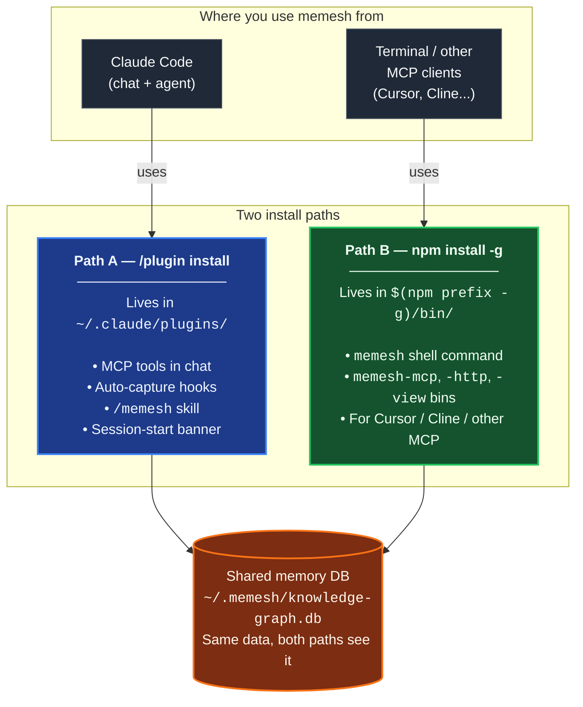

🌐 [English](README.md) | [繁體中文](README.zh-TW.md) | [简体中文](README.zh-CN.md) | [日本語](README.ja.md) | [한국어](README.ko.md) | [Português](README.pt.md) | [Français](README.fr.md) | [Deutsch](README.de.md) | [Tiếng Việt](README.vi.md) | [Español](README.es.md) | [ภาษาไทย](README.th.md)

<p align="center">
  <h1 align="center">MeMesh LLM Memory</h1>
  <p align="center">
    <strong>給 Claude Code 和 MCP 程式開發代理的在地記憶系統。</strong><br />
    一個 SQLite 檔案。不需要 Docker。不需要雲端。
  </p>
  <p align="center">
    <a href="https://www.npmjs.com/package/@pcircle/memesh"></a>
    <a href="LICENSE"></a>
    <a href="https://nodejs.org"></a>
    <a href="https://modelcontextprotocol.io"></a>
  </p>
</p>

---

> [!IMPORTANT]
> **持續開發中的專案** — 功能會持續更新，版本之間可能會有變動。遇到問題或想要新功能，請[開 issue](https://github.com/PCIRCLE-AI/memesh-llm-memory/issues)。

## 問題所在

你的程式開發代理在每次對話之間就會忘記一切。每個架構決策、每個修復的臭蟲、每個失敗的測試、每個代價不菲的教訓，都得重新跟它解釋一遍。Claude Code 每次都從零開始，重新發現舊的限制條件，浪費寶貴的上下文在它本應已知的事情上。

**MeMesh 讓程式開發代理擁有持久、可搜尋、不斷演進的在地記憶。**

這個套件是 MeMesh 產品系列的在地記憶層。我們刻意保持它的精簡和開源：用 npm 安裝，把記憶保存在 `~/.memesh/knowledge-graph.db`，然後連接到 Claude Code 或任何支援 MCP 的用戶端。託管工作區和企業級作業系統產品應該與這個套件的 README 和路線圖分開。

---

## 實證 — 在 LongMemEval-S 上 R@5 達 95.60%

MeMesh 的檢索引擎**只用 FTS5**（熱路徑上不使用 LLM、不使用嵌入），對照公開的 [LongMemEval-S](https://huggingface.co/datasets/xiaowu0162/longmemeval) 基準測試（500 題，MIT 授權）量測：

| 系統 | R@5 | 來源 |
|---|---|---|
| **MeMesh（Mode A，經由 `recallEnhanced()`）** | **95.60%** | [benchmarks/longmemeval/RESULTS.md](benchmarks/longmemeval/RESULTS.md) |
| MemPalace | 96.6% | 廠商自行回報 |
| Supermemory | ~82% | 廠商估計值 |
| Zep | 63.8% | LongMemEval 論文 |
| Mem0 | 49.0% | LongMemEval 論文 |

重現指令、資料集 SHA256、原始逐題結果與已知失敗分析全部都在 [`benchmarks/longmemeval/`](benchmarks/longmemeval/)。約 10 秒可重跑一次。

---

## 安裝路徑一覽

MeMesh 有**兩條會共存的安裝路徑**。多數使用者兩條都需要。它們寫入**同一份記憶資料庫**（`~/.memesh/knowledge-graph.db`），所以 Claude Code 對話裡記下的東西在 terminal 也看得到，反之亦然。



**你需要哪一條？**

| 你想做什麼 | 安裝路徑 |
|---|---|
| 在 Claude Code 對話裡用 `/memesh` skill | Path A（plugin）|
| 在 Claude Code 自動 capture（session → 教訓 → 下次 recall）| Path A（plugin）|
| 在任何 terminal 跑 `memesh remember` / `memesh recall` / `memesh doctor` | Path B（npm-global）|
| 用 `memesh serve` 直接開 dashboard（沒有 `npx` 啟動延遲）| Path B（npm-global）|
| 把 `memesh-mcp` 接到 Cursor、Cline 或其他 MCP client | Path B（npm-global）|
| 以上都要 | **兩條都裝** — 不會衝突 |

> **常見誤會（小心踩雷）**：Claude Code 的 plugin **不會** 把 `memesh` 放到你的 shell `PATH` 上。如果你只跑 `/plugin install`，然後在 terminal 打 `memesh reindex`，你會看到 `command not found`。這是正常的 — 還要加 `npm install -g @pcircle/memesh` 才有 shell 指令。

### ⚠️ 裝 plugin 不會裝 CLI

這個是最常見的踩坑點，讀一次省下未來的循環：

- 從 Claude Code 跑 `/plugin install memesh@pcircle-memesh` → 只裝 **Path A**。給你 MCP 工具、hooks、`/memesh` skill。**不會**把 `memesh` 放到你的 shell `PATH`。
- 在 terminal 打 `memesh reindex` / `memesh update` / `memesh doctor` → 需要 **Path B**（npm-global）。沒裝就會 `zsh: command not found: memesh`。
- **Claude Code 使用者建議的安裝方式**：**兩條都裝**。共存、共用同一份資料庫、不衝突。

```bash
# 跑完 /plugin install ... 之後，再跑這個：
npm install -g @pcircle/memesh
```

如果你只透過 Claude Code 對話用 memesh（從不在 terminal 打 `memesh`），Path A 自己就夠了。其他人請兩條都裝。

---

## 60 秒快速開始

### 選項 A — Claude Code 外掛（一行安裝）

如果你使用 Claude Code，從 CLI 內把 MeMesh 當外掛安裝：

```
/plugin marketplace add PCIRCLE-AI/memesh-llm-memory
/plugin install memesh@pcircle-memesh
```

Claude Code 會自動接好 hooks、skills 和 MCP server。你會獲得對話內自動擷取、主動回憶、可在 Claude Code 對話中使用的 `/memesh` skill（remember / recall / learn / forget），以及代理可呼叫的 `remember` / `recall` / `forget` / `learn` MCP 工具。CLI 與本地儀表板無需任何額外的全域安裝就能完整使用 — `npx @pcircle/memesh <command>` 可執行所有 CLI 指令，`npx @pcircle/memesh` 可在 `localhost:3737` 啟動儀表板。MCP server 直接從外掛內建的編譯產物啟動 — 不需要 `npx` 查找、不需要 `npm install -g`、不需要本地建置步驟。memesh 透過 Node 內建的 `node:sqlite`（22.13+）存放資料，所以升級 Node 不會留下一個為錯誤 runtime 編譯的二進位檔。

### 選項 B — npm 全域安裝（可選最佳化）

如果你希望二進位執行檔直接放在 shell `PATH` 上（讓 `memesh`、`memesh-mcp` 等指令能在任何終端機直接執行，省去每次呼叫的 `npx` 查找），或想將 `memesh-mcp` 以固定路徑的 stdio 指令暴露給**非 Claude Code 的 MCP 用戶端**（Cursor、Cline、純終端機流程）：

```bash
npm install -g @pcircle/memesh
```

> **首次安裝注意事項（一次性）：**
> - **不需要編譯器** — 資料庫引擎就是 Node 自己的 `node:sqlite`。負責「用意思搜尋」的 `sqlite-vec` 以預先編譯好的檔案形式提供 macOS（arm64/x64）、Linux（x64/arm64）和 Windows x64；在其他平台它就是不存在，回憶維持關鍵字搜尋。這裡沒有任何東西會執行安裝腳本，所以 `npm install --ignore-scripts` 也能裝出完全可用的 memesh。
> - **語意搜尋是選用的** — 預設的檢索路徑是關鍵字搜尋（FTS5），不需要模型也不需要下載。以語意（意義）為基礎的搜尋需要一個 embedder：在本地執行 [Ollama](https://ollama.com)，或設定一個雲端 embedder（見下方「嵌入」）。沒有設定時，memesh 只使用關鍵字搜尋。

### 第一步半：把 MeMesh 接進 Claude Code（僅 npm 路徑需要）

如果你透過**選項 A**（`/plugin install memesh@pcircle-memesh`）安裝，請略過此步驟 — Claude Code 會自動接好外掛 hooks。

如果你透過**選項 B**（`npm install -g`）安裝，CLI 已在 PATH 上、MCP server 也已註冊，但 Claude Code session hooks 並未自動接上。沒有這些 hooks 還是可以手動使用 `memesh remember` / `recall`，但**自動擷取迴路**（session → 教訓 → 下次 session 主動回憶）就會靜默不動。

```bash
memesh install-hooks         # 把 memesh hooks 加進 ~/.claude/settings.json
memesh doctor                # 確認「Hooks wired into Claude Code」過了
```

這些 hooks 會跟你既有的 `~/.claude/hooks/` 自訂 hooks 共存 — `install-hooks` 用追加方式寫入，從不覆寫你的東西。要移除：`memesh uninstall-hooks`。

### 第二步：保存一個決策

> 下方的 bash 範例假設 `memesh` 已在 `PATH` 上（選項 B）。選項 A（純外掛）使用者有兩條等價路徑：在 Claude Code 對話中發問（`/memesh` skill 與 MCP 工具涵蓋同樣的流程），或將任何 shell 中的 `memesh` 替換為 `npx @pcircle/memesh` — 旗標相同，不需要全域安裝。

```bash
memesh remember "Use OAuth 2.0 with PKCE for the new auth"
```

或使用顯式形式，當你想要穩定的名稱與類型以便日後篩選：

```bash
memesh remember --name "auth-decision" --type "decision" --obs "Use OAuth 2.0 with PKCE"
```

### 第三步：稍後回憶它

```bash
memesh recall "login security"
# → 找到 "OAuth 2.0 with PKCE" 即使你搜尋的是不同的詞彙
```

**完成。** MeMesh 現在已經在跨對話記憶和回憶。

如果你想驗證安裝和本地連線的整個流程：

```bash
memesh doctor
```

開啟儀表板來探索你的記憶：

```bash
memesh serve
```

<p align="center">
  
</p>

<p align="center">
  
</p>

<p align="center">
  
</p>

---

## 誰應該用 MeMesh？

| 如果你是... | MeMesh 幫你... |
|---------------|---------------------|
| **使用 Claude Code 的開發者** | 在工作時自動回憶專案決策、檔案特定的經驗教訓和過去的失敗 |
| **程式開發代理進階使用者** | 在多個 MCP 相容工具間共享一層在地記憶 |
| **嘗試 AI 程式開發工作流的團隊** | 匯出／匯入專案知識，無需引入託管基礎設施 |
| **代理開發者** | 透過 MCP、HTTP 或 CLI 添加在地記憶 |

---

## 專為程式開發代理設計

<table>
<tr>
<td width="33%" align="center">

**Claude Code / Desktop**
```bash
memesh-mcp
```
MCP 工具 + Claude Code hooks

</td>
<td width="33%" align="center">

**任何 HTTP 用戶端**
```bash
curl localhost:3737/v1/recall \
  -H "Content-Type: application/json" \
  -d '{"query":"auth"}'
```
`memesh serve`（REST API）

</td>
<td width="33%" align="center">

**任何 LLM（OpenAI 格式）**
```bash
memesh export-schema \
  --format openai
```
貼到任何 API 呼叫中

</td>
</tr>
</table>

---

## 為什麼選 MeMesh 而不是 OpenMemory、Cursor Memories、Mem0 或 Zep？

| | **MeMesh** | OpenMemory | Cursor Memories | Mem0 | Zep / Graphiti |
|---|---|---|---|---|---|
| **最佳用途** | 程式開發代理的在地記憶 | 本地／跨用戶端 MCP 記憶 | Cursor 原生專案記憶 | 受管應用／代理記憶 | 時間性知識圖 |
| **安裝方式** | `npm install -g @pcircle/memesh` | 本地應用／伺服器流程 | 內建於 Cursor | 雲端 API / SDK / MCP | 服務／框架設定 |
| **儲存位置** | 單一本地 SQLite 檔案 | 本地記憶堆疊 | Cursor 管理的規則／記憶 | 託管或自管堆疊 | 圖形資料庫 |
| **需要雲端** | 否 | 否（本地模式） | 取決於 Cursor 帳戶／設定 | 是（平台） | 通常是／自管 |
| **Claude Code hooks** | 一級支援 | MCP 工具 | 否 | MCP 工具 | 不特別針對 Claude Code |
| **儀表板** | 內建 | 內建 | Cursor 設定 | 平台儀表板 | 平台／圖表工具 |
| **取捨** | 簡潔的本地方案，不適合企業規模 | 更寬泛的本地應用足跡 | 綁定到 Cursor | 強大的受管平台，較少本地優先 | 強大的圖形模型，設定更複雜 |

**MeMesh 用立即可用的本地設定、可檢查的儲存和程式開發代理工作流 hooks 來交換企業級受管基礎設施。**

---

## Claude Code 自動進行的事情

你不需要手動記住所有事情。MeMesh 有 **7 個 hooks**，會在你工作時自動擷取與注入知識：

| 何時 | MeMesh 做什麼 |
|------|------------------|
| **每次 session 開始時** | 載入最相關的記憶 + 來自過去教訓的主動警告 |
| **編輯檔案前** | 回憶與檔案或專案相關的記憶，再讓 Claude 寫程式碼 |
| **執行 bash 指令前** | （可選加入）促使 Claude 將高可驗證性指令（測試、建置、檢查、遷移、部署、基準測試）派遣為背景代理 |
| **當你要求記住** | 偵測「remember this」／「guardar en memesh」／「sauvegarder dans memesh」／「記下來」意圖（5 種語言）並提醒 Claude 使用 memesh |
| **每次 `git commit` 之後** | 記錄你的變更，包含 diff 統計 |
| **Claude 停止時** | 擷取已編輯的檔案、已修復的錯誤，並從失敗自動產生結構化教訓 |
| **上下文壓縮前** | 在知識被上下文限制丟掉之前先保存 |

> **隨時退出：** `export MEMESH_AUTO_CAPTURE=false`

---

## 設定

所有設定都透過環境變數。預設是純本地、零網路 — 你不需要設定任何東西就能取得可運作的系統。

| 變數 | 預設值 | 用途 |
|---|---|---|
| `MEMESH_DB_PATH` | `~/.memesh/knowledge-graph.db` | 覆寫 SQLite 資料庫位置。 |
| `MEMESH_AUTO_CAPTURE` | `true` | 完全停用自動擷取 hooks（`Stop`、`PreCompact`）。 |
| `MEMESH_AUTO_DETECT_LLM` | 未設定（自動偵測**開啟**） | 設為 `0` 讓 memesh 不使用它在 shell 環境中找到的 API 金鑰。預設情況下，如果設定了 `ANTHROPIC_API_KEY` / `OPENAI_API_KEY` / `OLLAMA_HOST` 且你沒有在 `~/.memesh/config.json` 設定供應商，memesh 會用它來跑寫入側的 LLM 功能（整合、經驗提取、自動打標籤、dream）。嵌入不受影響 —— 除非你把 `embedder.provider` 明確設定為 `ollama` 或 `openai`，否則保持僅關鍵字（FTS5）。 |
| `MEMESH_AUTO_UPDATE` | `off` | 自動更新策略。`off`（預設）永不自動更新；`patch` 允許 `X.Y.Z → X.Y.Z+N`；`minor` 加上 `X.Y.Z → X.Y+1.0`；`major` 允許任何升級。允許時，分離的 `npm install -g` 會在 session 結束時（Stop hook）執行，避免阻塞你的工作 — 結果寫入 `~/.memesh/auto-update.log`。也可在 `~/.memesh/config.json` 中以 `autoUpdate` 設定（環境變數優先）。當已安裝版本被維護者標為 deprecated（安全公告）時，即使是 `off` 也會強制允許 `patch` — 仍維持 minor／major 升級的手動門檻，避免靜默行為偏移。 |
| `OPENAI_API_KEY` | 未設定 | 你的 OpenAI 金鑰。除非你設定 `MEMESH_AUTO_DETECT_LLM=0` 或明確設定供應商，否則會自動用於 LLM 功能。 |
| `OLLAMA_HOST` | `http://localhost:11434` | 使用本地 Ollama 供應商時覆寫 Ollama 的端點。 |

`memesh doctor` 會印出已解析的設定，讓你看到目前實際生效的內容。

**備援 LLM 供應商（Smart Mode）。** 在 dashboard 的 **Settings → 「Fallback providers」** 可以設定一條有順序的備援鏈——當你的主要供應商掛掉時，memesh 會依序改用清單裡的下一個。可以加本機的 [Ollama](https://ollama.com) 備援，或雲端的（OpenAI / Anthropic，需要 API key）。隱私取捨：一旦用到雲端備援，記憶內容（可能是私密的）會被送到那個供應商，所以如果你為了隱私只跑本機，這點要留意。

當 npm 將已安裝版本標為 deprecated（通常是安全公告），下次 session-start 會在前面附上強警示橫幅 `⚠️ MeMesh <ver> is DEPRECATED`，`memesh update-status` 也會持續顯示同一行直到你升級為止。檢查結果會被快取於 `~/.memesh/update-check.<version>.json`，以避免短暫網路失敗讓警示變淡。

---

## 儀表板

8 個分頁、11 種語言、零外部相依性。伺服器執行時可在 `http://localhost:3737/dashboard` 存取。

| 分頁 | 你會看到 |
|-----|-------------|
| **Insights** | 記憶洞察 — 來自 dreamer 引擎的每週摘要和模式提案；一鍵接受／拒絕 |
| **Search** | 全文 + 向量相似度搜尋所有記憶 |
| **Browse** | 所有實體的分頁列表，可以歸檔／復原 |
| **Analytics** | 記憶健康分數、30 天時間線、PM 速度 + KG 連通性指標、工作模式、清理建議 |
| **Graph** | 互動式力導向知識圖，具有類型篩選、搜尋、自我中心模式、近期熱力圖 |
| **Lessons** | 來自過去失敗的結構化教訓（錯誤、根本原因、修復、預防） |
| **Manage** | 歸檔和復原實體 |
| **Settings** | LLM 供應商設定、即時語言選擇器 |

---

## 智慧功能

**🧠 智慧搜尋** — 搜尋「登入安全」並找到關於「OAuth PKCE」的記憶。MeMesh 用 FTS5 + sqlite-vec 在熱路徑上保持 LLM-free，仍能跨同義詞匹配。

**🌏 支援不用空格分詞的文字** — 中文、日文、韓文、泰文、寮文、高棉文和半形片假名都會拆成相鄰兩字一組來建索引，所以寫成「資料庫遷移前一定要先備份」的記憶，搜尋「備份」就找得到，不必打出一模一樣的全文。寫入和查詢兩邊都會做 NFC 正規化，因此在 macOS 上或用韓文、越南文輸入法打的記憶，兩種寫法都找得到。

**📊 評分排名** — 結果按相關性（30%）+ 近期性（25%）+ 頻率（18%）+ 信心（17%）+ 回憶影響（10%）排名。

**🔄 知識演進** — 決策會改變。`forget` 歸檔舊記憶（永不刪除）。`supersedes` 關係連結舊 → 新。你的 AI 總是看到最新版本。

**⚠️ 衝突偵測** — 如果你有兩個互相矛盾的記憶，MeMesh 會警告你。

**🕸️ 知識圖連通性** — `memesh kg backfill-relations --all-rules` 使用標籤共現、專案叢集、會話上下文和名稱相似度連結孤立實體 — 無需 LLM。

**📦 團隊共享** — `memesh export > team-knowledge.json` → 與團隊共享 → `memesh import team-knowledge.json`
匯入的組合保持可搜尋，但 MeMesh 不會自動將匯入的記憶注入 Claude hooks，直到你檢查或在本地重新儲存。

---

## 使用範例

> 「MeMesh 記得我們三週前選擇了 PKCE 而不是隱式流程。當我再次問 Claude 關於身份驗證的問題時，它已經知道了——不需要重新解釋。」
> — **獨立開發者，正在打造 SaaS**

> 「我們每個星期五匯出團隊的記憶，星期一匯入。每個人的 Claude 在新一週開始時都知道團隊上週學到的東西。」
> — **3 人新創公司，共享知識庫**

> 「儀表板顯示我 90% 的記憶是自動生成的對話日誌。我開始有意使用 `remember` 來記錄架構決策。改變了遊戲規則。」
> — **發現分析分頁的開發者**

---

## 解鎖智慧模式（可選）

MeMesh 預設離線運作 — 回憶嚴格保持 LLM-free（開箱即用就有 LongMemEval-S 上 95.60% R@5）。只有當你想要在上層加入 LLM 增強的分析流程時，才需要加入 LLM API 金鑰：更聰明的 session 擷取、新記憶的自動標籤、從失敗產生教訓，以及 `dream` 壓縮：

```bash
memesh config set llm.provider anthropic
memesh config set llm.api-key sk-ant-...
```

或使用儀表板 Settings 分頁（視覺化設定）：

```bash
memesh serve  # 開啟儀表板 → Settings 分頁
```

**把過去的對話挖成記憶。** `memesh dream run --from-transcripts` 會讀這個專案的 Claude Code 對話記錄，請 LLM 找出藏在對話裡的決策與教訓，再把它們暫存成提案——不會自動寫進你的知識圖譜。用 `memesh dream show <id>` 逐一檢視，挑值得留的 accept。

### 自帶嵌入(可選)

預設情況下 MeMesh 只做**關鍵字**召回(FTS5)—— 無需 API 金鑰,無需下載模型,資料不離開你的機器。語意(以意義為基礎的)搜尋是選用的,需要一個嵌入器。設定其中之一:

```bash
memesh config set embedder.provider openai          # or: ollama
memesh config set embedder.model text-embedding-3-small
```

嵌入器**獨立於對話 LLM** 設定 —— 更改 `llm.provider` 絕不會悄悄改變你的嵌入。如果切換到不同維度(如 768 → 1536),MeMesh 會在下次寫入時自動重建向量索引。支援的 `embedder.provider` 取值:`ollama`(本地)、`openai`(託管)。兩者都不設定時,召回保持關鍵字搜尋。

| | 等級 0（預設） | 等級 1（智慧模式） |
|---|---|---|
| **搜尋** | FTS5 + sqlite-vec，95.60% R@5 | 不變 — 回憶在每個等級都保持 LLM-free |
| **自動擷取** | 基於規則的模式 | + LLM 擷取決策與教訓 |
| **自動標籤** | 僅手動標籤 | + LLM 為新記憶產生標籤 |
| **失敗分析** | 不可用 | + LLM 將 session 錯誤轉為結構化教訓 |
| **壓縮** | 不可用 | `dream` 壓縮冗長記憶 |
| **成本** | 免費，無需 API 金鑰 | 約 $0.0001 / 次分析呼叫（Haiku） |

---

## 全部 8 個記憶工具

| 工具 | 做什麼 |
|------|--------|
| `remember` | 用觀察、關係和標籤儲存知識 |
| `recall` | FTS5 + sqlite-vec 搜尋，包含多因素評分（相關性、近期性、頻率、信心、回憶影響）— 熱路徑上不使用 LLM |
| `forget` | 軟歸檔（永不刪除）或移除特定觀察 |
| `export` | 在專案或團隊成員之間以 JSON 共享記憶 |
| `import` | 匯入記憶，包含合併策略（跳過 / 覆寫 / 追加） |
| `learn` | 記錄來自錯誤的結構化教訓（錯誤、根本原因、修復、預防） |
| `user_patterns` | 分析你的工作模式——時間表、工具、優勢、學習領域 |

---

## 架構

```
                    ┌─────────────────┐
                    │   核心引擎      │
                    │  （8 項操作）  │
                    └────────┬────────┘
           ┌─────────────────┼─────────────────┐
           │                 │                 │
     CLI (memesh)    HTTP API (serve)    MCP (memesh-mcp)
           │                 │                 │
           └─────────────────┼─────────────────┘
                             │
                    SQLite + FTS5 + sqlite-vec
                    (~/.memesh/knowledge-graph.db)
```

核心與框架無關。同一邏輯從終端、HTTP 或 MCP 執行。

---

## 升級

Claude Code 的 plugin marketplace 在安裝時把版本釘住，**不會**自動更新。要拿到新版本：

**方法 A — `/plugin` 介面**：先 uninstall `memesh@pcircle-memesh`，再重新安裝。Claude Code 會抓 marketplace 最新版。

**方法 B — 一行指令**（不用點 UI、可重複執行）：

```bash
# 如果 plugin 已經是 v4.2.5 或更新，腳本已經內建：
bash ~/.claude/plugins/cache/pcircle-memesh/memesh/<current-version>/scripts/upgrade-plugin.sh

# 如果是 v4.2.5 之前的版本（也就是 v4.2.4 或 v4.2.3），
# 腳本還沒在你的 plugin 裡，改用 npm-global 的副本：
bash "$(npm prefix -g)/lib/node_modules/@pcircle/memesh/scripts/upgrade-plugin.sh"

# （這假設你也跑過 `npm install -g @pcircle/memesh`。如果還沒，
# 現在正好可以一起裝 — 參考上面「安裝路徑一覽」說明為什麼大部分人兩條路徑都裝。）
```

腳本會 fast-forward marketplace cache、把新版本放進 `~/.claude/plugins/cache/`、安裝 runtime deps，然後把 `installed_plugins.json` 重指向新版本。執行完請重啟 Claude Code 讓 MCP server 重連。

**npm-global 安裝**（`npm install -g @pcircle/memesh`）可以直接 `memesh update` 自動更新。Source checkouts：`git pull && npm install && npm run build`。

Session 開始時，有新版本可下載時會跳一行 banner（每版本每 24 小時節流一次），`memesh doctor` 會回報升級目標版本與對應指令。

---

## 貢獻

```bash
git clone https://github.com/PCIRCLE-AI/memesh-llm-memory
cd memesh-llm-memory && npm install && npm run build
npm test             # 630 項測試
npm run test:e2e-dashboard
```

儀表板：`cd dashboard && npm install && npm run dev`

---

<p align="center">
  <strong>MIT</strong> — 由 <a href="https://pcircle.com">PCIRCLE AI</a> 製作
</p>
